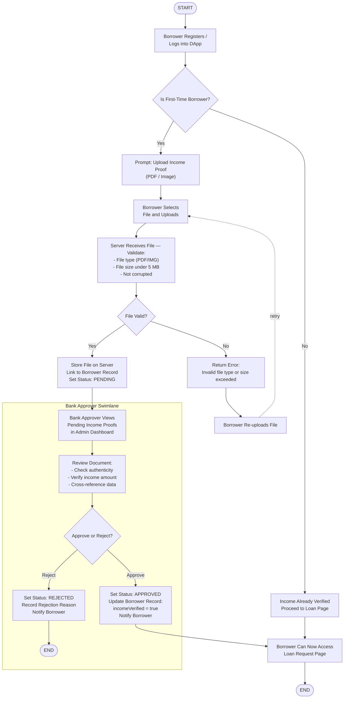
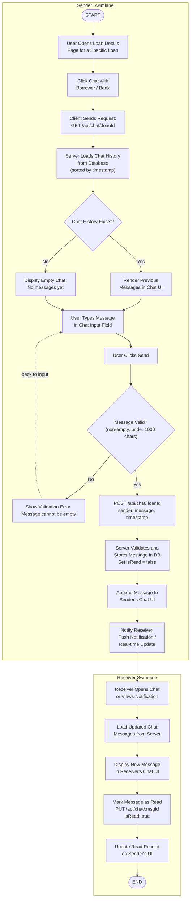
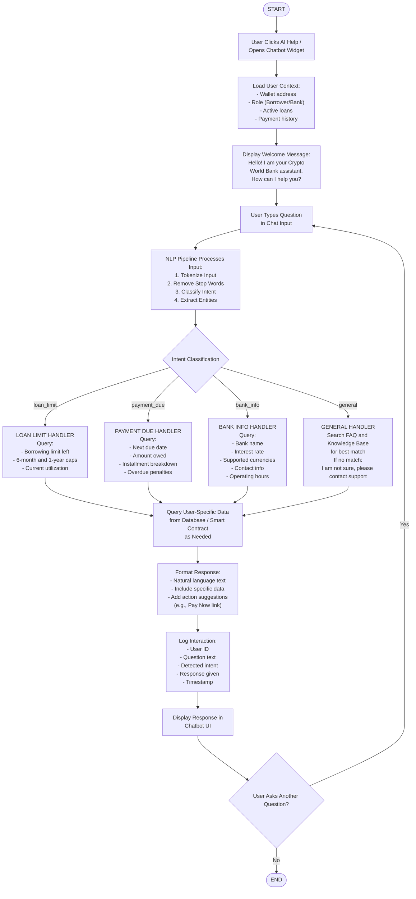
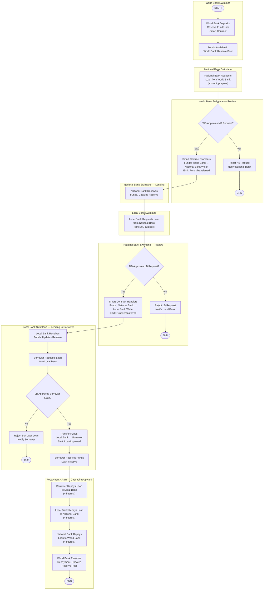
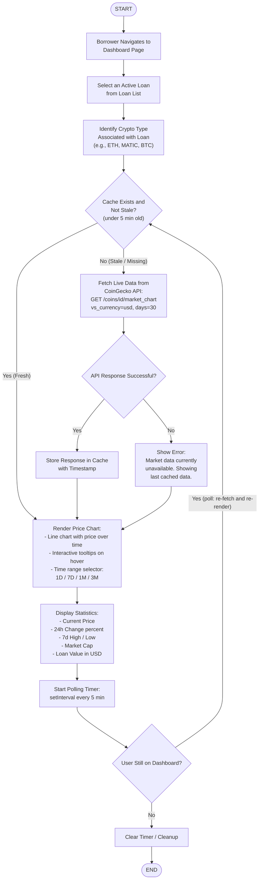
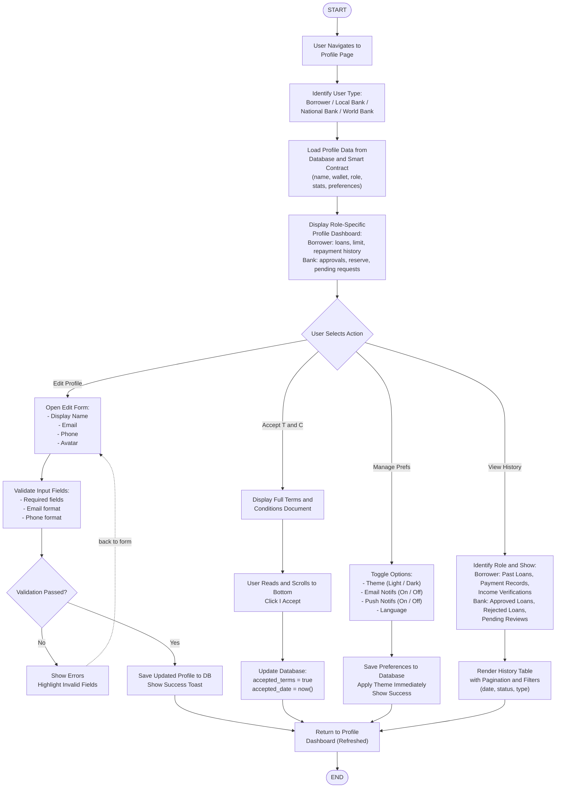

```mermaid
flowchart TD
    A([START]) --> B[Borrower Opens DApp]
    B --> C["Connect Wallet<br>(MetaMask / WalletConnect)"]
    C --> D{Wallet Connected?}
    D -- Yes --> E["Read Wallet Address and<br>Determine Role"]
    D -- No --> F["Show Connect Wallet Error"]
    F --> END1([END])

    E --> G["Navigate to Loan Page<br>Enter Amount and Purpose"]
    G --> H{Is First-Time Borrower?}
    H -- Yes --> I[Upload Income Proof Document]
    I --> J{Income Proof Approved?}
    J -- Yes --> K["Query Borrowing Limit<br>(6-month and 1-year rolling windows)"]
    J -- No --> L["Reject: Income Not Verified"]
    L --> END2([END])
    H -- No --> K

    K --> M{Amount Within Borrowing Limit?}
    M -- Yes --> N["Prepare Transaction<br>requestLoan(amount, purpose)"]
    M -- No --> O["Reject: Limit Exceeded"]
    O --> END3([END])

    N --> P["MetaMask Prompts User<br>Display Gas Estimate"]
    P --> Q{User Confirms Transaction?}
    Q -- Yes --> R["Sign and Broadcast Transaction<br>to Polygon Network"]
    Q -- No --> S[Transaction Cancelled]
    S --> END4([END])

    R --> T["Smart Contract Validates and Executes:<br>- Check amount is positive<br>- Check purpose is not empty<br>- Check reserve balance<br>- Create Loan struct<br>- Emit LoanRequested"]
    T --> U{Transaction Successful?}
    U -- No --> V["Show Error: Tx Failed"]
    V --> END5([END])
    U -- Yes --> W["Display Success:<br>Loan Requested — Show Tx Hash"]
    W --> X["Event Listener Detects<br>LoanRequested Event<br>→ Store in Database<br>→ Trigger AI/ML Risk Assessment"]

    subgraph APPROVER["Bank Approver Swimlane"]
        Y["View Pending Loans<br>with AI Risk Scores<br>and SHAP Explanations"]
        Y --> Z{Approve or Reject?}
        Z -- Reject --> AA["Sign rejectLoan()<br>Record Reason<br>Notify Borrower"]
        AA --> END6([END])
        Z -- Approve --> AB["Sign approveLoan()<br>via Approver Wallet"]
        AB --> AC["Smart Contract:<br>- Verify approver role<br>- Verify loan pending<br>- Verify balance<br>- Transfer ETH to borrower wallet<br>- Emit LoanApproved"]
    end
    X --> Y

    AC --> AD{"Loan Amount at least 100 ETH?"}
    AD -- Yes --> AE["Generate Installment Plan<br>(N installments with due dates)"]
    AD -- No --> AF[Single Payment Due by Deadline]
    AE --> AG["Borrower Receives Funds in Wallet<br>Update Borrowing Limit<br>Update Transaction Log"]
    AF --> AG
    AG --> AH{Installment Due?}
    AH -- Yes --> AI["Pay Installment<br>via payInstallment — Sign tx"]
    AI --> AH
    AH -- Paid All --> AJ["Loan Completed<br>Update consecutive paid loans count"]
    AJ --> END7([END])
```

# Activity Diagram

## Crypto World Bank — Loan Request to Repayment Flow

---

---

## Crypto World Bank — Income Verification Flow

---

## Crypto World Bank — Chat System Flow

---

## Crypto World Bank — AI Chatbot Interaction Flow

---

## Crypto World Bank — Hierarchical Banking Flow

---

## Crypto World Bank — Market Data Viewing Flow

---

## Crypto World Bank — Profile Management Flow

