```mermaid
graph TB

    %% ════════════════════════════════════════════════
    %% PRESENTATION LAYER
    %% ════════════════════════════════════════════════
    subgraph PL["🖥️ PRESENTATION LAYER"]
        direction LR

        subgraph PL_Core["Core Modules"]
            Dashboard["Dashboard<br/><i>IDashboard</i>"]
            LoanModule["Loan Module<br/><i>ILoanService</i>"]
            AdminPanel["Admin Panel<br/><i>IAdminService</i>"]
        end

        subgraph PL_Features["Feature Modules"]
            RiskDash["Risk Dashboard<br/><i>IRiskService</i>"]
            ChatModule["Chat Module<br/><i>IChatService</i>"]
            ChatbotUI["Chatbot UI<br/><i>IChatbotUI</i>"]
        end

        subgraph PL_Utility["Utility Modules"]
            ProfileMod["Profile Module<br/><i>IProfileService</i>"]
            MarketMod["Market Data<br/><i>IMarketDataView</i>"]
            QRModule["QR Module<br/><i>IQRService</i>"]
            WalletProv["Wallet Provider<br/><i>Wagmi + RainbowKit</i>"]
        end
    end

    %% ════════════════════════════════════════════════
    %% SMART CONTRACT LAYER
    %% ════════════════════════════════════════════════
    subgraph SCL["⛓️ SMART CONTRACT LAYER"]
        direction LR

        subgraph SC_Contracts["Contracts (Solidity 0.8.20)"]
            direction LR
            WBReserve["WorldBankReserve<br/><i>IReserve</i><br/>depositToReserve( )<br/>registerNatBank( )<br/>lendToNatBank( )<br/>pause( ) / unpause( )<br/>emergencyWithdraw( )"]
            NatBankC["NationalBank<br/><i>INationalBank</i><br/>registerLocalBank( )<br/>borrowFromWB( )<br/>lendToLocalBank( )"]
            LocBankC["LocalBank<br/><i>ILocalBank</i><br/>requestLoan( )<br/>approveLoan( )<br/>rejectLoan( )<br/>payInstallment( )<br/>setApprover( )"]
        end

        subgraph SC_Libs["Libraries"]
            OZ["OpenZeppelin<br/>ReentrancyGuard<br/>Ownable"]
        end

        WBReserve -->|"lends to"| NatBankC
        NatBankC -->|"lends to"| LocBankC
        SC_Contracts --> OZ
    end

    %% ════════════════════════════════════════════════
    %% BACKEND SERVICES LAYER
    %% ════════════════════════════════════════════════
    subgraph BSL["⚙️ BACKEND SERVICES LAYER"]
        direction LR

        subgraph BS_API["API Gateway"]
            FastAPI["FastAPI<br/><i>ILoanAPI · IUserAPI · IRiskAPI</i>"]
        end

        subgraph BS_Data["Data Services"]
            Postgres["PostgreSQL<br/><i>IDataStore</i><br/>15 tables"]
            Redis["Redis Cache<br/><i>ICacheService</i>"]
            FileStor["File Storage<br/><i>IFileStore</i>"]
        end

        subgraph BS_Intelligence["Intelligence Services"]
            AIML["AI/ML Engine<br/><i>IMLService</i><br/>Random Forest<br/>Isolation Forest<br/>SHAP"]
            ChatbotSvc["Chatbot Service<br/><i>IChatbotService</i>"]
        end

        subgraph BS_Realtime["Realtime Services"]
            EventLsnr["Event Listener<br/><i>IEventSync</i>"]
            WSSvc["WebSocket<br/><i>IWebSocket</i>"]
            IncomeSvc["Income Proof<br/><i>IIncomeService</i>"]
        end

        FastAPI --> Postgres
        FastAPI --> Redis
        FastAPI --> AIML
        FastAPI --> ChatbotSvc
        FastAPI --> IncomeSvc
        IncomeSvc --> FileStor
        EventLsnr --> Postgres
    end

    %% ════════════════════════════════════════════════
    %% EXTERNAL SERVICES
    %% ════════════════════════════════════════════════
    subgraph EXT["🌐 EXTERNAL SERVICES"]
        direction LR
        MetaMask["MetaMask<br/><i>IWalletAuth</i>"]
        Polygon["Polygon PoS<br/><i>IConsensus</i>"]
        Alchemy["Alchemy RPC<br/><i>IRPC</i>"]
        CoinGecko["CoinGecko API<br/><i>IMarketData</i>"]
    end

    %% ════════════════════════════════════════════════
    %% INTER-LAYER CONNECTIONS
    %% ════════════════════════════════════════════════

    %% Presentation → Smart Contracts (via wallet)
    Dashboard -->|"read stats"| SCL
    LoanModule -->|"loan ops"| SCL
    AdminPanel -->|"admin ops"| SCL
    RiskDash -->|"risk queries"| SCL

    %% Presentation → Backend
    LoanModule -->|"REST"| FastAPI
    AdminPanel -->|"REST"| FastAPI
    RiskDash -->|"REST"| FastAPI
    ProfileMod -->|"REST"| FastAPI
    ChatbotUI -->|"REST"| FastAPI
    ChatModule -->|"ws://"| WSSvc
    MarketMod -->|"cached"| Redis

    %% Wallet → External
    WalletProv -->|"connect"| MetaMask
    WalletProv -->|"RPC"| Alchemy

    %% Smart Contracts → External
    SC_Contracts -->|"deploy/tx"| Polygon
    SC_Contracts -->|"RPC"| Alchemy

    %% Backend → External
    EventLsnr -->|"events"| Alchemy
    Redis -->|"price feed"| CoinGecko

    %% Backend → Smart Contracts
    EventLsnr -->|"listen"| SCL

    %% ════════════════════════════════════════════════
    %% STYLING
    %% ════════════════════════════════════════════════
    style PL fill:#e3f2fd,stroke:#1565c0,stroke-width:2px,color:#000
    style PL_Core fill:#bbdefb,stroke:#1976d2,stroke-width:1px,color:#000
    style PL_Features fill:#bbdefb,stroke:#1976d2,stroke-width:1px,color:#000
    style PL_Utility fill:#bbdefb,stroke:#1976d2,stroke-width:1px,color:#000

    style SCL fill:#fff3e0,stroke:#e65100,stroke-width:2px,color:#000
    style SC_Contracts fill:#ffe0b2,stroke:#ef6c00,stroke-width:1px,color:#000
    style SC_Libs fill:#ffe0b2,stroke:#ef6c00,stroke-width:1px,color:#000

    style BSL fill:#e8f5e9,stroke:#2e7d32,stroke-width:2px,color:#000
    style BS_API fill:#c8e6c9,stroke:#388e3c,stroke-width:1px,color:#000
    style BS_Data fill:#c8e6c9,stroke:#388e3c,stroke-width:1px,color:#000
    style BS_Intelligence fill:#c8e6c9,stroke:#388e3c,stroke-width:1px,color:#000
    style BS_Realtime fill:#c8e6c9,stroke:#388e3c,stroke-width:1px,color:#000

    style EXT fill:#fce4ec,stroke:#c62828,stroke-width:2px,color:#000
```

# Component Diagram (Mermaid)
## Crypto World Bank System

---

## How to View

- **In Cursor/VS Code:** Open this file and use `Ctrl+Shift+V` (or `Cmd+Shift+V` on Mac) for Markdown preview
- **Online:** Copy the Mermaid block below and paste at [mermaid.live](https://mermaid.live)

---



---

## Subsystem Summary

| Layer | Components | Responsibility |
|-------|-----------|----------------|
| **Presentation** | Dashboard, Loan, Admin, Risk Dashboard, Chat, Chatbot UI, Profile, Market Data, QR, Wallet | User-facing React 18 + TypeScript modules |
| **Smart Contract** | WorldBankReserve, NationalBank, LocalBank + OpenZeppelin | On-chain business logic and hierarchical lending |
| **Backend Services** | FastAPI, PostgreSQL, Redis, AI/ML Engine, Chatbot, WebSocket, Event Listener, Income Proof, File Storage | Off-chain processing, storage, and intelligence |
| **External** | MetaMask, Polygon PoS, Alchemy RPC, CoinGecko | Third-party wallets, networks, and data feeds |

## Key Interfaces

| Interface | Purpose |
|-----------|---------|
| `IReserve` / `INationalBank` / `ILocalBank` | Smart contract operations per tier |
| `ILoanAPI` / `IUserAPI` / `IRiskAPI` | Backend REST endpoints |
| `IMLService` | Fraud detection (Random Forest), anomaly detection (Isolation Forest), explainability (SHAP) |
| `IDataStore` | PostgreSQL persistence across 15 tables |
| `ICacheService` | Redis caching for market data and borrowing limits |
| `IWebSocket` | Real-time chat messaging and notifications |
| `IChatbotService` | NLP intent classification and response generation |
| `IIncomeService` | Income proof upload, validation, and review workflow |
| `IWalletAuth` / `IRPC` | Wallet connection and blockchain node communication |

## Data Flow

```
Borrower → [Wallet Provider] → MetaMask → Alchemy RPC → Smart Contracts → Polygon PoS
                                                              ↕
                              Event Listener ← Alchemy RPC ← (blockchain events)
                                    ↓
                               PostgreSQL ← FastAPI ← Presentation Layer
                                    ↑
                              AI/ML Engine → SHAP explanations → Risk Dashboard
```
