# Component Diagram
## Crypto World Bank System

---

```mermaid
flowchart TD

    subgraph PL["PRESENTATION LAYER &lt;&lt;subsystem&gt;&gt;"]
        direction TB

        Dashboard["Dashboard\n○ IDashboard"]
        LoanModule["LoanModule\n○ ILoanService"]
        AdminPanel["AdminPanel\n○ IAdminService"]
        RiskDashboard["RiskDashboard\n○ IRiskService"]
        QRModule["QRModule\n○ IQRService"]
        WalletProvider["WalletProvider\n(Wagmi+RainbowKit)\n○ IWalletService"]
        ChatModule["ChatModule\n○ IChatService"]
        ProfileModule["ProfileModule\n○ IProfileService"]
        MarketDataModule["MarketDataModule\n○ IMarketDataView"]
        ChatbotModule["ChatbotModule\n○ IChatbotUI"]
    end

    subgraph SCL["SMART CONTRACT LAYER &lt;&lt;subsystem&gt;&gt;"]
        direction TB

        subgraph Contracts["Smart Contracts"]
            direction LR
            WorldBankReserve["WorldBankReserve\n○ IReserve\n+ depositToReserve()\n+ registerNatBank()\n+ lendToNatBank()\n+ getStats()\n+ pause() / unpause()\n+ emergencyWithdraw()"]
            NationalBank["NationalBank\n○ INationalBank\n+ registerLocalBank()\n+ borrowFromWB()\n+ lendToLocalBank()"]
            LocalBank["LocalBank\n○ ILocalBank\n+ requestLoan()\n+ approveLoan()\n+ rejectLoan()\n+ setApprover()\n+ addBankUser()\n+ payInstallment()"]

            WorldBankReserve -->|"hierarchical"| NationalBank
            NationalBank -->|"hierarchical"| LocalBank
        end

        subgraph Libs["Libraries"]
            direction LR
            OpenZeppelin["OpenZeppelin\n+ ReentrancyGuard\n+ Ownable"]
            Solidity["Solidity 0.8.20\n+ Built-in overflow check\n+ require() validation"]
        end

        Contracts --> Libs
    end

    subgraph BSL["BACKEND SERVICES LAYER &lt;&lt;subsystem&gt;&gt;"]
        direction TB

        EventListener["EventListener\n○ IEventSync\n+ onLoanReq()\n+ onLoanAppr()\n+ onDeposit()"]
        FastAPI["FastAPI (REST API)\n○ ILoanAPI\n○ IUserAPI\n○ IRiskAPI"]
        AIMLService["AI/ML Service\n○ IMLService\n+ predictFraud()\n+ detectAnomaly()\n+ explainSHAP()"]
        PostgreSQL["PostgreSQL\n○ IDataStore\n+ LOAN_REQUEST\n+ TRANSACTION\n+ BORROWER\n+ AI_ML_LOG\n+ (15 tables)"]
        RedisCache["Redis Cache\n○ ICacheService\n+ marketData\n+ borrowLimits\n+ sessions"]
        FileStorage["File Storage\n(Income Proofs)\n○ IFileStore\n+ upload()\n+ retrieve()"]
        WebSocketService["WebSocket Service\n○ IWebSocket"]
        ChatbotService["Chatbot Service\n○ IChatbotService\n+ classifyIntent()\n+ generateResponse()\n+ logInteraction()"]
        IncomeProofService["Income Proof Service\n○ IIncomeService\n+ upload()\n+ validate()\n+ getStatus()"]

        EventListener --> PostgreSQL
        FastAPI --> PostgreSQL
        FastAPI --> RedisCache
        FastAPI --> AIMLService
        AIMLService --> FastAPI
        FastAPI --> ChatbotService
        FastAPI --> IncomeProofService
        IncomeProofService --> FileStorage
    end

    subgraph EXT["EXTERNAL SERVICES &lt;&lt;external&gt;&gt;"]
        direction LR
        MetaMask["MetaMask Wallet\n○ IWalletAuth"]
        PolygonPoS["Polygon PoS Network\n○ IConsensus"]
        CoinGeckoAPI["CoinGecko API\n(Market Data)\n○ IMarketData"]
        AlchemyRPC["Alchemy RPC\n(Blockchain Node Provider)\n○ IRPC"]
    end

    %% Presentation → Smart Contract Layer
    Dashboard --> SCL
    LoanModule --> SCL
    AdminPanel --> SCL
    RiskDashboard --> SCL

    %% Presentation → Backend Services
    LoanModule --> FastAPI
    AdminPanel --> FastAPI
    RiskDashboard --> FastAPI
    ProfileModule --> FastAPI
    ChatModule --> WebSocketService
    ChatbotModule --> FastAPI
    MarketDataModule --> RedisCache

    %% Wallet connections
    WalletProvider --> MetaMask
    WalletProvider --> AlchemyRPC

    %% Smart Contract → External
    Contracts --> PolygonPoS
    Contracts --> AlchemyRPC

    %% Backend → External
    EventListener --> AlchemyRPC
    RedisCache --> CoinGeckoAPI

    %% Smart Contract ← Backend
    EventListener --> SCL

    %% Styling
    style PL fill:#e3f2fd,stroke:#1565c0,stroke-width:2px,color:#000
    style SCL fill:#fff3e0,stroke:#e65100,stroke-width:2px,color:#000
    style BSL fill:#e8f5e9,stroke:#2e7d32,stroke-width:2px,color:#000
    style EXT fill:#fce4ec,stroke:#c62828,stroke-width:2px,color:#000
```

**Subsystems:** Presentation Layer, Smart Contract Layer, Backend Services Layer, External Services

**Key Interfaces:**
- `IWalletService` — Wallet connection and transaction signing
- `IReserve`, `INationalBank`, `ILocalBank` — Smart contract operations
- `ILoanAPI`, `IRiskAPI` — Backend REST endpoints
- `IMLService` — AI/ML fraud detection and explainability
- `IDataStore` — Database persistence (15 tables)
- `ICacheService` — Redis caching for market data and limits
- `IChatService` — Borrower-bank real-time chat messaging
- `IProfileService` — Profile management and terms acceptance
- `IMarketDataView` — Crypto price charts and statistics visualization
- `IChatbotUI` — AI chatbot interaction interface
- `IWebSocket` — Real-time messaging, typing indicators, notifications
- `IChatbotService` — NLP processing, intent classification, response generation
- `IIncomeService` — Income proof upload, validation, and review workflow

**Dependencies:** WorldBankReserve → NationalBank → LocalBank (hierarchical); FastAPI → AI/ML Service (risk assessment); EventListener → PostgreSQL (event sync); ChatModule → WebSocket Service (real-time chat); ChatbotModule → Chatbot Service (NLP processing); ProfileModule → FastAPI (profile CRUD); MarketDataModule → CoinGecko API (price data); Income Proof Service → File Storage (document storage); FastAPI → Chatbot Service (intent routing); FastAPI → Income Proof Service (upload endpoint)
