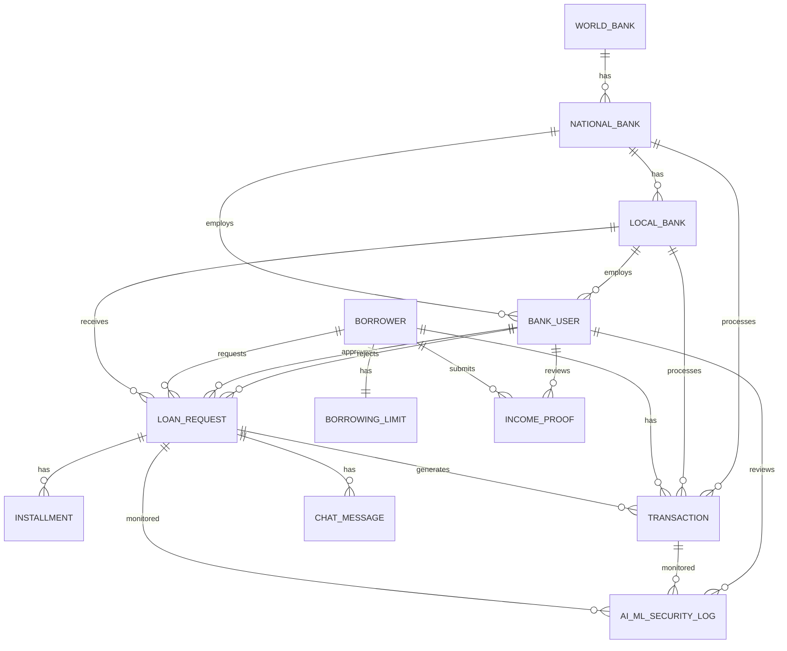

# CSE370 - Database Management Report
## Crypto World Bank: Relational Database Design

**Course:** CSE370 - Database Management  
**Project:** Decentralized Crypto Reserve & Lending Bank  
**Date:** 2024

---

## 1. Project Overview

The Crypto World Bank is a decentralized lending platform with a hierarchical banking structure: **World Bank → National Banks → Local Banks → Users**. The database supports loan management, transaction tracking, chat systems, AI/ML security monitoring, income verification, and market data for cryptocurrency visualization.

---

## 2. Entity-Relationship Diagram (ERD)

### 2.1 Core System Graph

```
┌─────────────────────────────────────────────────────────────────┐
│                    CRYPTO WORLD BANK SYSTEM                       │
│                      Entity Relationship Model                    │
└─────────────────────────────────────────────────────────────────┘

┌──────────────┐         ┌──────────────┐         ┌──────────────┐
│  WORLD_BANK  │────────<│ NATIONAL_BANK│────────<│  LOCAL_BANK  │
│              │   1:N   │              │   1:N   │              │
└──────────────┘         └──────┬───────┘         └──────┬───────┘
                                │                        │
                         ┌──────▼───────┐        ┌──────▼───────┐
                         │ BANK_USER    │        │ BANK_USER    │
                         │ (National)   │        │ (Local)      │
                         └──────┬───────┘        └──────┬───────┘
                                │                        │
                                └────────┬───────────────┘
                                         │
                                  ┌──────▼───────┐
                                  │   BORROWER   │
                                  └──────┬───────┘
                                         │
                    ┌────────────────────┼────────────────────┐
                    │                    │                    │
            ┌───────▼──────┐    ┌────────▼────────┐  ┌───────▼──────┐
            │  LOAN_REQUEST│    │  TRANSACTION    │  │ INCOME_PROOF  │
            └───────┬──────┘    └─────────────────┘  └───────────────┘
                    │
            ┌───────▼──────┐
            │  INSTALLMENT │
            └──────────────┘
                    │
            ┌───────▼──────┐
            │  CHAT_MESSAGE │
            └──────────────┘
                    │
            ┌───────▼──────┐
            │  AI_ML_LOG   │
            └──────────────┘
```

### 2.2 Mermaid ER Diagram



---

## 3. Generalization of the Graph

### 3.1 Structural Overview

The database follows a **hierarchical and relational** design:

| Layer | Structure | Description |
|-------|-----------|-------------|
| **Banking Hierarchy** | 1:N cascading | World Bank → National Bank → Local Bank |
| **User Layer** | Bank Users + Borrowers | Bank staff (approvers/viewers) and end-user borrowers |
| **Lending Core** | Loan-centric | Loan requests, installments, transactions |
| **Supporting Entities** | Independent/auxiliary | Income proof, chat, AI logs, market data, profiles |

### 3.2 Relationship Categories

| Category | Relationships |
|----------|---------------|
| **Hierarchical Banking** | WORLD_BANK (1) → NATIONAL_BANK (N) → LOCAL_BANK (N) |
| **User Assignment** | NATIONAL_BANK / LOCAL_BANK (1) → BANK_USER (N) |
| **Lending Flow** | BORROWER (N) → LOAN_REQUEST (N) ← LOCAL_BANK (1) |
| **Transaction Tracking** | LOAN_REQUEST (1) → INSTALLMENT (N), TRANSACTION (N) |
| **Communication** | LOAN_REQUEST (1) → CHAT_MESSAGE (N) |
| **Security & AI** | LOAN_REQUEST, TRANSACTION → AI_ML_SECURITY_LOG (N) |

### 3.3 Entity Summary

| Entity | Role |
|--------|------|
| WORLD_BANK | Top-level reserve holder |
| NATIONAL_BANK | Country-level banks |
| LOCAL_BANK | City-level banks |
| BANK_USER | Bank staff (approve/reject loans) |
| BORROWER | End-users requesting loans |
| LOAN_REQUEST | Loan applications and lifecycle |
| INSTALLMENT | Installment payment records |
| TRANSACTION | Financial transactions |
| BORROWING_LIMIT | Limits per borrower |
| INCOME_PROOF | Income verification documents |
| CHAT_MESSAGE | Borrower–bank chat |
| AI_CHATBOT_LOG | AI chatbot interactions |
| AI_ML_SECURITY_LOG | Security/ML monitoring |
| MARKET_DATA | Cryptocurrency prices |
| PROFILE_SETTINGS | User profiles and terms |

---

## 4. Database Management Summary

- **Normalization:** 3NF (Third Normal Form)
- **Purpose:** Supports hierarchical banking, loan lifecycle, installments, borrowing limits, chat, AI/ML security, income verification, and market data
- **Key Design:** Referential integrity via foreign keys; indexes for query optimization; partitioning for scalability (transactions, logs, market data)

---

**Document Version:** 1.0  
**Course:** CSE370 - Database Management
