# CSE470 - Software Engineering
## Crypto World Bank: Agile Development Methodology

**Course:** CSE470 - Software Engineering  
**Project:** Decentralized Crypto Reserve & Lending Bank  
**Duration:** 2 Months (8 Weeks)  
**Methodology:** Agile/Scrum  
**Sprints:** 3 Sprints  
**Date:** February 2026

---

## Contents

| § | Section |
|---|---------|
| 1 | Project Overview |
| 2 | Sprint Structure |
| 3 | Sprint 1: Foundation & Core Banking |
| 4 | Sprint 2: Lending & Payment Features |
| 5 | Sprint 3: Advanced Features & Security |
| 6 | Agile Artifacts |
| 7 | Team Roles & Responsibilities |
| 8 | Risk Management |
| 9 | Metrics & KPIs |
| 10 | Communication Plan |
| 11 | SDLC Stage Mapping |
| 12 | Design Decisions and Alternatives Considered |
| 13 | UML and Architecture |
| 14 | Design Patterns |
| 15 | Software Testing and Metrics |
| 16 | Effort Estimation and Project Scheduling |
| 17 | Conclusion |

---

## 1. Project Overview

### 1.1 Project Scope

The Crypto World Bank is a decentralized lending platform built on blockchain technology with a hierarchical banking structure (World Bank → National Banks → Local Banks → Users). The system includes installment payments, AI/ML security layers, chat functionality, and comprehensive user management.

### 1.2 Development Methodology

**Agile/Scrum Framework** with the following characteristics:
- **Sprint Duration:** 2-3 weeks per sprint
- **Team Size:** 2 developers (thesis project)
- **Weekly Sync:** Progress review, blockers, planning (replaces daily standup for 2-person team)
- **Sprint Planning:** 1 hour at sprint start
- **Sprint Review:** 30 minutes at sprint end
- **Retrospective:** 30 minutes at sprint end

---

## 2. Sprint Structure

### 2.1 Overall Timeline

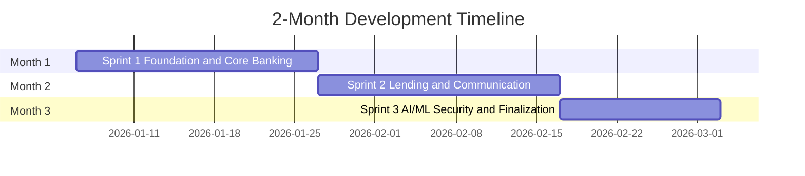

### 2.2 Sprint Breakdown

| Sprint | Duration | Focus Area | Key Deliverables |
|--------|----------|------------|-----------------|
| **Sprint 1** | Weeks 1-3 | Foundation & Core Banking | Smart contracts, basic UI, wallet integration, database schema |
| **Sprint 2** | Weeks 4-6 | Lending, Payment & Communication | Loan requests, installments, borrowing limits, chat, income verification, bank hierarchy |
| **Sprint 3** | Weeks 7-8 | AI/ML Security, Testing & Finalization | AI/ML integration, risk dashboard, profiles, market data, testing, documentation |

---

## 3. Sprint 1: Foundation & Core Banking
**Duration:** 3 Weeks (Weeks 1-3)  
**Sprint Goal:** Establish core blockchain infrastructure and hierarchical banking structure

### 3.1 Sprint Backlog

#### Epic 1: Smart Contract Development (21 pts)

| ID | Story | Pts |
|----|-------|-----|
| US-1.1 | World Bank contract — reserve management, national bank registration | 5 |
| US-1.2 | National Bank contract — borrow from WB, lend to Local Banks | 5 |
| US-1.3 | Local Bank contract — borrow from NB, lend to users | 5 |
| US-1.4 | Role-based access control — WB/NB/LB Admin, Bank User, Borrower | 3 |
| US-1.5 | Gas cost management — initiator pays; Polygon low-fee ($0.001–0.01/tx) | 3 |

#### Epic 2: Frontend Foundation (13 pts)

| ID | Story | Pts |
|----|-------|-----|
| US-1.6 | Wallet connection — MetaMask, WalletConnect, Sepolia/Mumbai | 3 |
| US-1.7 | Dashboard UI — Material Design 3, responsive, blockchain-themed | 5 |
| US-1.8 | Navigation & layout — AppBar, role-based menu | 3 |
| US-1.9 | Blockchain visual elements — tx hash, security badges | 2 |

#### Epic 3: Database Schema (8 pts)

| ID | Story | Pts |
|----|-------|-----|
| US-1.10 | Database design — 15 tables, 3NF (see CSE370) | 5 |
| US-1.11 | Migration scripts and seed data | 3 |

### 3.2 Sprint 1 Burndown

**Total Story Points:** 42  
**Team Velocity:** ~21 points per week (estimated)

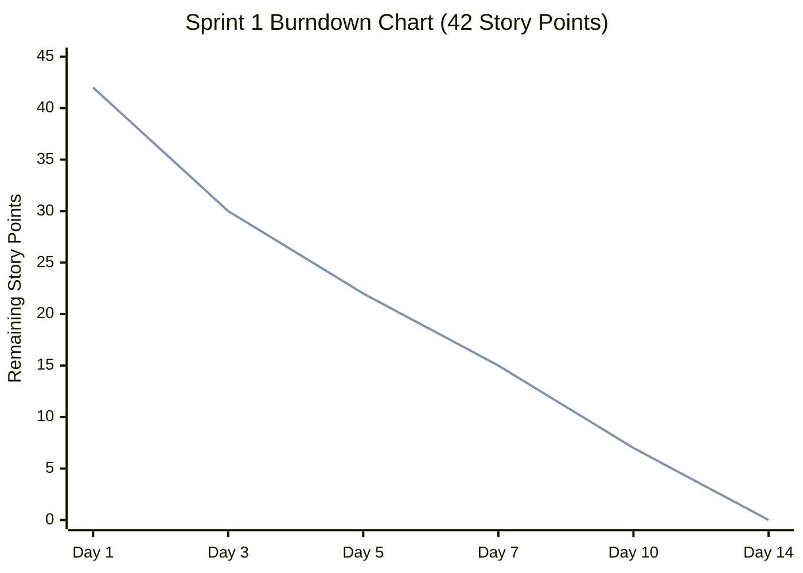

| Day | Planned | Completed | Remaining |
|-----|---------|-----------|-----------|
| Day 1 | 0 | 0 | 42 |
| Day 3 | 14 | 12 | 30 |
| Day 5 | 21 | 20 | 22 |
| Day 7 | 28 | 27 | 15 |
| Day 10 | 35 | 35 | 7 |
| Day 14 | 42 | 42 | 0 |

### 3.3 Sprint 1 Deliverables

- ✅ Smart contracts deployed on testnet
- ✅ Basic frontend with wallet connection
- ✅ Database schema implemented
- ✅ Role-based access control working
- ✅ Dashboard UI with blockchain elements

---

## 4. Sprint 2: Lending & Payment Features
**Duration:** 3 Weeks (Weeks 4-6)  
**Sprint Goal:** Implement complete lending flow with installment payments and communication

### 4.1 Sprint Backlog

#### Epic 4: Loan Management (21 pts)

| ID | Story | Pts |
|----|-------|-----|
| US-2.1 | Loan request — form, one per bank, on-chain storage | 5 |
| US-2.2 | Loan approval/rejection — pending view, approver per bank | 5 |
| US-2.3 | Income verification — file upload, document storage | 5 |
| US-2.4 | Borrowing limit — 6mo/1yr calc, 3+ paid exception | 5 |
| US-2.5 | Loan request visibility — hide after approval | 1 |

#### Epic 5: Installment Payment (13 pts)

| ID | Story | Pts |
|----|-------|-----|
| US-2.6 | Installment logic — auto setup for ≥100 ETH, configurable count | 5 |
| US-2.7 | Installment UI — list, pay button, confirmation | 5 |
| US-2.8 | Deadline tracking — display, overdue warnings | 3 |

#### Epic 6: Chat System (13 pts)

| ID | Story | Pts |
|----|-------|-----|
| US-2.9 | Borrower–bank chat — real-time, history, read/unread | 8 |
| US-2.10 | Chat notifications — in-app, unread count | 5 |

#### Epic 7: Profile Management (8 pts)

| ID | Story | Pts |
|----|-------|-----|
| US-2.11 | Profile pages — all user types, role-specific | 5 |
| US-2.12 | Terms and conditions — view, acceptance tracking | 3 |

#### Epic 7b: QR Code System (3 pts)

| ID | Story | Pts |
|----|-------|-----|
| US-2.13 | QR generation & scan — wallet, loan URL, contract address | 3 |

### 4.2 Sprint 2 Burndown

**Total Story Points:** 58  
**Team Velocity:** ~27 points per week (estimated)

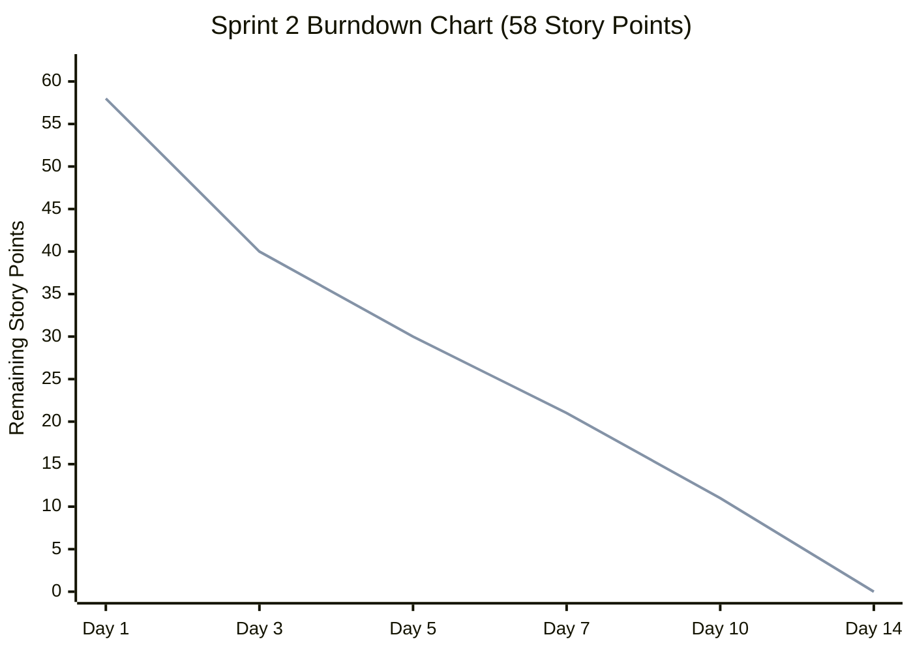

| Day | Planned | Completed | Remaining |
|-----|---------|-----------|-----------|
| Day 1 | 0 | 0 | 58 |
| Day 3 | 19 | 18 | 40 |
| Day 5 | 29 | 28 | 30 |
| Day 7 | 38 | 37 | 21 |
| Day 10 | 48 | 47 | 11 |
| Day 14 | 58 | 58 | 0 |

### 4.3 Sprint 2 Deliverables

- ✅ Complete loan request and approval system
- ✅ Installment payment functionality
- ✅ Deadline tracking in dashboard
- ✅ Chat system between borrowers and banks
- ✅ Profile pages for all user types
- ✅ Terms and conditions page

---

## 5. Sprint 3: Advanced Features & Security
**Duration:** 2 Weeks (Weeks 7-8)  
**Sprint Goal:** Implement AI/ML security, market data visualization, AI chatbot, and finalize testing & documentation

### 5.1 Sprint Backlog

#### Epic 8: Market Data Visualization (8 pts)

| ID | Story | Pts |
|----|-------|-----|
| US-3.1 | Market data API — CoinGecko/CoinMarketCap, caching | 3 |
| US-3.2 | Market value graph — Chart.js/Recharts, live + historical | 5 |

#### Epic 9: AI Chatbot (13 pts)

| ID | Story | Pts |
|----|-------|-----|
| US-3.3 | Chatbot integration — NLP, context-aware responses | 5 |
| US-3.4 | Chatbot training — dataset, intent recognition | 5 |
| US-3.5 | Chatbot features — loan limit, payment, bank contact queries | 3 |

#### Epic 10: AI/ML Security Layer (21 pts)

| ID | Story | Pts |
|----|-------|-----|
| US-3.6 | ML data collection — transaction logging, feature extraction | 5 |
| US-3.7 | Fraud detection model — risk scoring, loan approval integration | 8 |
| US-3.8 | Anomaly detection — alerts, dashboard | 5 |
| US-3.9 | Security logging — event tracking, bank dashboard | 3 |

#### Epic 11: Testing & QA (13 pts)

| ID | Story | Pts |
|----|-------|-----|
| US-3.10 | Unit testing — smart contracts, >80% coverage | 5 |
| US-3.11 | Integration testing — E2E, API tests | 5 |
| US-3.12 | Security testing — contract audit, penetration testing | 3 |

### 5.2 Sprint 3 Burndown

**Total Story Points:** 55  
**Team Velocity:** ~27 points per week (estimated)

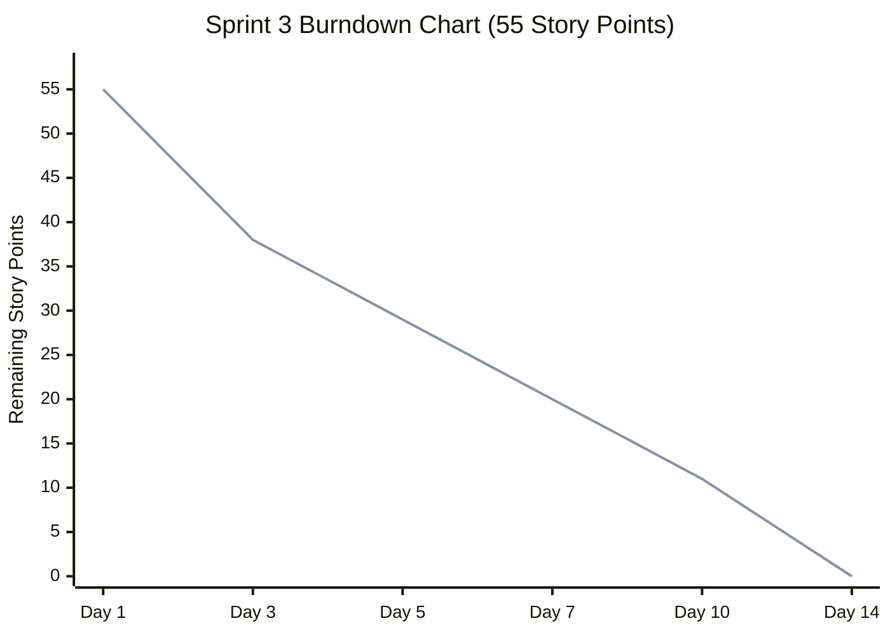

| Day | Planned | Completed | Remaining |
|-----|---------|-----------|-----------|
| Day 1 | 0 | 0 | 55 |
| Day 3 | 18 | 17 | 38 |
| Day 5 | 27 | 26 | 29 |
| Day 7 | 36 | 35 | 20 |
| Day 10 | 45 | 44 | 11 |
| Day 14 | 55 | 55 | 0 |

### 5.3 Sprint 3 Deliverables

- ✅ Live cryptocurrency market data visualization
- ✅ AI chatbot for user support
- ✅ AI/ML security layer foundation
- ✅ Comprehensive testing suite
- ✅ Security audit completed

### 5.4 Integration, Testing & Deployment (Weeks 7-8)

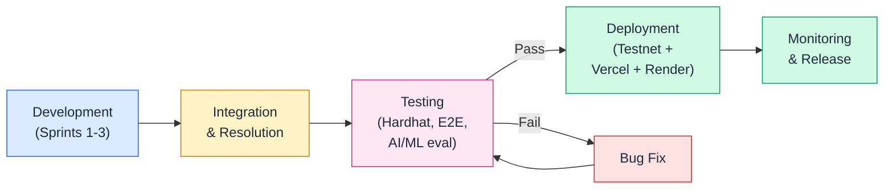

These activities run in parallel with Sprint 3 development:

**Integration Activities:**
- Integrate all sprint deliverables
- Resolve integration issues
- Performance optimization

**Testing Checklist:**
- [ ] Smart contract functionality (Hardhat unit tests)
- [ ] Frontend-backend integration
- [ ] Database operations (PostgreSQL)
- [ ] Chat system real-time communication (WebSocket)
- [ ] Installment payment flow (on-chain)
- [ ] AI chatbot responses (NLP pipeline)
- [ ] Market data updates (CoinGecko API + Redis cache)
- [ ] Security layer monitoring (AI/ML risk scores)
- [ ] Mobile responsiveness
- [ ] Cross-browser compatibility

**Deployment Activities:**
- Deploy smart contracts to testnet (Polygon Mumbai / Ethereum Sepolia)
- Deploy frontend (Vercel free tier)
- Deploy backend API (Render free tier)
- Set up monitoring (application and blockchain event listeners)

**Release Checklist:**
- [ ] All features implemented
- [ ] All tests passing
- [ ] Security audit completed
- [ ] Documentation complete
- [ ] Production deployment successful
- [ ] Monitoring active

---

## 5.5 Sprint Story Points Distribution

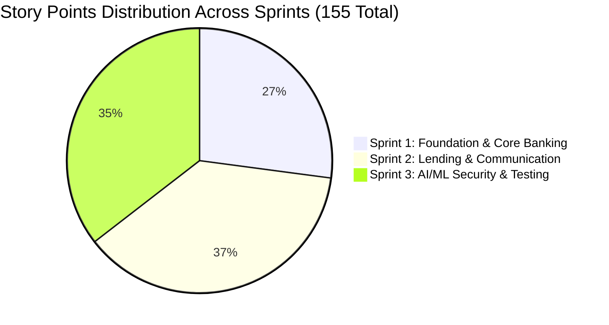

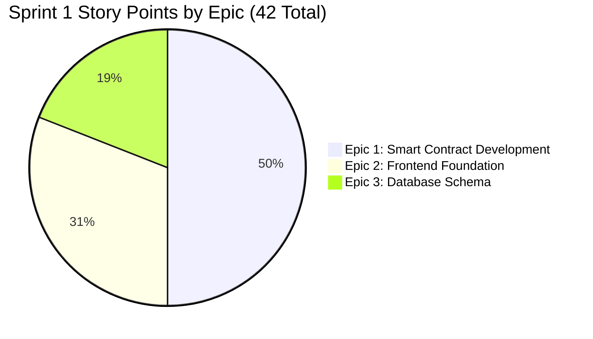

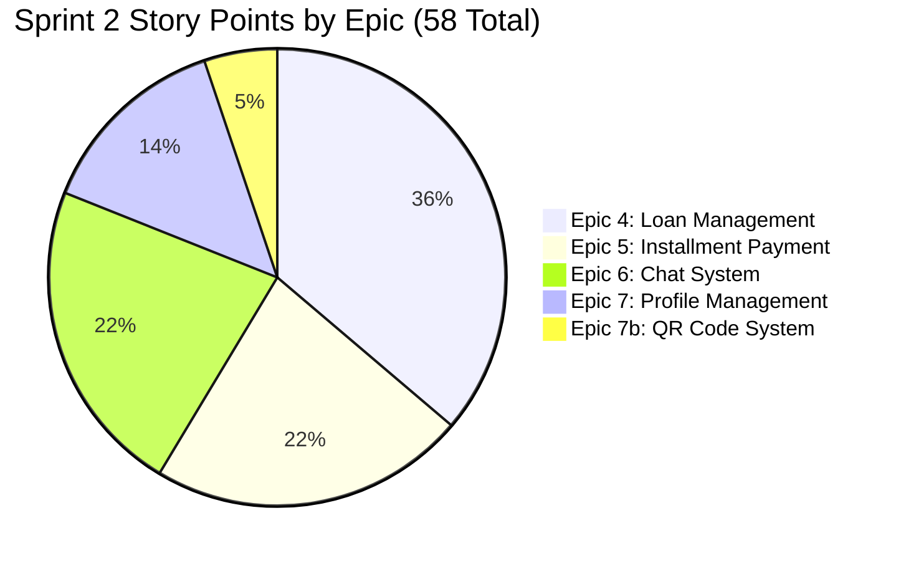

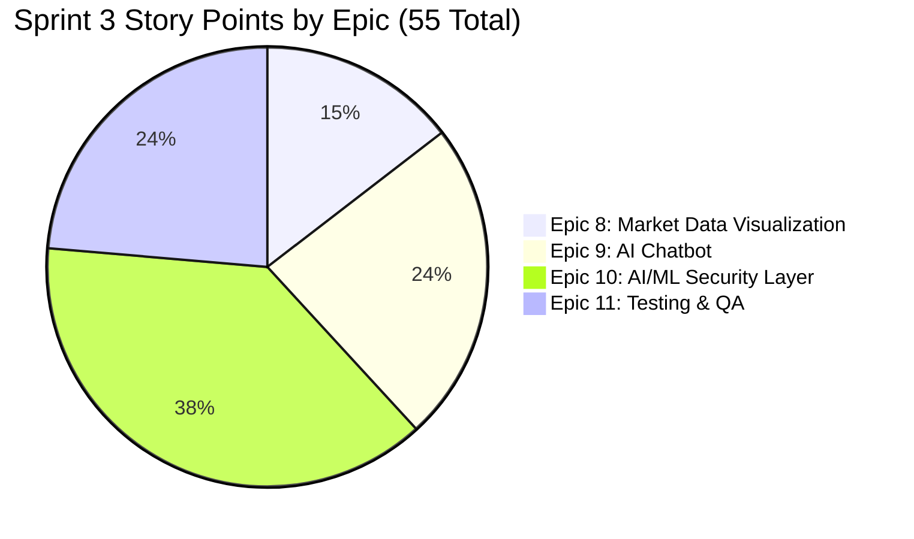

---

## 5.6 Agile/Scrum Process Flow

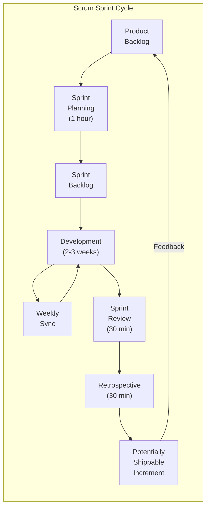

---

## 6. Agile Artifacts

### 6.1 Product Backlog

The complete product backlog includes the condensed user stories (US-1.1 through US-3.12) from sections 3–5, plus additional items for future releases:

**Future Features (Post-MVP):**
- Multi-cryptocurrency support
- Advanced ML models (LSTM, Transformer)
- Mobile apps (iOS/Android)
- Internationalization (i18n)
- Advanced analytics dashboard
- Automated loan approval using ML
- Credit scoring system

### 6.2 Sprint Backlog

Each sprint has its own backlog (detailed in sections 3, 4, and 5).

### 6.3 Definition of Done

A user story is considered "Done" when:
- ✅ Code is written and reviewed
- ✅ Unit tests are written and passing
- ✅ Integration tests are passing
- ✅ Documentation is updated
- ✅ Code is merged to main branch
- ✅ Feature is deployed to staging
- ✅ Product Owner has accepted the story

### 6.4 Definition of Ready

A user story is "Ready" for sprint planning when:
- ✅ User story is clearly written
- ✅ Acceptance criteria are defined
- ✅ Story points are estimated
- ✅ Dependencies are identified
- ✅ Technical feasibility is confirmed

---

## 7. Team Roles & Responsibilities

### 7.1 Team Structure

This is a 2-person thesis project. Both members share responsibilities across all domains.

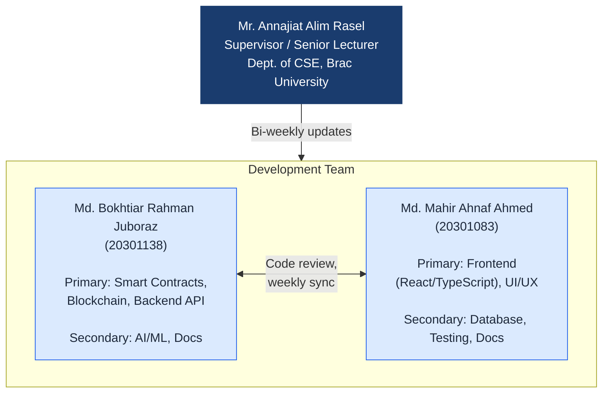

| Team Member | Primary Focus | Secondary Focus |
|-------------|---------------|-----------------|
| **Md. Bokhtiar Rahman Juboraz (20301138)** | Smart contract development, blockchain integration, backend API | AI/ML model development, documentation |
| **Md. Mahir Ahnaf Ahmed (20301083)** | Frontend development (React/TypeScript), UI/UX design | Database design, testing, documentation |

**Supervisor:** Mr. Annajiat Alim Rasel, Senior Lecturer, Dept. of CSE, Brac University

### 7.2 Collaboration Process

**Weekly Sync Format:**
1. What was completed this week?
2. What is planned for next week?
3. Are there any blockers or dependency issues?

**Code Review:** All pull requests reviewed by the other team member before merge.

---

## 8. Risk Management

### 8.1 Identified Risks

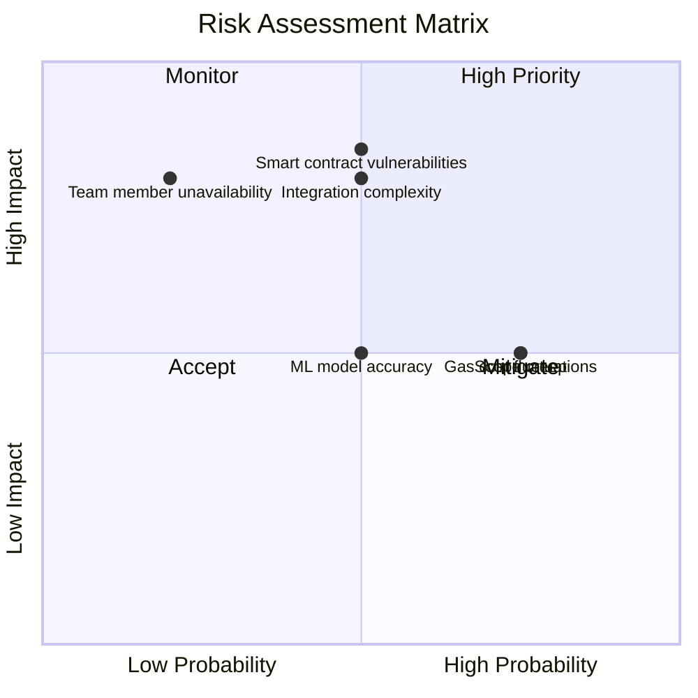

| Risk | Probability | Impact | Mitigation Strategy |
|------|-------------|--------|---------------------|
| Smart contract vulnerabilities | Medium | High | Security audit, extensive testing |
| Gas cost fluctuations | High | Medium | Gas optimization, cost estimation |
| ML model accuracy | Medium | Medium | Continuous training, human review |
| Integration complexity | Medium | High | Early integration, frequent testing |
| Scope creep | High | Medium | Strict sprint boundaries, backlog management |
| Team member unavailability | Low | High | Cross-training, documentation |

### 8.2 Risk Response Plan

- **High Priority Risks:** Weekly review and mitigation
- **Medium Priority Risks:** Bi-weekly review
- **Low Priority Risks:** Monthly review

---

## 9. Metrics & KPIs

### 9.1 Sprint Metrics

- **Velocity:** Story points completed per sprint
- **Burndown:** Progress tracking
- **Sprint Goal Achievement:** % of sprint goal met

### 9.2 Quality Metrics

- **Test Coverage:** > 80%
- **Bug Density:** < 5 bugs per 1000 lines of code
- **Code Review Coverage:** 100%

### 9.3 Performance Metrics

- **Page Load Time:** < 2 seconds
- **Transaction Confirmation:** < 30 seconds
- **API Response Time:** < 500ms

---

## 10. Communication Plan

### 10.1 Communication Channels

- **Weekly Sync:** Progress review, blockers, planning
- **Sprint Planning:** 1 hour, start of sprint
- **Sprint Review:** 30 minutes, end of sprint
- **Retrospective:** 30 minutes, end of sprint
- **Supervisor Updates:** Bi-weekly

### 10.2 Tools

- **Version Control:** GitHub (primary collaboration platform)
- **Documentation:** Overleaf (LaTeX report), Markdown files in repository
- **Communication:** In-person meetings, email (professor updates bi-weekly)
- **IDE:** VS Code with Cursor AI assistant
- **CI/CD:** GitHub Actions (planned)

---

## 11. SDLC Stage Mapping

The Agile sprint structure maps to the standard Software Development Life Cycle (SDLC) stages (ref: [GeeksforGeeks SDLC](https://www.geeksforgeeks.org/software-engineering/software-development-life-cycle-sdlc/)):

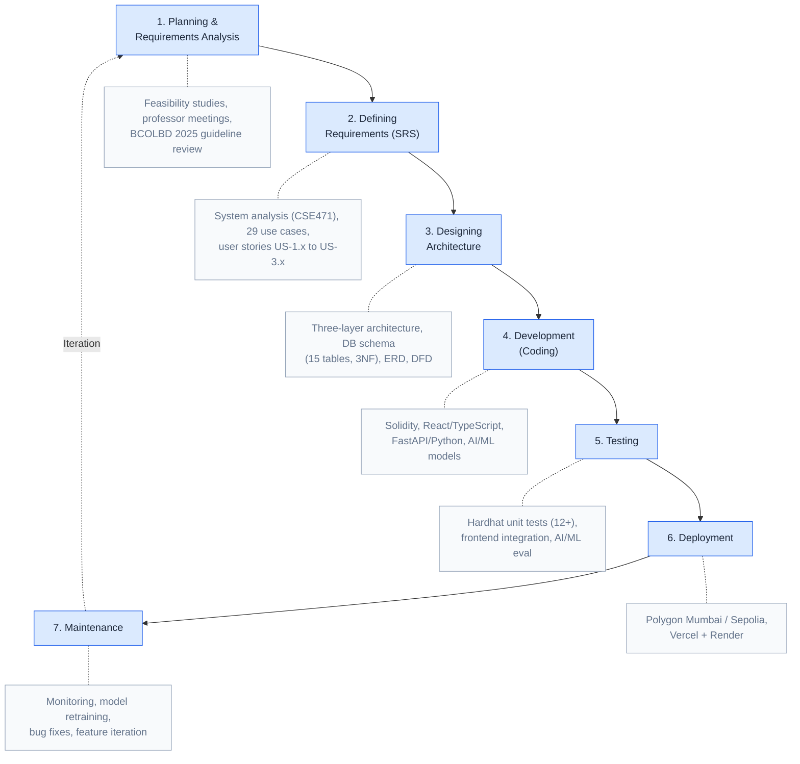

| SDLC Stage | Project Activity | Timeline |
|------------|------------------|----------|
| **1. Planning & Requirements Analysis** | Feasibility studies (technical, economic, operational, schedule); professor meetings; BCOLBD 2025 guideline review; stakeholder requirement gathering | Pre-Sprint |
| **2. Defining Requirements (SRS)** | System analysis (CSE471); use case definitions (29 use cases); non-functional requirements; system constraints; user stories (US-1.x through US-3.x) | Pre-Sprint + Sprint 1 |
| **3. Designing Architecture** | Three-layer architecture (Presentation, Smart Contract, Off-chain); database schema (15 tables, 3NF); component diagram; data flow diagram; ERD | Sprint 1 |
| **4. Development (Coding)** | Smart contracts (Solidity), frontend (React/TypeScript), backend (FastAPI/Python), AI/ML models | Sprints 1–3 |
| **5. Testing** | Hardhat unit tests (12+ tests); frontend integration tests; AI/ML model evaluation; end-to-end testing | Week 7 (Integration & Testing) |
| **6. Deployment** | Testnet deployment (Polygon Mumbai / Ethereum Sepolia); frontend on Vercel; backend on Render | Week 8 (Release) |
| **7. Maintenance** | Post-deployment monitoring; AI/ML model retraining; bug fixes; feature iteration | Post-Release |

---

## 12. Design Decisions and Alternatives Considered

Per professor requirement: *"For every decision you take, first present the alternative and then justify your first and second choices."*

The complete decision justification document is maintained in `DECISION_JUSTIFICATION_PLAN.md`. Summary:

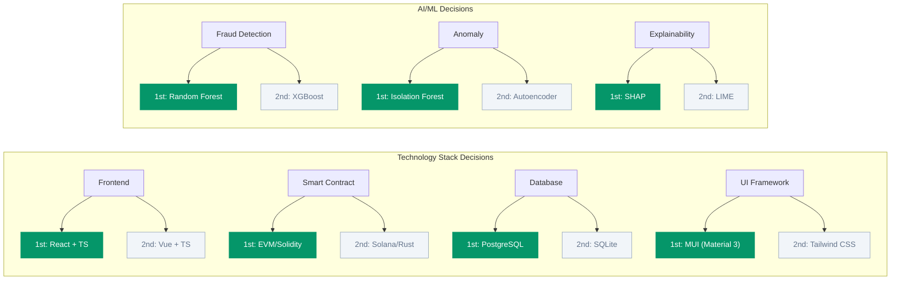

| Decision Area | 1st Choice | 2nd Choice | Key Criterion |
|---------------|------------|------------|---------------|
| Development Methodology | Agile / Scrum | Incremental / Spiral | Evolving scope, sprint milestones |
| Software Architecture | DApp + Off-chain AI | Hybrid with Oracle | Gas cost, ML iteration flexibility |
| Frontend Framework | React + TypeScript | Vue + TypeScript | Web3 library ecosystem (Wagmi, RainbowKit) |
| Smart Contract Platform | Ethereum / EVM (Solidity) | Solana (Rust) | Largest ecosystem, free testnets, OpenZeppelin |
| UI Design System | Material Design 3 (MUI) | Tailwind CSS | Professional banking UI, development speed |
| Release Cycle | Incremental releases | Continuous deployment | Professor milestones, integration risk |
| Fraud Detection Algorithm | Random Forest | XGBoost | SHAP compatibility, 94%+ precision |
| Anomaly Detection | Isolation Forest | Autoencoder | Unsupervised, no labeled data needed |
| XAI Method | SHAP | LIME | Theoretical foundation, regulatory compliance |
| Database | PostgreSQL | SQLite | CSE370 alignment, 3NF schema, async support |
| Hosting / Deployment | Vercel + Render | Localhost | $0 cost, public URL, CI/CD |

Each decision includes 2–3 alternatives evaluated, the chosen option with justification, and a backup option with rationale for when it would be preferred. See `DECISION_JUSTIFICATION_PLAN.md` for full details including criteria analysis.

---

## 13. UML and Architecture

### 13.1 Use Case Diagram

The Use Case diagram is maintained in the CSE471 report. See [Usecase diagram.png](https://github.com/Yuvraajrahman/Cryto-World-Bank/blob/main/Documentation/Diagrams/CSE471/Usecase%20diagram.png) and [CSE471 System Analysis Report §4 Use Case Diagram](https://github.com/Yuvraajrahman/Cryto-World-Bank/blob/main/Documentation/CSE471_SYSTEM_ANALYSIS_AND_DESIGN%20REPORT.md#4-use-case-diagram). It shows actors (Borrower, Bank User, World Bank, National Bank, Local Bank) and 29 use cases.

### 13.2 Class Diagram (Conceptual)

| Component | Classes / Modules |
|-----------|-------------------|
| **Frontend** | `App`, `Layout`, `Pages` (Dashboard, Loan, Deposit, Chat, Profile), `Hooks` (useContract, useUser) |
| **Backend** | `routes` (loans, users, blockchain), `services` (blockchain), `database` |
| **Smart Contracts** | WorldBankReserve, NationalBank, LocalBank (Solidity) |
| **ML Backend** | fraud_detector, anomaly_detector, XAI (SHAP) |

Relationships: Frontend → Backend API; Backend → PostgreSQL, Blockchain; Backend → ML API for risk scoring.

### 13.3 Software Architecture: MVC and Layered

- **MVC:** React components = View; hooks/state = Controller logic; backend API + DB = Model.
- **Layered:** Presentation (React) → Application (Node.js/FastAPI) → Data (PostgreSQL, blockchain).
- **Client-Server:** Frontend (client) ↔ Backend (server); Backend ↔ Blockchain nodes.

---

## 14. Design Patterns

| Pattern | Usage |
|---------|-------|
| **Singleton** | Contract instances (useContract), Wagmi/Web3 config — single shared instance |
| **Observer** | React state, blockchain event listeners — components react to data changes |
| **Adapter** | Wagmi/viem adapts different wallet providers (MetaMask, WalletConnect) to a common interface |

---

## 15. Software Testing and Metrics

### 15.1 Testing

- **Unit tests:** Hardhat for smart contracts; Jest/Vitest for frontend/backend (planned).
- **Integration:** API tests, E2E (Playwright/Cypress) for critical flows.

### 15.2 Software Metrics

| Metric | Target | Notes |
|--------|--------|-------|
| **Cyclomatic Complexity** | < 10 per function | Reduces branching; complex logic split into smaller functions |
| **CFG (Control Flow Graph)** | Used for test path coverage | Each branch in conditionals adds paths |
| **Test Coverage** | > 80% | Smart contracts; frontend/backend in progress |

---

## 16. Effort Estimation and Project Scheduling

### 16.1 COCOMO (Simplified)

- **Mode:** Organic (small team, familiar domain).
- **Size:** ~15–20 KLOC (frontend + backend + contracts + ML).
- **Effort:** E = a × (KLOC)^b; a=2.4, b=1.05 → ~35–45 person-months nominal; scaled down for 2-person, 2-month → ~4 person-months equivalent for prethesis scope.

### 16.2 CPM (Critical Path Method)

Critical path: Smart Contracts → Wallet Integration → Loan Flow → AI/ML Integration → Testing. Longest dependency chain; delays here directly impact release. Non-critical: Market data, QR codes, profile polish can slip without blocking core delivery.

### 16.3 Refactoring

Refactoring is applied during sprint retrospectives: extract reusable hooks, consolidate API routes, simplify contract modifiers. No large-scale refactor planned; incremental improvements as technical debt is identified.

---

## 17. Conclusion

This Agile development plan provides a structured approach to building the Crypto World Bank platform over 2 months with 3 sprints (Prethesis 1 scope). The methodology ensures:

- Incremental delivery of features aligned with SDLC stages
- Continuous feedback and improvement through sprint reviews
- Risk mitigation through early testing and integration
- Justified design decisions with documented alternatives
- Quality assurance throughout development

The plan is flexible and can be adjusted based on team velocity and changing requirements.

---

**Document Version:** 3.1  
**Last Updated:** February 2026  
**Author:** Software Engineering Team  
**Course:** CSE470 - Software Engineering

