# CSE470 - Software Engineering
## Crypto World Bank: Agile Development Methodology

**Course:** CSE470 - Software Engineering  
**Project:** Decentralized Crypto Reserve & Lending Bank  
**Duration:** 2 Months (8 Weeks)  
**Methodology:** Agile/Scrum  
**Sprints:** 3 Sprints  
**Date:** February 2026

---

## 1. Project Overview

### 1.1 Project Scope

The Crypto World Bank is a decentralized lending platform built on blockchain technology with a hierarchical banking structure (World Bank → National Banks → Local Banks → Users). The system includes installment payments, AI/ML security layers, chat functionality, and comprehensive user management.

### 1.2 Development Methodology

**Agile/Scrum Framework** with the following characteristics:
- **Sprint Duration:** 2-3 weeks per sprint
- **Team Size:** 2 developers (thesis project)
- **Weekly Sync:** Progress review, blockers, planning (replaces daily standup for 2-person team)
- **Sprint Planning:** 1 hour at sprint start
- **Sprint Review:** 30 minutes at sprint end
- **Retrospective:** 30 minutes at sprint end

---

## 2. Sprint Structure

### 2.1 Overall Timeline

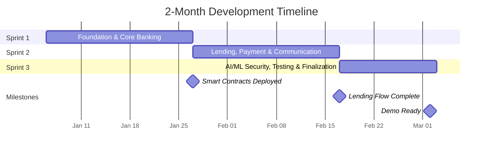

### 2.2 Sprint Breakdown

| Sprint | Duration | Focus Area | Key Deliverables |
|--------|----------|------------|-----------------|
| **Sprint 1** | Weeks 1-3 | Foundation & Core Banking | Smart contracts, basic UI, wallet integration, database schema |
| **Sprint 2** | Weeks 4-6 | Lending, Payment & Communication | Loan requests, installments, borrowing limits, chat, income verification, bank hierarchy |
| **Sprint 3** | Weeks 7-8 | AI/ML Security, Testing & Finalization | AI/ML integration, risk dashboard, profiles, market data, testing, documentation |

---

## 3. Sprint 1: Foundation & Core Banking
**Duration:** 3 Weeks (Weeks 1-3)  
**Sprint Goal:** Establish core blockchain infrastructure and hierarchical banking structure

### 3.1 Sprint Backlog

#### Epic 1: Smart Contract Development
**Story Points:** 21

**User Stories:**

1. **US-1.1: World Bank Smart Contract**
   - **As a** system administrator  
   - **I want** a smart contract for the Crypto World Bank  
   - **So that** I can manage the global reserve and national bank relationships
   - **Acceptance Criteria:**
     - Contract deployed on testnet
     - Functions: depositToReserve, getTotalReserve
     - Events: ReserveDeposited
     - **Story Points:** 5

2. **US-1.2: National Bank Smart Contract**
   - **As a** national bank administrator  
   - **I want** a smart contract for national banks  
   - **So that** I can borrow from World Bank and lend to Local Banks
   - **Acceptance Criteria:**
     - Contract with borrowing/lending functions
     - Relationship with World Bank contract
     - **Story Points:** 5

3. **US-1.3: Local Bank Smart Contract**
   - **As a** local bank administrator  
   - **I want** a smart contract for local banks  
   - **So that** I can borrow from National Banks and lend to users
   - **Acceptance Criteria:**
     - Contract with borrowing/lending functions
     - Relationship with National Bank contract
     - **Story Points:** 5

4. **US-1.4: Role-Based Access Control**
   - **As a** system administrator  
   - **I want** role-based access control in smart contracts  
   - **So that** only authorized users can perform specific actions
   - **Acceptance Criteria:**
     - Roles: World Bank Admin, National Bank Admin, Local Bank Admin, Bank User, Borrower
     - Modifiers for each role
     - **Story Points:** 3

5. **US-1.5: Gas Cost Management**
   - **As a** borrower  
   - **I want** gas costs deducted from my loan amount  
   - **So that** I understand the true cost of borrowing
   - **Acceptance Criteria:**
     - Gas estimation displayed before transaction confirmation
     - Gas fees borne by transaction initiator (borrower for loan requests, approver for approvals)
     - Polygon PoS low-fee environment ($0.001-$0.01 per tx) for retail viability
     - **Story Points:** 3

#### Epic 2: Frontend Foundation
**Story Points:** 13

**User Stories:**

6. **US-1.6: Wallet Connection**
   - **As a** user  
   - **I want** to connect my MetaMask or WalletConnect wallet  
   - **So that** I can interact with the platform
   - **Acceptance Criteria:**
     - MetaMask integration
     - WalletConnect support
     - Network switching (Sepolia/Mumbai)
     - **Story Points:** 3

7. **US-1.7: Dashboard UI**
   - **As a** user  
   - **I want** a dashboard showing my account overview  
   - **So that** I can see my balance and activity
   - **Acceptance Criteria:**
     - Material Design 3 UI
     - Responsive layout
     - Blockchain-themed visual elements
     - **Story Points:** 5

8. **US-1.8: Navigation & Layout**
   - **As a** user  
   - **I want** intuitive navigation  
   - **So that** I can access all features easily
   - **Acceptance Criteria:**
     - AppBar with wallet connection
     - Bottom navigation for mobile
     - Role-based menu items
     - **Story Points:** 3

9. **US-1.9: Blockchain Visual Elements**
   - **As a** user  
   - **I want** visual reminders that this is blockchain technology  
   - **So that** I understand the security and transparency
   - **Acceptance Criteria:**
     - Blockchain-themed animations
     - Transaction hash displays
     - Security badges
     - **Story Points:** 2

#### Epic 3: Database Schema
**Story Points:** 8

**User Stories:**

10. **US-1.10: Database Design**
    - **As a** developer  
    - **I want** a complete database schema  
    - **So that** I can store all system data
    - **Acceptance Criteria:**
      - All tables defined (see CSE370 documentation)
      - Relationships established
      - Indexes created
      - **Story Points:** 5

11. **US-1.11: Database Migration Scripts**
    - **As a** developer  
    - **I want** database migration scripts  
    - **So that** I can deploy the database easily
    - **Acceptance Criteria:**
      - Migration scripts for all tables
      - Seed data for testing
      - **Story Points:** 3

### 3.2 Sprint 1 Burndown

**Total Story Points:** 42  
**Team Velocity:** ~21 points per week (estimated)

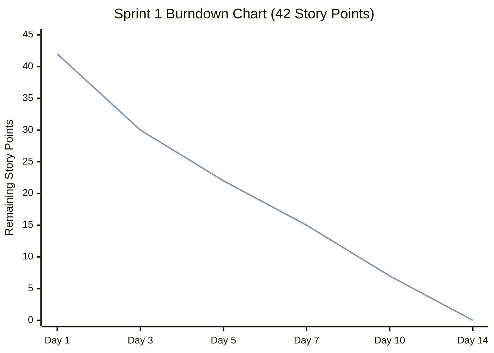

| Day | Planned | Completed | Remaining |
|-----|---------|-----------|-----------|
| Day 1 | 0 | 0 | 42 |
| Day 3 | 14 | 12 | 30 |
| Day 5 | 21 | 20 | 22 |
| Day 7 | 28 | 27 | 15 |
| Day 10 | 35 | 35 | 7 |
| Day 14 | 42 | 42 | 0 |

### 3.3 Sprint 1 Deliverables

- ✅ Smart contracts deployed on testnet
- ✅ Basic frontend with wallet connection
- ✅ Database schema implemented
- ✅ Role-based access control working
- ✅ Dashboard UI with blockchain elements

---

## 4. Sprint 2: Lending & Payment Features
**Duration:** 3 Weeks (Weeks 4-6)  
**Sprint Goal:** Implement complete lending flow with installment payments and communication

### 4.1 Sprint Backlog

#### Epic 4: Loan Management
**Story Points:** 21

**User Stories:**

12. **US-2.1: Loan Request System**
    - **As a** borrower  
    - **I want** to request a loan from a local bank  
    - **So that** I can borrow money
    - **Acceptance Criteria:**
      - Request form with amount and purpose
      - One request per bank per user
      - Request stored on blockchain
      - **Story Points:** 5

13. **US-2.2: Loan Approval/Rejection**
    - **As a** bank user  
    - **I want** to approve or reject loan requests  
    - **So that** I can manage lending
    - **Acceptance Criteria:**
      - View pending requests
      - Approve/reject functionality
      - Only one approver per bank
      - **Story Points:** 5

14. **US-2.3: First-Time Borrower Verification**
    - **As a** bank user  
    - **I want** to review income proof documents  
    - **So that** I can verify first-time borrowers
    - **Acceptance Criteria:**
      - File upload for income proof
      - Document storage (IPFS or encrypted)
      - Approval/rejection workflow
      - **Story Points:** 5

15. **US-2.4: Borrowing Limit Calculation**
    - **As a** system  
    - **I want** to calculate borrowing limits  
    - **So that** users cannot exceed their limits
    - **Acceptance Criteria:**
      - 6-month and 1-year limit calculations
      - Transaction history tracking
      - Exception for 3+ consecutive paid loans
      - **Story Points:** 5

16. **US-2.5: Loan Request Visibility**
    - **As a** borrower  
    - **I want** my loan requests to disappear after approval  
    - **So that** I don't see duplicate requests
    - **Acceptance Criteria:**
      - Requests hidden after approval
      - Request list in borrower profile
      - **Story Points:** 1

#### Epic 5: Installment Payment System
**Story Points:** 13

**User Stories:**

17. **US-2.6: Installment Payment Logic**
    - **As a** borrower  
    - **I want** to pay loans in installments if amount >= 100 ETH  
    - **So that** I can manage large loans
    - **Acceptance Criteria:**
      - Automatic installment setup for >= 100 ETH
      - Configurable number of installments
      - Payment schedule generation
      - **Story Points:** 5

18. **US-2.7: Installment Payment Interface**
    - **As a** borrower  
    - **I want** to see and pay installments  
    - **So that** I can track my payments
    - **Acceptance Criteria:**
      - Installment list in dashboard
      - Pay installment button
      - Payment confirmation
      - **Story Points:** 5

19. **US-2.8: Deadline Tracking**
    - **As a** borrower  
    - **I want** to see payment deadlines  
    - **So that** I know when payments are due
    - **Acceptance Criteria:**
      - Deadline display in dashboard
      - Overdue warnings
      - Countdown timer
      - **Story Points:** 3

#### Epic 6: Chat System
**Story Points:** 13

**User Stories:**

20. **US-2.9: Borrower-Bank Chat**
    - **As a** borrower  
    - **I want** to chat with the bank about my loan  
    - **So that** I can ask questions
    - **Acceptance Criteria:**
      - Real-time chat interface
      - Message history
      - Read/unread status
      - **Story Points:** 8

21. **US-2.10: Chat Notifications**
    - **As a** user  
    - **I want** notifications for new messages  
    - **So that** I don't miss important communications
    - **Acceptance Criteria:**
      - Push notifications (optional)
      - In-app notifications
      - Unread message count
      - **Story Points:** 5

#### Epic 7: Profile Management
**Story Points:** 8

**User Stories:**

22. **US-2.11: User Profile Pages**
    - **As a** user  
    - **I want** a dedicated profile section  
    - **So that** I can manage my account
    - **Acceptance Criteria:**
      - Profile pages for all user types
      - Role-specific features
      - Terms and conditions page
      - **Story Points:** 5

23. **US-2.12: Terms and Conditions**
    - **As a** user  
    - **I want** to view terms and conditions  
    - **So that** I understand the platform rules
    - **Acceptance Criteria:**
      - Terms page in profile
      - Acceptance tracking
      - Version control
      - **Story Points:** 3

#### Epic 7b: QR Code System
**Story Points:** 3

**User Stories:**

24. **US-2.13: QR Code Generation & Scanning**
    - **As a** user  
    - **I want** to generate and scan QR codes for wallet addresses and loan pages  
    - **So that** I can quickly share and access information
    - **Acceptance Criteria:**
      - Generate QR for wallet address, loan page URL, or contract address
      - Scan/paste QR content with type-based action (view address, navigate, display raw)
      - **Story Points:** 3

### 4.2 Sprint 2 Burndown

**Total Story Points:** 58  
**Team Velocity:** ~27 points per week (estimated)

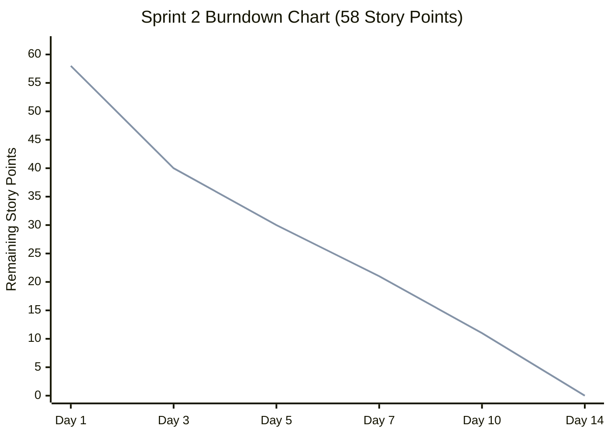

| Day | Planned | Completed | Remaining |
|-----|---------|-----------|-----------|
| Day 1 | 0 | 0 | 58 |
| Day 3 | 19 | 18 | 40 |
| Day 5 | 29 | 28 | 30 |
| Day 7 | 38 | 37 | 21 |
| Day 10 | 48 | 47 | 11 |
| Day 14 | 58 | 58 | 0 |

### 4.3 Sprint 2 Deliverables

- ✅ Complete loan request and approval system
- ✅ Installment payment functionality
- ✅ Deadline tracking in dashboard
- ✅ Chat system between borrowers and banks
- ✅ Profile pages for all user types
- ✅ Terms and conditions page

---

## 5. Sprint 3: Advanced Features & Security
**Duration:** 2 Weeks (Weeks 7-8)  
**Sprint Goal:** Implement AI/ML security, market data visualization, AI chatbot, and finalize testing & documentation

### 5.1 Sprint Backlog

#### Epic 8: Market Data Visualization
**Story Points:** 8

**User Stories:**

25. **US-3.1: Cryptocurrency Market Data API**
    - **As a** developer  
    - **I want** to fetch live cryptocurrency prices  
    - **So that** users can see market data
    - **Acceptance Criteria:**
      - Integration with CoinGecko/CoinMarketCap API
      - Real-time price updates
      - Data caching
      - **Story Points:** 3

26. **US-3.2: Market Value Graph**
    - **As a** borrower  
    - **I want** to see a graph of cryptocurrency prices  
    - **So that** I can track market trends
    - **Acceptance Criteria:**
      - Interactive graph (Chart.js/Recharts)
      - Live updates
      - Historical data display
      - **Story Points:** 5

#### Epic 9: AI Chatbot
**Story Points:** 13

**User Stories:**

27. **US-3.3: AI Chatbot Integration**
    - **As a** user  
    - **I want** to ask an AI chatbot questions  
    - **So that** I can get instant help
    - **Acceptance Criteria:**
      - Chatbot interface
      - Natural language processing
      - Context-aware responses
      - **Story Points:** 5

28. **US-3.4: Chatbot Training Data**
    - **As a** developer  
    - **I want** to train the chatbot  
    - **So that** it can answer common questions
    - **Acceptance Criteria:**
      - Training dataset
      - Intent recognition
      - Response generation
      - **Story Points:** 5

29. **US-3.5: Chatbot Features**
    - **As a** user  
    - **I want** the chatbot to answer questions about loan limits and payments  
    - **So that** I can get quick information
    - **Acceptance Criteria:**
      - "What is my loan limit?" query
      - "How much do I owe this month?" query
      - "Which bank should I contact?" query
      - **Story Points:** 3

#### Epic 10: AI/ML Security Layer
**Story Points:** 21

**User Stories:**

30. **US-3.6: Data Collection for ML**
    - **As a** developer  
    - **I want** to collect transaction data  
    - **So that** ML models can be trained
    - **Acceptance Criteria:**
      - Transaction logging
      - Feature extraction
      - Data pipeline
      - **Story Points:** 5

31. **US-3.7: Fraud Detection Model**
    - **As a** system  
    - **I want** to detect fraudulent loan requests  
    - **So that** I can protect the platform
    - **Acceptance Criteria:**
      - ML model for fraud detection
      - Risk scoring
      - Integration with loan approval
      - **Story Points:** 8

32. **US-3.8: Anomaly Detection**
    - **As a** system  
    - **I want** to detect anomalous transactions  
    - **So that** I can identify suspicious activity
    - **Acceptance Criteria:**
      - Anomaly detection algorithm
      - Alert system
      - Dashboard visualization
      - **Story Points:** 5

33. **US-3.9: Security Logging**
    - **As a** developer  
    - **I want** to log all security events  
    - **So that** I can monitor and improve security
    - **Acceptance Criteria:**
      - Security log table
      - Event tracking
      - Dashboard for bank users
      - **Story Points:** 3

#### Epic 11: Testing & Quality Assurance
**Story Points:** 13

**User Stories:**

34. **US-3.10: Unit Testing**
    - **As a** developer  
    - **I want** unit tests for all smart contracts  
    - **So that** I can ensure code quality
    - **Acceptance Criteria:**
      - Test coverage > 80%
      - All critical functions tested
      - **Story Points:** 5

35. **US-3.11: Integration Testing**
    - **As a** developer  
    - **I want** integration tests  
    - **So that** I can verify system components work together
    - **Acceptance Criteria:**
      - End-to-end test scenarios
      - API integration tests
      - **Story Points:** 5

36. **US-3.12: Security Testing**
    - **As a** developer  
    - **I want** security audits  
    - **So that** I can identify vulnerabilities
    - **Acceptance Criteria:**
      - Smart contract audit
      - Penetration testing
      - **Story Points:** 3

### 5.2 Sprint 3 Burndown

**Total Story Points:** 55  
**Team Velocity:** ~27 points per week (estimated)

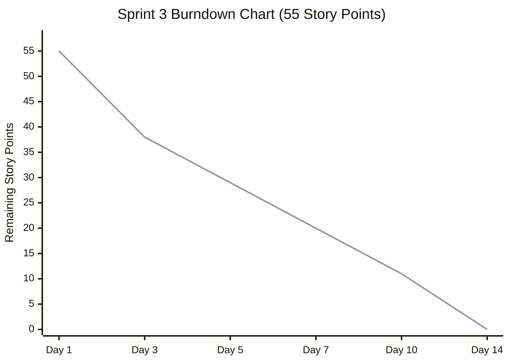

| Day | Planned | Completed | Remaining |
|-----|---------|-----------|-----------|
| Day 1 | 0 | 0 | 55 |
| Day 3 | 18 | 17 | 38 |
| Day 5 | 27 | 26 | 29 |
| Day 7 | 36 | 35 | 20 |
| Day 10 | 45 | 44 | 11 |
| Day 14 | 55 | 55 | 0 |

### 5.3 Sprint 3 Deliverables

- ✅ Live cryptocurrency market data visualization
- ✅ AI chatbot for user support
- ✅ AI/ML security layer foundation
- ✅ Comprehensive testing suite
- ✅ Security audit completed

### 5.4 Integration, Testing & Deployment (Weeks 7-8)

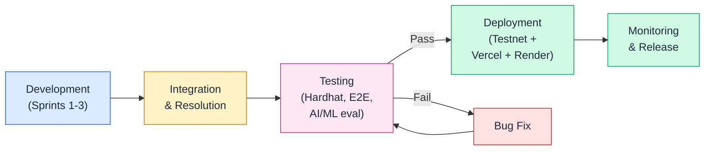

These activities run in parallel with Sprint 3 development:

**Integration Activities:**
- Integrate all sprint deliverables
- Resolve integration issues
- Performance optimization

**Testing Checklist:**
- [ ] Smart contract functionality (Hardhat unit tests)
- [ ] Frontend-backend integration
- [ ] Database operations (PostgreSQL)
- [ ] Chat system real-time communication (WebSocket)
- [ ] Installment payment flow (on-chain)
- [ ] AI chatbot responses (NLP pipeline)
- [ ] Market data updates (CoinGecko API + Redis cache)
- [ ] Security layer monitoring (AI/ML risk scores)
- [ ] Mobile responsiveness
- [ ] Cross-browser compatibility

**Deployment Activities:**
- Deploy smart contracts to testnet (Polygon Mumbai / Ethereum Sepolia)
- Deploy frontend (Vercel free tier)
- Deploy backend API (Render free tier)
- Set up monitoring (application and blockchain event listeners)

**Release Checklist:**
- [ ] All features implemented
- [ ] All tests passing
- [ ] Security audit completed
- [ ] Documentation complete
- [ ] Production deployment successful
- [ ] Monitoring active

---

## 5.5 Sprint Story Points Distribution

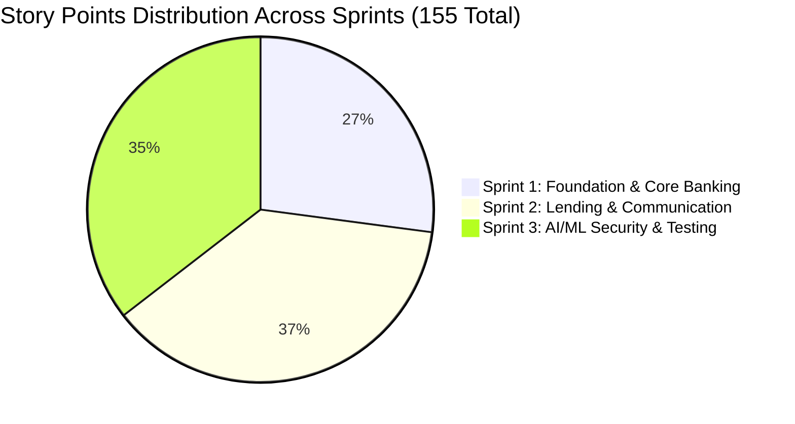

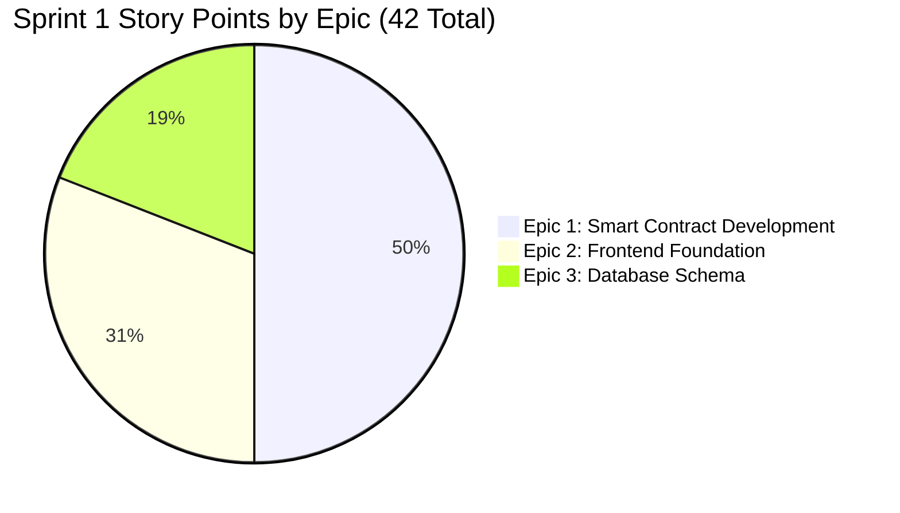

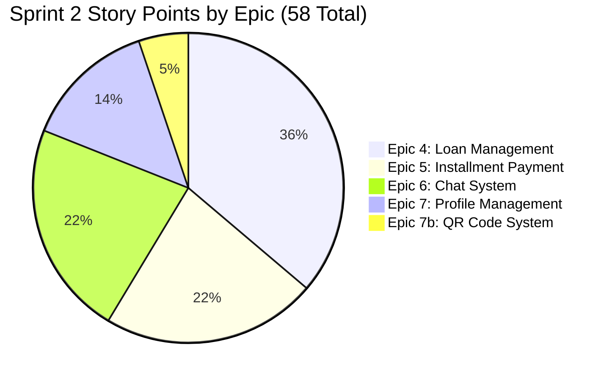

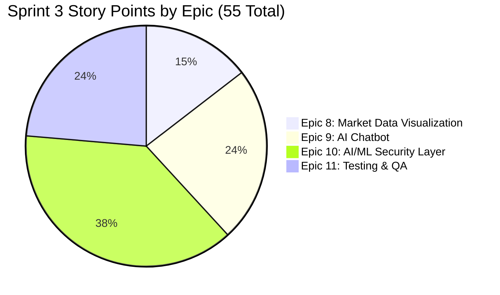

---

## 5.6 Agile/Scrum Process Flow

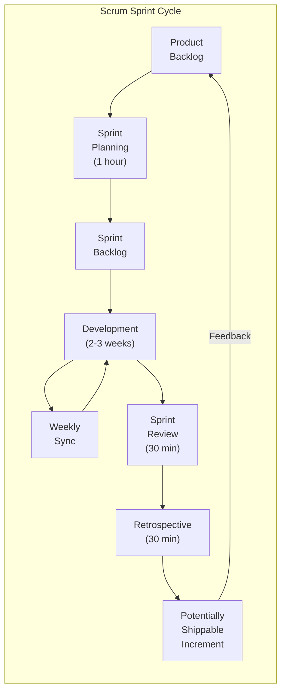

---

## 6. Agile Artifacts

### 6.1 Product Backlog

The complete product backlog includes all user stories from all sprints, plus additional items for future releases:

**Future Features (Post-MVP):**
- Multi-cryptocurrency support
- Advanced ML models (LSTM, Transformer)
- Mobile apps (iOS/Android)
- Internationalization (i18n)
- Advanced analytics dashboard
- Automated loan approval using ML
- Credit scoring system

### 6.2 Sprint Backlog

Each sprint has its own backlog (detailed in sections 3, 4, and 5).

### 6.3 Definition of Done

A user story is considered "Done" when:
- ✅ Code is written and reviewed
- ✅ Unit tests are written and passing
- ✅ Integration tests are passing
- ✅ Documentation is updated
- ✅ Code is merged to main branch
- ✅ Feature is deployed to staging
- ✅ Product Owner has accepted the story

### 6.4 Definition of Ready

A user story is "Ready" for sprint planning when:
- ✅ User story is clearly written
- ✅ Acceptance criteria are defined
- ✅ Story points are estimated
- ✅ Dependencies are identified
- ✅ Technical feasibility is confirmed

---

## 7. Team Roles & Responsibilities

### 7.1 Team Structure

This is a 2-person thesis project. Both members share responsibilities across all domains.

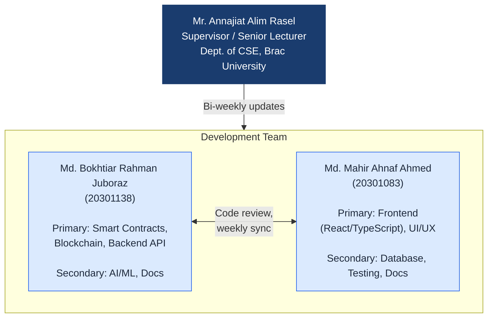

| Team Member | Primary Focus | Secondary Focus |
|-------------|---------------|-----------------|
| **Md. Bokhtiar Rahman Juboraz (20301138)** | Smart contract development, blockchain integration, backend API | AI/ML model development, documentation |
| **Md. Mahir Ahnaf Ahmed (20301083)** | Frontend development (React/TypeScript), UI/UX design | Database design, testing, documentation |

**Supervisor:** Mr. Annajiat Alim Rasel, Senior Lecturer, Dept. of CSE, Brac University

### 7.2 Collaboration Process

**Weekly Sync Format:**
1. What was completed this week?
2. What is planned for next week?
3. Are there any blockers or dependency issues?

**Code Review:** All pull requests reviewed by the other team member before merge.

---

## 8. Risk Management

### 8.1 Identified Risks

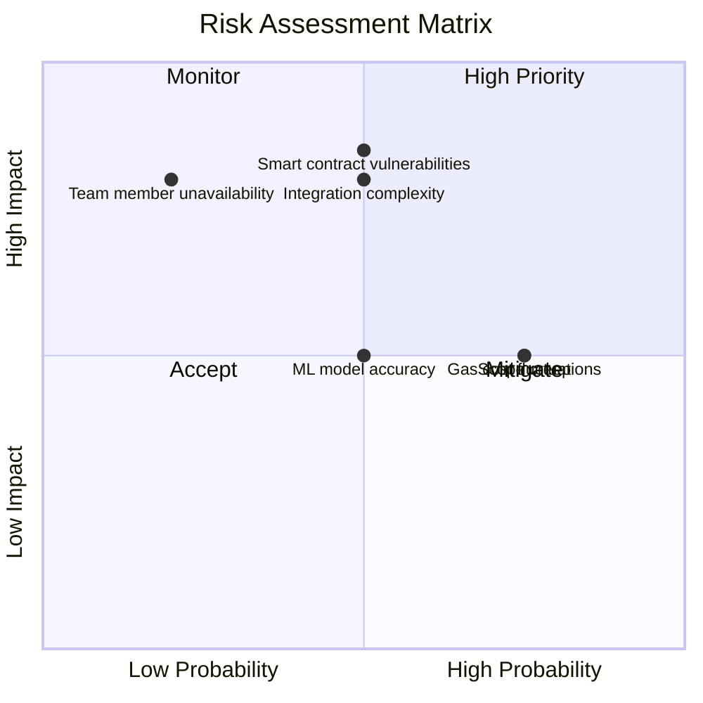

| Risk | Probability | Impact | Mitigation Strategy |
|------|-------------|--------|---------------------|
| Smart contract vulnerabilities | Medium | High | Security audit, extensive testing |
| Gas cost fluctuations | High | Medium | Gas optimization, cost estimation |
| ML model accuracy | Medium | Medium | Continuous training, human review |
| Integration complexity | Medium | High | Early integration, frequent testing |
| Scope creep | High | Medium | Strict sprint boundaries, backlog management |
| Team member unavailability | Low | High | Cross-training, documentation |

### 8.2 Risk Response Plan

- **High Priority Risks:** Weekly review and mitigation
- **Medium Priority Risks:** Bi-weekly review
- **Low Priority Risks:** Monthly review

---

## 9. Metrics & KPIs

### 9.1 Sprint Metrics

- **Velocity:** Story points completed per sprint
- **Burndown:** Progress tracking
- **Sprint Goal Achievement:** % of sprint goal met

### 9.2 Quality Metrics

- **Test Coverage:** > 80%
- **Bug Density:** < 5 bugs per 1000 lines of code
- **Code Review Coverage:** 100%

### 9.3 Performance Metrics

- **Page Load Time:** < 2 seconds
- **Transaction Confirmation:** < 30 seconds
- **API Response Time:** < 500ms

---

## 10. Communication Plan

### 10.1 Communication Channels

- **Weekly Sync:** Progress review, blockers, planning
- **Sprint Planning:** 1 hour, start of sprint
- **Sprint Review:** 30 minutes, end of sprint
- **Retrospective:** 30 minutes, end of sprint
- **Supervisor Updates:** Bi-weekly

### 10.2 Tools

- **Version Control:** GitHub (primary collaboration platform)
- **Documentation:** Overleaf (LaTeX report), Markdown files in repository
- **Communication:** In-person meetings, email (professor updates bi-weekly)
- **IDE:** VS Code with Cursor AI assistant
- **CI/CD:** GitHub Actions (planned)

---

## 11. SDLC Stage Mapping

The Agile sprint structure maps to the standard Software Development Life Cycle (SDLC) stages (ref: [GeeksforGeeks SDLC](https://www.geeksforgeeks.org/software-engineering/software-development-life-cycle-sdlc/)):

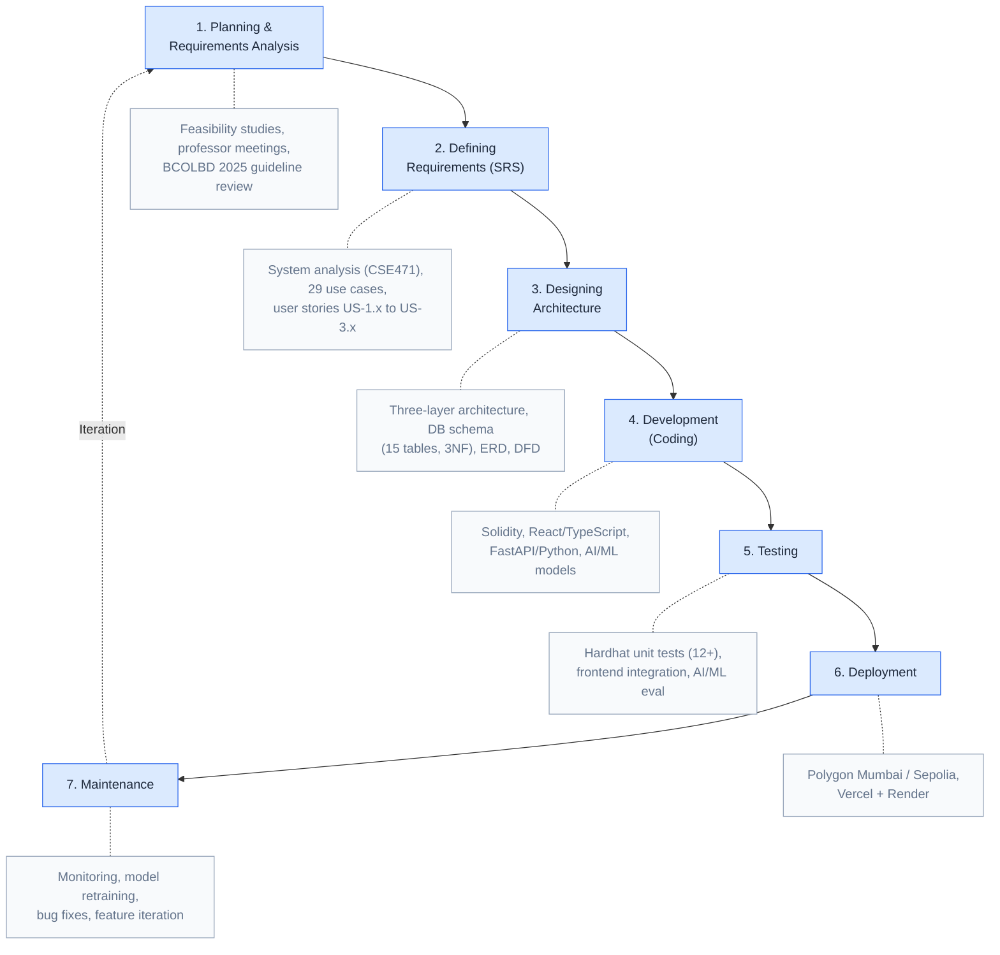

| SDLC Stage | Project Activity | Timeline |
|------------|------------------|----------|
| **1. Planning & Requirements Analysis** | Feasibility studies (technical, economic, operational, schedule); professor meetings; BCOLBD 2025 guideline review; stakeholder requirement gathering | Pre-Sprint |
| **2. Defining Requirements (SRS)** | System analysis (CSE471); use case definitions (29 use cases); non-functional requirements; system constraints; user stories (US-1.x through US-3.x) | Pre-Sprint + Sprint 1 |
| **3. Designing Architecture** | Three-layer architecture (Presentation, Smart Contract, Off-chain); database schema (15 tables, 3NF); component diagram; data flow diagram; ERD | Sprint 1 |
| **4. Development (Coding)** | Smart contracts (Solidity), frontend (React/TypeScript), backend (FastAPI/Python), AI/ML models | Sprints 1–3 |
| **5. Testing** | Hardhat unit tests (12+ tests); frontend integration tests; AI/ML model evaluation; end-to-end testing | Week 7 (Integration & Testing) |
| **6. Deployment** | Testnet deployment (Polygon Mumbai / Ethereum Sepolia); frontend on Vercel; backend on Render | Week 8 (Release) |
| **7. Maintenance** | Post-deployment monitoring; AI/ML model retraining; bug fixes; feature iteration | Post-Release |

---

## 12. Design Decisions and Alternatives Considered

Per professor requirement: *"For every decision you take, first present the alternative and then justify your first and second choices."*

The complete decision justification document is maintained in `DECISION_JUSTIFICATION_PLAN.md`. Summary:

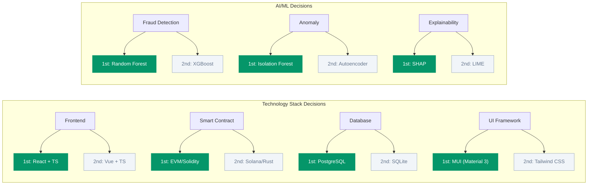

| Decision Area | 1st Choice | 2nd Choice | Key Criterion |
|---------------|------------|------------|---------------|
| Development Methodology | Agile / Scrum | Incremental / Spiral | Evolving scope, sprint milestones |
| Software Architecture | DApp + Off-chain AI | Hybrid with Oracle | Gas cost, ML iteration flexibility |
| Frontend Framework | React + TypeScript | Vue + TypeScript | Web3 library ecosystem (Wagmi, RainbowKit) |
| Smart Contract Platform | Ethereum / EVM (Solidity) | Solana (Rust) | Largest ecosystem, free testnets, OpenZeppelin |
| UI Design System | Material Design 3 (MUI) | Tailwind CSS | Professional banking UI, development speed |
| Release Cycle | Incremental releases | Continuous deployment | Professor milestones, integration risk |
| Fraud Detection Algorithm | Random Forest | XGBoost | SHAP compatibility, 94%+ precision |
| Anomaly Detection | Isolation Forest | Autoencoder | Unsupervised, no labeled data needed |
| XAI Method | SHAP | LIME | Theoretical foundation, regulatory compliance |
| Database | PostgreSQL | SQLite | CSE370 alignment, 3NF schema, async support |
| Hosting / Deployment | Vercel + Render | Localhost | $0 cost, public URL, CI/CD |

Each decision includes 2–3 alternatives evaluated, the chosen option with justification, and a backup option with rationale for when it would be preferred. See `DECISION_JUSTIFICATION_PLAN.md` for full details including criteria analysis.

---

## 13. Conclusion

This Agile development plan provides a structured approach to building the Crypto World Bank platform over 2 months with 3 sprints. The methodology ensures:

- Incremental delivery of features aligned with SDLC stages
- Continuous feedback and improvement through sprint reviews
- Risk mitigation through early testing and integration
- Justified design decisions with documented alternatives
- Quality assurance throughout development

The plan is flexible and can be adjusted based on team velocity and changing requirements.

---

**Document Version:** 3.0  
**Last Updated:** February 2026  
**Author:** Software Engineering Team  
**Course:** CSE470 - Software Engineering

