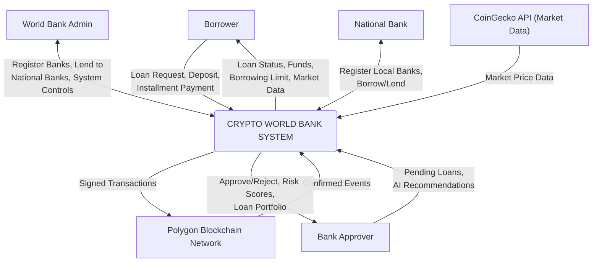
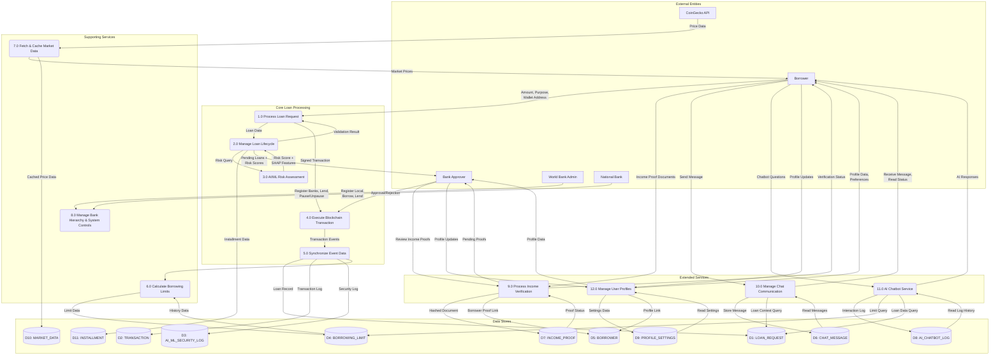

# Data Flow Diagrams
## Crypto World Bank System

---

### Context Diagram (Level 0)

---

### Level 1 DFD

**Processes:**
1.0 Process Loan Request — Validates input, checks limits, prepares transaction
2.0 Manage Loan Lifecycle — Tracks status (pending → approved/rejected → active → completed); creates installment records
3.0 AI/ML Risk Assessment — Fraud detection (RF), anomaly detection (IF), SHAP explanations
4.0 Execute Blockchain Transaction — Signs and broadcasts to Polygon PoS
5.0 Synchronize Event Data — Listens to on-chain events, persists to PostgreSQL
6.0 Calculate Borrowing Limits — 6-month and 1-year rolling window computations
7.0 Fetch & Cache Market Data — External API → Redis cache → frontend; persists to MARKET_DATA store
8.0 Manage Bank Hierarchy & System Controls — Registration, lending, pause/unpause
9.0 Process Income Verification — Upload, validate, hash, store files; bank review and approval
10.0 Manage Chat Communication — Send/receive messages between borrowers and banks; track read status
11.0 AI Chatbot Service — NLP intent classification, data querying, response generation, interaction logging
12.0 Manage User Profiles — Profile CRUD, terms acceptance, preferences management

**Data Stores:**
D1: LOAN_REQUEST — loan applications and their statuses
D2: TRANSACTION — blockchain transaction records
D3: AI_ML_SECURITY_LOG — AI/ML model predictions and security audit logs
D4: BORROWING_LIMIT — computed borrowing limits per borrower
D5: BORROWER — borrower registration and identity data
D6: CHAT_MESSAGE — borrower-bank chat messages
D7: INCOME_PROOF — income verification documents
D8: AI_CHATBOT_LOG — chatbot interaction logs
D9: PROFILE_SETTINGS — user profiles and preferences
D10: MARKET_DATA — cryptocurrency price data
D11: INSTALLMENT — installment payment records
