# All Mermaid Diagrams — Master Source Archive

Every diagram used in `Pre-thesis_v11.tex` is stored here as **Mermaid source**.
PNG files in `Diagrams/mermaid-pdf/` are generated from this file and `new-diagrams-build.md`.

**Regenerate this file:** `python3 tools/rebuild_all_diagrams_md.py`  
**Build PNGs:** `python3 tools/build_mermaid_pdfs.py`

---

## Part 1 — CSE471 system analysis (UML, DFD, sequences)

## Component Diagram

- **Rendered PNG:** `Diagrams/mermaid-pdf/component-diagram.png`
- **Mermaid archive:** `Diagrams/mermaid-src/component-diagram.mmd`

```mermaid
graph TB

    subgraph PL["️ PRESENTATION LAYER"]
        direction TB

        subgraph PL_Core["Core Modules"]
            direction TB
            Dashboard["Dashboard\n<i>IDashboard</i>"]
            LoanModule["Loan Module\n<i>ILoanService</i>"]
            AdminPanel["Admin Panel\n<i>IAdminService</i>"]
        end

        subgraph PL_Features["Feature Modules"]
            direction TB
            RiskDash["Risk Dashboard\n<i>IRiskService</i>"]
            ChatModule["Chat Module\n<i>IChatService</i>"]
            ChatbotUI["Chatbot UI\n<i>IChatbotUI</i>"]
        end

        subgraph PL_Utility["Utility Modules"]
            direction TB
            ProfileMod["Profile Module\n<i>IProfileService</i>"]
            MarketMod["Market Data\n<i>IMarketDataView</i>"]
            QRModule["QR Module\n<i>IQRService</i>"]
            WalletProv["Wallet Provider\n<i>Wagmi + RainbowKit</i>"]
        end
    end

    subgraph SCL["️ SMART CONTRACT LAYER"]
        direction TB

        subgraph SC_Contracts["Contracts (Solidity 0.8.20)"]
            direction TB
            WBReserve["WorldBankReserve\n<i>IReserve</i>"]
            WBReserveOps["depositToReserve( )\nregisterNatBank( )\nlendToNatBank( )\npause( ) / unpause( )\nemergencyWithdraw( )"]

            NatBankC["NationalBank\n<i>INationalBank</i>"]
            NatBankOps["registerLocalBank( )\nborrowFromWB( )\nlendToLocalBank( )"]

            LocBankC["LocalBank\n<i>ILocalBank</i>"]
            LocBankOps["requestLoan( )\napproveLoan( )\nrejectLoan( )\npayInstallment( )\nsetApprover( )"]
        end

        subgraph SC_Libs["Libraries"]
            direction TB
            OZ["OpenZeppelin\nReentrancyGuard\nOwnable"]
        end

        WBReserve -->|"lends to"| NatBankC
        NatBankC -->|"lends to"| LocBankC
        WBReserve -->|"implements"| WBReserveOps
        NatBankC -->|"implements"| NatBankOps
        LocBankC -->|"implements"| LocBankOps
        SC_Contracts --> OZ
    end

    subgraph BSL["️ BACKEND SERVICES LAYER"]
        direction TB

        subgraph BS_API["API Gateway"]
            direction TB
            FastAPI["FastAPI\n<i>ILoanAPI · IUserAPI · IRiskAPI</i>"]
        end

        subgraph BS_Data["Data Services"]
            direction TB
            Postgres["PostgreSQL\n<i>IDataStore</i>\n15 tables"]
            Redis["Redis Cache\n<i>ICacheService</i>"]
            FileStor["File Storage\n<i>IFileStore</i>"]
        end

        subgraph BS_Intelligence["Intelligence Services"]
            direction TB
            AIML["AI/ML Engine\n<i>IMLService</i>\nRandom Forest\nIsolation Forest\nSHAP"]
            ChatbotSvc["Chatbot Service\n<i>IChatbotService</i>"]
        end

        subgraph BS_Realtime["Realtime Services"]
            direction TB
            EventLsnr["Event Listener\n<i>IEventSync</i>"]
            WSSvc["WebSocket\n<i>IWebSocket</i>"]
            IncomeSvc["Income Proof\n<i>IIncomeService</i>"]
        end

        FastAPI --> Postgres
        FastAPI --> Redis
        FastAPI --> AIML
        FastAPI --> ChatbotSvc
        FastAPI --> IncomeSvc
        IncomeSvc --> FileStor
        EventLsnr --> Postgres
    end

    subgraph EXT[" EXTERNAL SERVICES"]
        direction TB
        MetaMask["MetaMask\n<i>IWalletAuth</i>"]
        Polygon["Polygon PoS\n<i>IConsensus</i>"]
        Alchemy["Alchemy RPC\n<i>IRPC</i>"]
        CoinGecko["CoinGecko API\n<i>IMarketData</i>"]
    end


    Dashboard -->|"read stats"| SCL
    LoanModule -->|"loan ops"| SCL
    AdminPanel -->|"admin ops"| SCL
    RiskDash -->|"risk queries"| SCL

    LoanModule -->|"REST"| FastAPI
    AdminPanel -->|"REST"| FastAPI
    RiskDash -->|"REST"| FastAPI
    ProfileMod -->|"REST"| FastAPI
    ChatbotUI -->|"REST"| FastAPI
    ChatModule -->|"ws://"| WSSvc
    MarketMod -->|"cached"| Redis

    WalletProv -->|"connect"| MetaMask
    WalletProv -->|"RPC"| Alchemy

    SC_Contracts -->|"deploy/tx"| Polygon
    SC_Contracts -->|"RPC"| Alchemy

    EventLsnr -->|"events"| Alchemy
    Redis -->|"price feed"| CoinGecko

    EventLsnr -->|"listen"| SCL

    style PL fill:#e3f2fd,stroke:#1565c0,stroke-width:2px,color:#000
    style PL_Core fill:#bbdefb,stroke:#1976d2,stroke-width:1px,color:#000
    style PL_Features fill:#bbdefb,stroke:#1976d2,stroke-width:1px,color:#000
    style PL_Utility fill:#bbdefb,stroke:#1976d2,stroke-width:1px,color:#000

    style SCL fill:#fff3e0,stroke:#e65100,stroke-width:2px,color:#000
    style SC_Contracts fill:#ffe0b2,stroke:#ef6c00,stroke-width:1px,color:#000
    style SC_Libs fill:#ffe0b2,stroke:#ef6c00,stroke-width:1px,color:#000

    style BSL fill:#e8f5e9,stroke:#2e7d32,stroke-width:2px,color:#000
    style BS_API fill:#c8e6c9,stroke:#388e3c,stroke-width:1px,color:#000
    style BS_Data fill:#c8e6c9,stroke:#388e3c,stroke-width:1px,color:#000
    style BS_Intelligence fill:#c8e6c9,stroke:#388e3c,stroke-width:1px,color:#000
    style BS_Realtime fill:#c8e6c9,stroke:#388e3c,stroke-width:1px,color:#000

    style EXT fill:#fce4ec,stroke:#c62828,stroke-width:2px,color:#000
    style WBReserveOps fill:#fff8e1,stroke:#ef6c00,stroke-width:1px,color:#000
    style NatBankOps fill:#fff8e1,stroke:#ef6c00,stroke-width:1px,color:#000
    style LocBankOps fill:#fff8e1,stroke:#ef6c00,stroke-width:1px,color:#000
```


## Use Case Diagram

- **Rendered PNG:** `Diagrams/mermaid-pdf/usecase-diagram.png`
- **Mermaid archive:** `Diagrams/mermaid-src/usecase-diagram.mmd`

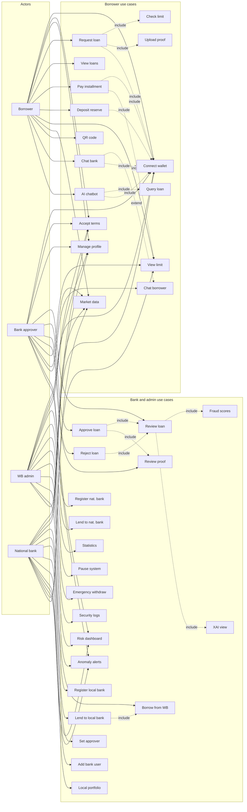


## Activity — Loan Request to Repayment

- **Rendered PNG:** `Diagrams/mermaid-pdf/activity-loan-request.png`
- **Mermaid archive:** `Diagrams/mermaid-src/activity-loan-request.mmd`

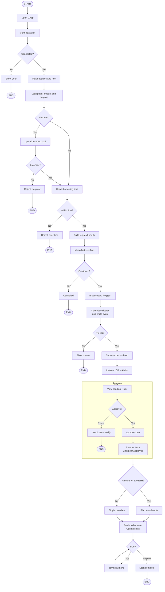


## Activity — Hierarchical Banking

- **Rendered PNG:** `Diagrams/mermaid-pdf/activity-hierarchical-banking.png`
- **Mermaid archive:** `Diagrams/mermaid-src/activity-hierarchical-banking.mmd`

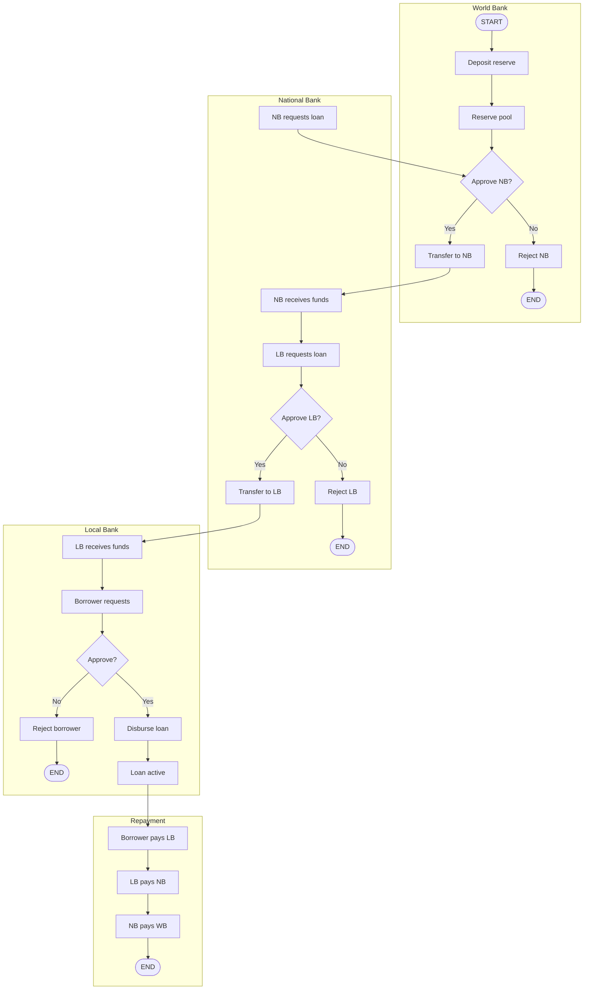


## Activity — Income Verification

- **Rendered PNG:** `Diagrams/mermaid-pdf/activity-income-verification.png`
- **Mermaid archive:** `Diagrams/mermaid-src/activity-income-verification.mmd`

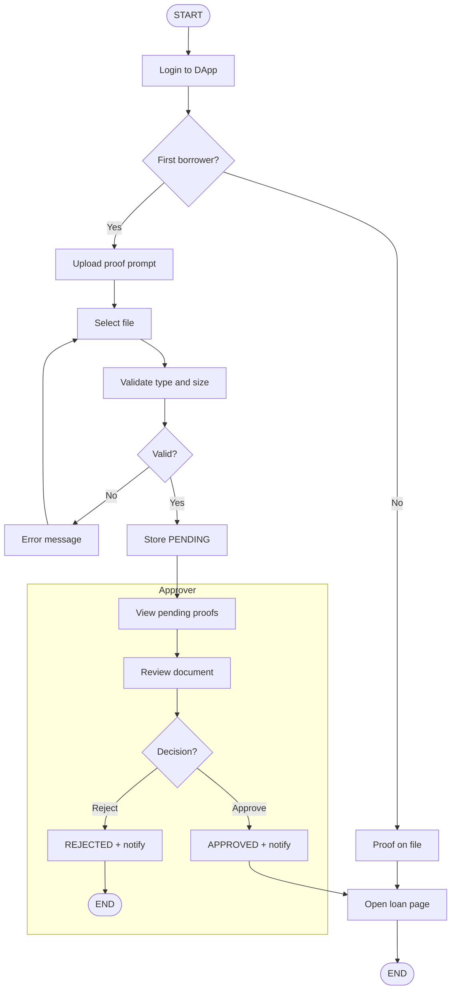


## Activity — Chat System

- **Rendered PNG:** `Diagrams/mermaid-pdf/activity-chat-system.png`
- **Mermaid archive:** `Diagrams/mermaid-src/activity-chat-system.mmd`

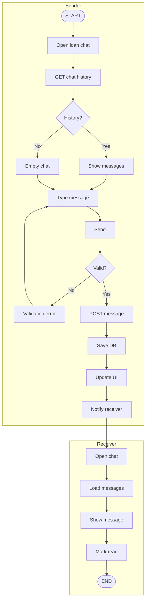


## Activity — AI Chatbot

- **Rendered PNG:** `Diagrams/mermaid-pdf/activity-ai-chatbot.png`
- **Mermaid archive:** `Diagrams/mermaid-src/activity-ai-chatbot.mmd`

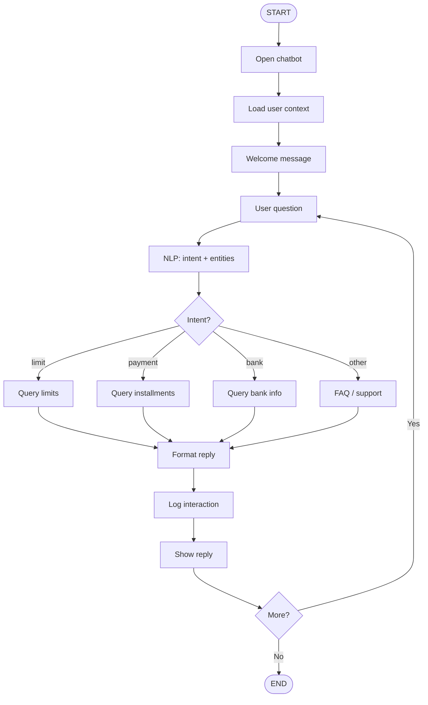


## Activity — Market Data Viewing

- **Rendered PNG:** `Diagrams/mermaid-pdf/activity-market-data.png`
- **Mermaid archive:** `Diagrams/mermaid-src/activity-market-data.mmd`

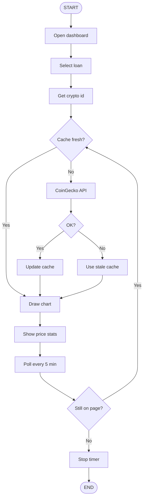


## Activity — Profile Management

- **Rendered PNG:** `Diagrams/mermaid-pdf/activity-profile-management.png`
- **Mermaid archive:** `Diagrams/mermaid-src/activity-profile-management.mmd`

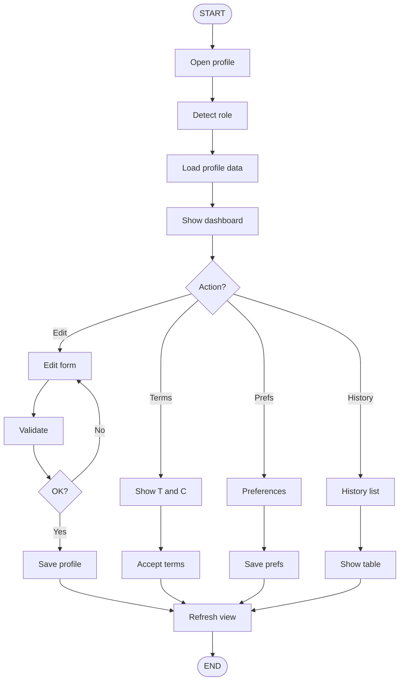


## DFD Context (Level 0)

- **Rendered PNG:** `Diagrams/mermaid-pdf/dfd-context.png`
- **Mermaid archive:** `Diagrams/mermaid-src/dfd-context.mmd`

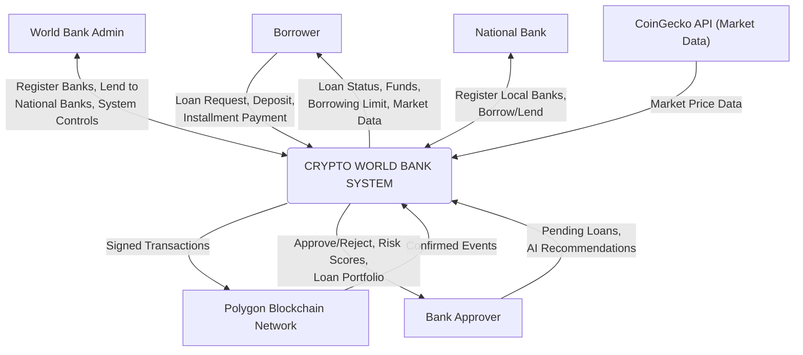


## DFD Level 1 Part 1

- **Rendered PNG:** `Diagrams/mermaid-pdf/dfd-level1-part1.png`
- **Mermaid archive:** `Diagrams/mermaid-src/dfd-level1-part1.mmd`

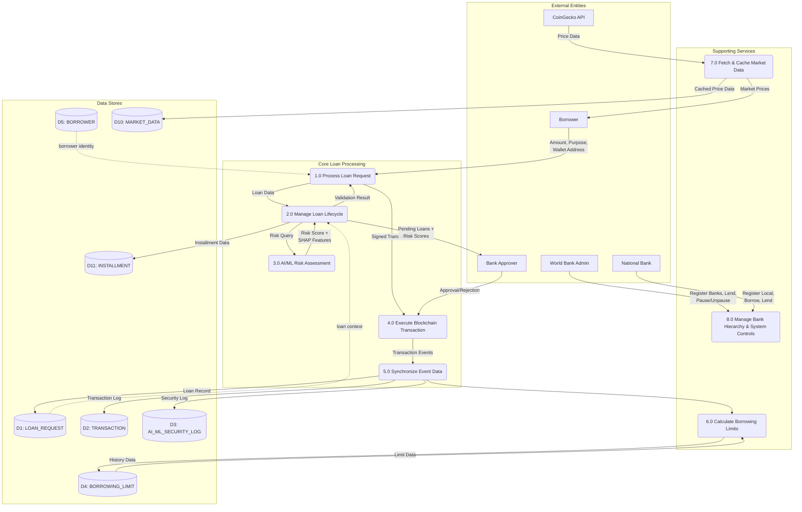


## DFD Level 1 Part 2

- **Rendered PNG:** `Diagrams/mermaid-pdf/dfd-level1-part2.png`
- **Mermaid archive:** `Diagrams/mermaid-src/dfd-level1-part2.mmd`

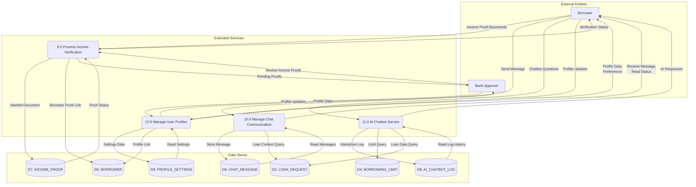


## Sequence 1 — Loan Approval

- **Rendered PNG:** `Diagrams/mermaid-pdf/sequence-loan-approval.png`
- **Mermaid archive:** `Diagrams/mermaid-src/sequence-loan-approval.mmd`

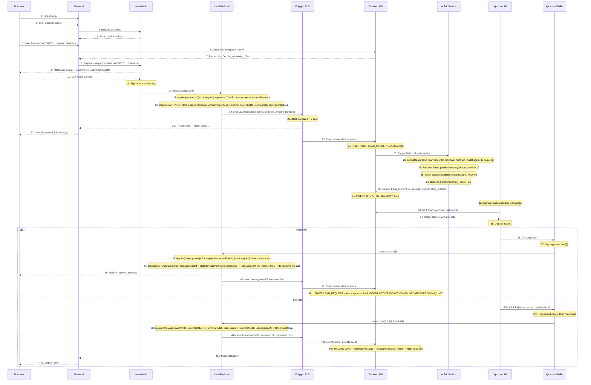


## Sequence 1B — Reject Path

- **Rendered PNG:** `Diagrams/mermaid-pdf/sequence-reject-path.png`
- **Mermaid archive:** `Diagrams/mermaid-src/sequence-reject-path.mmd`

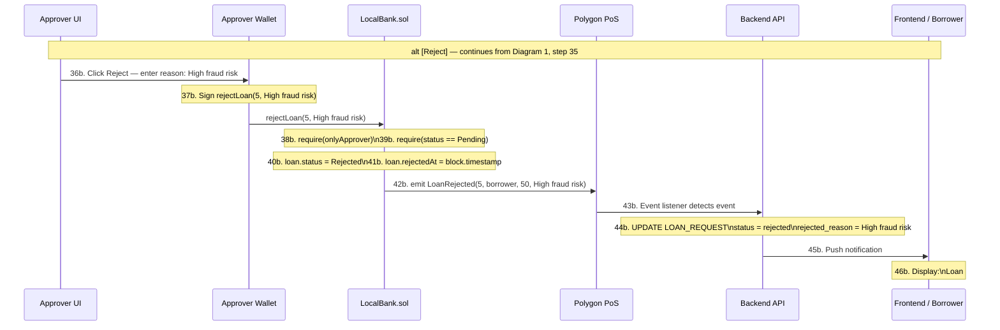


## Sequence 2 — Installment Loop

- **Rendered PNG:** `Diagrams/mermaid-pdf/sequence-installment.png`
- **Mermaid archive:** `Diagrams/mermaid-src/sequence-installment.mmd`

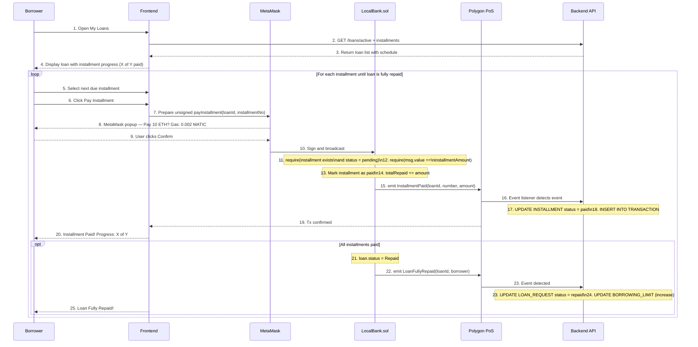


## Sequence 3 — Income Verification

- **Rendered PNG:** `Diagrams/mermaid-pdf/sequence-income-verification.png`
- **Mermaid archive:** `Diagrams/mermaid-src/sequence-income-verification.mmd`

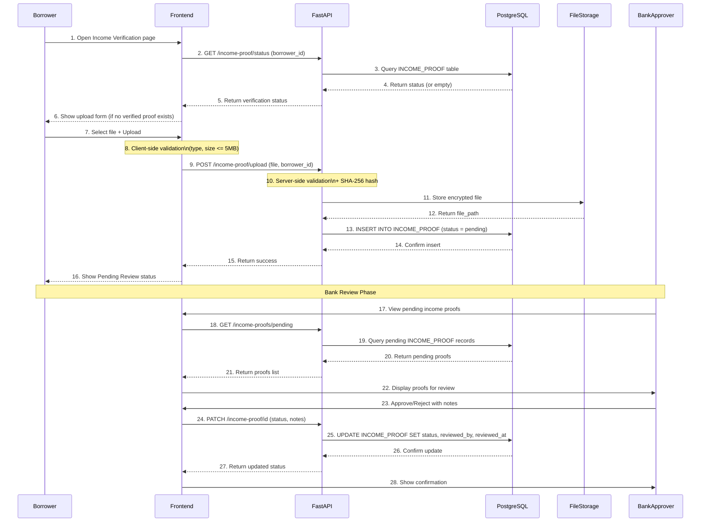


## Sequence 4 — Chat System

- **Rendered PNG:** `Diagrams/mermaid-pdf/sequence-chat-system.png`
- **Mermaid archive:** `Diagrams/mermaid-src/sequence-chat-system.mmd`

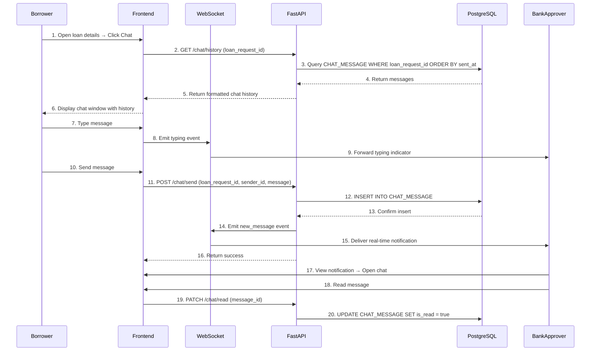


## Sequence 5 — AI Chatbot

- **Rendered PNG:** `Diagrams/mermaid-pdf/sequence-ai-chatbot.png`
- **Mermaid archive:** `Diagrams/mermaid-src/sequence-ai-chatbot.mmd`

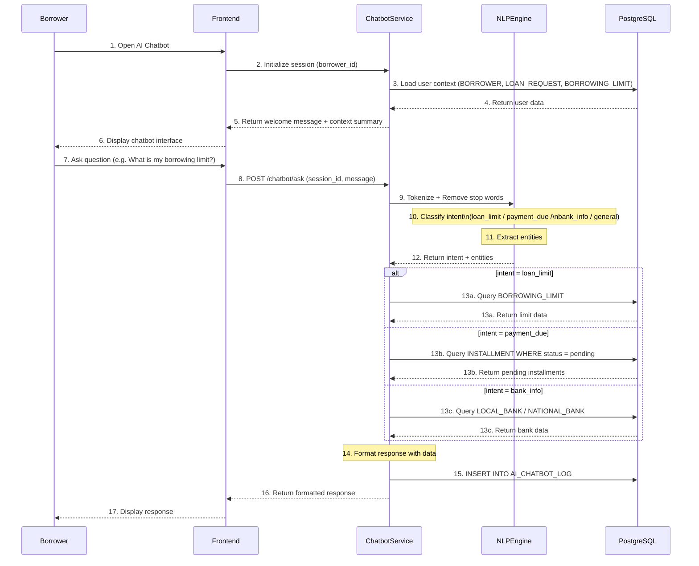


## Sequence 6 — Hierarchical Banking

- **Rendered PNG:** `Diagrams/mermaid-pdf/sequence-hierarchical-banking.png`
- **Mermaid archive:** `Diagrams/mermaid-src/sequence-hierarchical-banking.mmd`

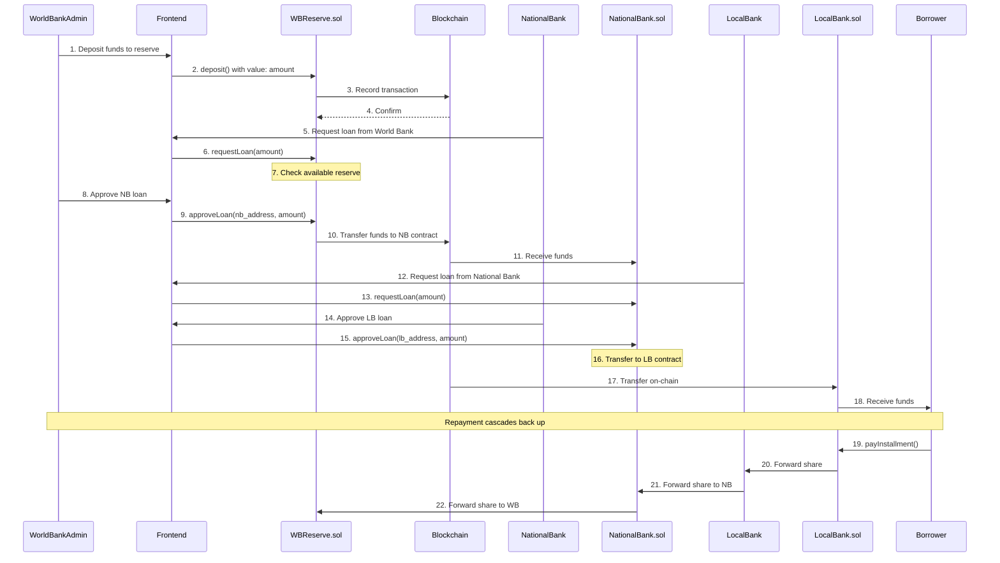


## Sequence 7 — Market Data

- **Rendered PNG:** `Diagrams/mermaid-pdf/sequence-market-data.png`
- **Mermaid archive:** `Diagrams/mermaid-src/sequence-market-data.mmd`

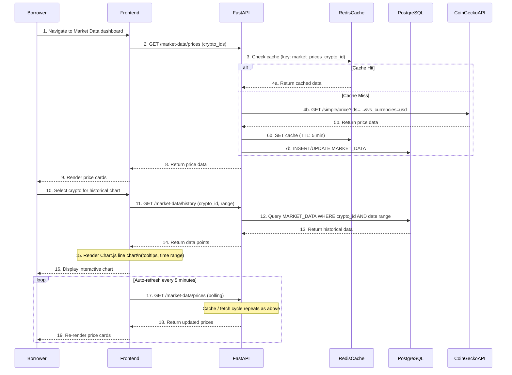


## Sequence 8 — Borrowing Limit

- **Rendered PNG:** `Diagrams/mermaid-pdf/sequence-borrowing-limit.png`
- **Mermaid archive:** `Diagrams/mermaid-src/sequence-borrowing-limit.mmd`

```mermaid
sequenceDiagram
    participant S as System / Trigger
    participant API as FastAPI
    participant BLE as BorrowingLimitEngine
    participant DB as PostgreSQL

    Note over S: Trigger: Loan Request / Approval / Payment / Scheduled Job

    S->>API: 1. Calculate borrowing limit (borrower_id)
    API->>BLE: 2. Process limit calculation

    BLE->>DB: 3. Query TRANSACTION (last 6 months)
    DB-->>BLE: 4. Return 6-month transactions
    Note over BLE: 5. Calculate 6-month rolling sum

    BLE->>DB: 6. Query TRANSACTION (last 12 months)
    DB-->>BLE: 7. Return 12-month transactions
    Note over BLE: 8. Calculate 12-month rolling sum

    BLE->>DB: 9. Query BORROWER.consecutive_paid_loans
    DB-->>BLE: 10. Return consecutive count
    Note over BLE: 11. Apply loyalty multiplier

    BLE->>DB: 12. Query active LOAN_REQUEST count
    DB-->>BLE: 13. Return active loan count
    Note over BLE: 14. Check max concurrent loans (3)
    Note over BLE: 15. Check yearly limit not exceeded
    Note over BLE: 16. Final limit =\nmin(6mo, 12mo) x loyalty x availability

    BLE->>DB: 17. UPSERT BORROWING_LIMIT
    DB-->>BLE: 18. Confirm update
    BLE-->>API: 19. Return calculated limit
    API-->>S: 20. Return limit result
```


---

## Part 2 — Thesis extensions (Ch.1–5, AI, blockchain, planned banking)

_Sections below mirror `new-diagrams-build.md`._

## Financial Inclusion Gap

- **Rendered PNG:** `Diagrams/mermaid-pdf/financial-inclusion-gap.png`

```mermaid
mindmap
  root((Global Financial Exclusion))
    Unbanked Population
      1.4 billion adults
      Developing economies
      Documentation barriers
    Remittance Fee Drain
      860B USD annual market
      48-56B lost to fees yearly
      6.49 pct avg cost
    SME Financing Gap
      4.5 trillion USD gap
      16 jobs per 1M USD lent
    Correspondent Banking
      Nostro capital trapped
      42 USD avg transaction
      2-5 day settlement
```

---

## Flat vs Hierarchical Architecture

- **Rendered PNG:** `Diagrams/mermaid-pdf/flat-vs-hierarchical.png`

```mermaid
graph TB
    subgraph FLAT["EXISTING DeFi - Flat Pool"]
        direction TB
        LP1["Lender A\n10K USD"] --> POOL["Single Liquidity Pool\n26.3B TVL"]
        LP2["Lender B\n500K USD"] --> POOL
        LP3["Lender C\n50M USD"] --> POOL
        POOL --> BR1["Borrower X\nRetail"]
        POOL --> BR2["Borrower Y\nInstitutional"]
        POOL --> BR3["Borrower Z\nDAO"]
    end
    subgraph HIER["CRYPTO WORLD BANK - Multi-Tier"]
        direction TB
        WB["World Bank Reserve"] -->|"3 pct APR"| NB1["National Bank A"]
        WB -->|"3 pct APR"| NB2["National Bank B"]
        NB1 -->|"5 pct APR"| LB1["Local Bank 1"]
        NB1 -->|"5 pct APR"| LB2["Local Bank 2"]
        NB2 -->|"5 pct APR"| LB3["Local Bank 3"]
        LB1 -->|"8 pct APR"| U1["Individual"]
        LB1 -->|"8 pct APR"| U2["SME"]
        LB2 -->|"8 pct APR"| U3["Micro-enterprise"]
        NB1 <-->|"Same-tier"| NB2
        LB1 <-->|"Same-tier"| LB2
        LB1 -.->|"Upward surplus"| NB1
    end
    style FLAT fill:#FEE2E2,stroke:#DC2626,stroke-width:2px
    style HIER fill:#DCFCE7,stroke:#16A34A,stroke-width:2px
    style POOL fill:#FECACA,stroke:#EF4444
    style WB fill:#1E40AF,color:#fff,stroke:#1E3A8A,stroke-width:2px
    style NB1 fill:#2563EB,color:#fff
    style NB2 fill:#2563EB,color:#fff
    style LB1 fill:#3B82F6,color:#fff
    style LB2 fill:#3B82F6,color:#fff
    style LB3 fill:#3B82F6,color:#fff
```

---

## Cross-Tier Lending Flow

- **Rendered PNG:** `Diagrams/mermaid-pdf/cross-tier-flow.png`

```mermaid
graph TB
    WB["WORLD BANK\nGlobal Reserve"]
    NB1["National Bank A"]
    NB2["National Bank B"]
    NB3["National Bank C"]
    LB1["Local Bank 1"]
    LB2["Local Bank 2"]
    LB3["Local Bank 3"]
    LB4["Local Bank 4"]
    U1["Individual\n0.01-10 ETH"]
    U2["SME\n1-100 ETH"]
    U3["Corporate\n50-10K ETH"]
    U4["Institutional\n1000+ ETH"]
    WB ==>|"3 pct Down"| NB1
    WB ==>|"3 pct Down"| NB2
    WB ==>|"3 pct Down"| NB3
    NB1 ==>|"5 pct"| LB1
    NB1 ==>|"5 pct"| LB2
    NB2 ==>|"5 pct"| LB3
    NB3 ==>|"5 pct"| LB4
    LB1 ==>|"8 pct"| U1
    LB1 ==>|"8 pct"| U2
    LB3 ==>|"8 pct"| U2
    LB2 -.->|"Surplus up"| NB1
    NB3 -.->|"Surplus up"| WB
    NB1 <-..->|"Interbank"| NB2
    NB2 <-..->|"Interbank"| NB3
    LB1 <-..->|"Peer pool"| LB2
    NB2 ==>|"Direct"| U3
    WB ==>|"Direct"| U4
    style WB fill:#1E3A8A,color:#fff,stroke-width:3px
    style NB1 fill:#1D4ED8,color:#fff
    style NB2 fill:#1D4ED8,color:#fff
    style NB3 fill:#1D4ED8,color:#fff
    style LB1 fill:#3B82F6,color:#fff
    style LB2 fill:#3B82F6,color:#fff
    style LB3 fill:#3B82F6,color:#fff
    style LB4 fill:#3B82F6,color:#fff
    style U1 fill:#DBEAFE,stroke:#3B82F6
    style U2 fill:#DBEAFE,stroke:#3B82F6
    style U3 fill:#DBEAFE,stroke:#3B82F6
    style U4 fill:#DBEAFE,stroke:#3B82F6
```

---

## Borrower Tier Access

- **Rendered PNG:** `Diagrams/mermaid-pdf/borrower-tier-access.png`

```mermaid
graph TD
    WB["WORLD BANK\nTier 1"] --- T1["Institutional / Sovereign\n1000+ ETH"]
    NB["NATIONAL BANKS\nTier 2"] --- T2["Large Corporate\n50-10000 ETH"]
    LB["LOCAL BANKS\nTier 3"] --- T3["Individual and SME\n0.01-100 ETH"]
    T1 -.->|"may also use"| NB
    T2 -.->|"may also use"| LB
    style WB fill:#1E3A8A,color:#fff,stroke-width:3px
    style NB fill:#2563EB,color:#fff,stroke-width:2px
    style LB fill:#3B82F6,color:#fff,stroke-width:2px
    style T1 fill:#EDE9FE,stroke:#7C3AED,stroke-width:2px
    style T2 fill:#FEF3C7,stroke:#D97706,stroke-width:2px
    style T3 fill:#DCFCE7,stroke:#16A34A,stroke-width:2px
```

---

## Correspondent vs On-Chain Settlement

- **Rendered PNG:** `Diagrams/mermaid-pdf/correspondent-vs-onchain.png`

```mermaid
graph LR
    subgraph TRAD["TRADITIONAL CORRESPONDENT BANKING"]
        direction LR
        SA["Sender Bank"] -->|"MT103 SWIFT"| CB1["Correspondent 1"]
        CB1 -->|"Compliance"| CB2["Correspondent 2"]
        CB2 -->|"FX"| CB3["Correspondent 3"]
        CB3 -->|"Nostro credit"| RB["Receiver Bank"]
        T1["2-5 days settlement"]
        T2["~42 USD per tx"]
        T3["Capital in nostro"]
    end
    subgraph CWB["CWB ON-CHAIN SETTLEMENT"]
        direction LR
        S2["Sender Local Bank"] -->|"Smart contract"| BC["Polygon L2"]
        BC -->|"State update"| R2["Receiver Local Bank"]
        T4["~2 sec finality"]
        T5["under 0.01 USD"]
        T6["No pre-funding"]
    end
    style TRAD fill:#FEF3C7,stroke:#D97706,stroke-width:2px
    style CWB fill:#DCFCE7,stroke:#16A34A,stroke-width:2px
    style SA fill:#FDE68A,stroke:#F59E0B
    style CB1 fill:#FDE68A,stroke:#F59E0B
    style CB2 fill:#FDE68A,stroke:#F59E0B
    style CB3 fill:#FDE68A,stroke:#F59E0B
    style RB fill:#FDE68A,stroke:#F59E0B
    style S2 fill:#86EFAC,stroke:#22C55E
    style BC fill:#86EFAC,stroke:#22C55E
    style R2 fill:#86EFAC,stroke:#22C55E
```

---

## Monetary Policy Comparison

- **Rendered PNG:** `Diagrams/mermaid-pdf/monetary-policy-comparison.png`

```mermaid
graph TD
    subgraph TRAD["TRADITIONAL - Cantillon Effect"]
        direction TB
        CB["Central Bank"] -->|"First access"| BANKS["Banks and Funds"]
        BANKS -->|"Second"| CORP["Large Corporations"]
        CORP -->|"Third"| SME2["Small Business"]
        SME2 -->|"Last"| PEOPLE["General Population"]
        NOTE1["Top 1 pct holds 32 pct wealth"]
        NOTE2["800B USD/year from developing economies"]
    end
    subgraph CWB2["CWB - Transparent Algorithmic"]
        direction TB
        WBR["World Bank Reserve"] -->|"3 pct visible"| NBR["National Banks"]
        NBR -->|"5 pct visible"| LBR["Local Banks"]
        LBR -->|"8 pct visible"| PPL["All Borrowers Same Rules"]
        NOTE3["Rates on-chain auditable"]
        NOTE4["No hidden fees"]
    end
    style TRAD fill:#FEF2F2,stroke:#DC2626,stroke-width:2px
    style CWB2 fill:#F0FDF4,stroke:#16A34A,stroke-width:2px
    style WBR fill:#166534,color:#fff
    style NBR fill:#16A34A,color:#fff
    style LBR fill:#4ADE80,stroke:#22C55E
    style PPL fill:#DCFCE7,stroke:#86EFAC
```

---

## Institutional Adoption Timeline

- **Rendered PNG:** `Diagrams/mermaid-pdf/institutional-adoption-timeline.png`

```mermaid
timeline
    title Institutional Blockchain Adoption
    2020 : JPMorgan Onyx Kinexys
         : Aave v2 1B TVL
    2021 : R3 Corda 5B RWAs
         : Maple institutional lending
         : Goldfinch 10+ countries
    2022 : DeFi lending TVL 50B+
         : MakerDAO RWA integration
    2023 : Celo MiniPay Africa
         : Morpho Blue primitive
    2024 : Ripple RLUSD NYDFS
         : Sky Protocol rebrand
         : Centrifuge v3 eight chains
    2025 : World Bank FundsChain
         : R3 Corda 17B RWAs
         : Kinexys 3B daily volume
         : DeFi TVL 55B+
    2026 : CWB prototype deployed
         : BRICS mBridge pilots
```

---

## AI/ML Security Pipeline

- **Rendered PNG:** `Diagrams/mermaid-pdf/aiml-security-pipeline.png`

```mermaid
graph LR
    TX["On-Chain Tx"] -->|"Event"| EL["Event Listener"]
    EL --> FE["Feature Engineering\n50+ features"]
    FE --> RF["Random Forest\nFraud F1 0.76-0.85"]
    FE --> IF["Isolation Forest\nAnomaly detect"]
    RF --> SHAP["SHAP Explain"]
    IF --> SHAP
    SHAP --> SCORE["Risk Score 0-100"]
    SCORE -->|"under 30"| APPROVE["Auto-Approve"]
    SCORE -->|"30-70"| REVIEW["Human Review"]
    SCORE -->|"over 70"| FLAG["Auto-Flag"]
    APPROVE --> SC["Smart Contract"]
    REVIEW --> SC
    style TX fill:#DBEAFE,stroke:#3B82F6
    style RF fill:#4ADE80,stroke:#16A34A,color:#000
    style IF fill:#FBBF24,stroke:#D97706,color:#000
    style SHAP fill:#A78BFA,stroke:#7C3AED,color:#fff
    style SCORE fill:#1E3A8A,color:#fff,stroke-width:2px
    style APPROVE fill:#DCFCE7,stroke:#16A34A
    style REVIEW fill:#FEF3C7,stroke:#D97706
    style FLAG fill:#FEE2E2,stroke:#DC2626
    style SC fill:#2563EB,color:#fff
```

---

## Market Sizing Funnel

- **Rendered PNG:** `Diagrams/mermaid-pdf/market-sizing-funnel.png`

```mermaid
graph TD
    TAM["TAM: 55B - 5T+\nDeFi TVL 55B+\nRemittances 860B\nSME gap 4.5T"]
    SAM["SAM: 5-15B\nInstitutional hierarchical lending\nEmerging-market credit"]
    SOM["SOM: 50-200M\nSandboxes and pilots\nNGO microfinance"]
    TAM --> SAM --> SOM
    style TAM fill:#1E3A8A,color:#fff,stroke-width:2px
    style SAM fill:#2563EB,color:#fff,stroke-width:2px
    style SOM fill:#3B82F6,color:#fff,stroke-width:2px
```

---

## DeFi TVL Comparison

- **Rendered PNG:** `Diagrams/mermaid-pdf/defi-tvl-comparison.png`

```mermaid
xychart-beta
    title "DeFi Lending TVL - March 2026 (USD Billions)"
    x-axis ["Aave", "Morpho", "Maker", "Spark", "Maple", "Compound", "Centrifuge", "Euler", "TrueFi"]
    y-axis "TVL (B USD)" 0 --> 28
    bar [26.3, 6.8, 6.0, 3.6, 3.0, 1.4, 1.0, 0.8, 0.1]
```

---

## Competitive Feature Matrix

- **Rendered PNG:** `Diagrams/mermaid-pdf/competitive-feature-matrix.png`

```mermaid
block-beta
    columns 8
    space:1 A["Aave"] B["Compound"] C["Maple"] D["Goldfinch"] E["Ripple"] F["Celo"] G["CWB"]
    H1["Hierarchical"]:1
    A1["No"]:1 B1["No"]:1 C1["No"]:1 D1["No"]:1 E1["No"]:1 F1["No"]:1 G1["Yes"]:1
    H2["Cross-Tier"]:1
    A2["No"]:1 B2["No"]:1 C2["No"]:1 D2["No"]:1 E2["No"]:1 F2["No"]:1 G2["Yes"]:1
    H3["On-Chain Lending"]:1
    A3["Yes"]:1 B3["Yes"]:1 C3["Yes"]:1 D3["Part"]:1 E3["No"]:1 F3["No"]:1 G3["Yes"]:1
    H4["ML Fraud"]:1
    A4["No"]:1 B4["No"]:1 C4["No"]:1 D4["No"]:1 E4["No"]:1 F4["No"]:1 G4["Yes"]:1
    H5["Inclusion"]:1
    A5["No"]:1 B5["No"]:1 C5["No"]:1 D5["Yes"]:1 E5["No"]:1 F5["Yes"]:1 G5["Yes"]:1
    H6["Cross-Border"]:1
    A6["Part"]:1 B6["No"]:1 C6["No"]:1 D6["No"]:1 E6["Yes"]:1 F6["Yes"]:1 G6["Yes"]:1
    H7["Stablecoin"]:1
    A7["No"]:1 B7["No"]:1 C7["No"]:1 D7["No"]:1 E7["RLUSD"]:1 F7["cUSD"]:1 G7["Planned"]:1
    H8["Open Source"]:1
    A8["Yes"]:1 B8["Yes"]:1 C8["Yes"]:1 D8["Yes"]:1 E8["Part"]:1 F8["Yes"]:1 G8["Yes"]:1
    style G1 fill:#16A34A,color:#fff
    style G2 fill:#16A34A,color:#fff
    style G3 fill:#16A34A,color:#fff
    style G4 fill:#16A34A,color:#fff
    style G5 fill:#16A34A,color:#fff
    style G6 fill:#16A34A,color:#fff
    style G7 fill:#16A34A,color:#fff
    style G8 fill:#16A34A,color:#fff
```

---

## Competitor Quadrant Chart

- **Rendered PNG:** `Diagrams/mermaid-pdf/competitor-quadrant.png`

```mermaid
quadrantChart
    title Competitor Positioning
    x-axis "Retail Users" --> "Institutional"
    y-axis "Flat Single-Tier" --> "Hierarchical Multi-Tier"
    quadrant-1 "Hierarchical Institutional"
    quadrant-2 "Hierarchical Retail"
    quadrant-3 "Flat Retail"
    quadrant-4 "Flat Institutional"
    Aave: [0.35, 0.15]
    Compound: [0.30, 0.10]
    MakerDAO: [0.40, 0.20]
    Morpho: [0.45, 0.18]
    Celo: [0.15, 0.12]
    Goldfinch: [0.65, 0.25]
    Maple: [0.80, 0.20]
    Ripple: [0.85, 0.30]
    Kinexys: [0.90, 0.35]
    FundsChain: [0.92, 0.70]
    Crypto World Bank: [0.50, 0.85]
```

---

## Interest Rate Waterfall

- **Rendered PNG:** `Diagrams/mermaid-pdf/interest-rate-waterfall.png`

```mermaid
graph LR
    WB["World Bank\nLends 3 pct APR"] -->|"NB margin 2 pct"| NB["National Bank\nLends 5 pct"]
    NB -->|"LB margin 3 pct"| LB["Local Bank\nLends 8 pct"]
    LB -->|"Borrower pays"| BR["Borrower 8 pct"]
    WB2["Cost 0 pct"] -.-> WB
    NB2["Cost 3 pct\nMargin 2 pct"] -.-> NB
    LB2["Cost 5 pct\nMargin 3 pct"] -.-> LB
    style WB fill:#1E3A8A,color:#fff,stroke-width:2px
    style NB fill:#2563EB,color:#fff
    style LB fill:#3B82F6,color:#fff
    style BR fill:#93C5FD,stroke:#3B82F6
    style WB2 fill:#EFF6FF,stroke:#BFDBFE
    style NB2 fill:#EFF6FF,stroke:#BFDBFE
    style LB2 fill:#EFF6FF,stroke:#BFDBFE
```

---

## Go-to-Market Roadmap

- **Rendered PNG:** `Diagrams/mermaid-pdf/gtm-roadmap.png`

```mermaid
graph LR
    P1["Phase 1 VALIDATION\nCurrent\nThesis and testnet\nRevenue 0"]
    P2["Phase 2 PILOT\n6-12 months\nSandbox partners\nRevenue 1.5M ARR"]
    P3["Phase 3 PRODUCTION\n12-24 months\nMulti-chain AI/ML\nRevenue 15M ARR"]
    P4["Phase 4 SCALE\n24-48 months\n50+ banks stablecoin\nRevenue 200M ARR"]
    P1 ==> P2 ==> P3 ==> P4
    style P1 fill:#DBEAFE,stroke:#2563EB,stroke-width:2px
    style P2 fill:#BFDBFE,stroke:#1D4ED8,stroke-width:2px
    style P3 fill:#93C5FD,stroke:#1E40AF,color:#fff,stroke-width:2px
    style P4 fill:#1E3A8A,color:#fff,stroke-width:3px
```

---

## Blockchain Stack Layers

- **Rendered PNG:** `Diagrams/mermaid-pdf/blockchain-stack-layers.png`

```mermaid
graph TB
  subgraph L7 [Application Layer]
    UI[Web dApp React]
    API[Express API]
  end
  subgraph L6 [Off-chain Services]
    AI[CWB-AI-9B plus RAG]
    IDX[Event indexer]
    ORA[Oracle relay]
  end
  subgraph L5 [Smart Contracts]
    LC[LoanController]
    WR[WorldBankReserve]
    GL[GroupLendingPool planned]
  end
  subgraph L4 [Chain]
    EVM[Polygon PoS testnet]
  end
  UI --> API --> LC
  API --> AI --> ORA --> LC
  IDX --> EVM
  LC --> EVM
  WR --> EVM
  style GL stroke-dasharray:5 5
  style WR fill:#1E3A8A,color:#fff
  style LC fill:#2563EB,color:#fff
  style AI fill:#3B82F6,color:#fff
```

---

## Blockchain Transaction Lifecycle

- **Rendered PNG:** `Diagrams/mermaid-pdf/blockchain-tx-lifecycle.png`

```mermaid
sequenceDiagram
  participant B as Borrower
  participant LB as Local Bank
  participant SC as LoanController
  participant O as Oracle
  participant AI as CWB-AI-9B
  B->>SC: requestLoan
  SC->>O: riskScoreRequest
  O->>AI: features plus context
  AI-->>O: tabular score plus narrative
  O-->>SC: updateRiskScore
  LB->>SC: approveLoan
  B->>SC: repayInstallment
```

---

## AI Unified 9B Architecture

- **Rendered PNG:** `Diagrams/mermaid-pdf/ai-unified-9b-architecture.png`

```mermaid
flowchart LR
  U[User query] --> R[Task prefix]
  D[RAG corpus] --> M[9B instruct plus QLoRA]
  R --> M
  M --> C[Chat and policy]
  M --> S[Security advisory]
  M --> E[Risk explanation]
  T[Tabular features] --> RF[RF or XGB score]
  RF --> E
  ST[Slither CI] -.-> D
  style M fill:#1E3A8A,color:#fff
```

---

## AI Data Pipeline

- **Rendered PNG:** `Diagrams/mermaid-pdf/ai-data-pipeline.png`

```mermaid
flowchart TB
  A[Architecture docs] --> C[Chunk and clean]
  B[SWC security pairs] --> C
  S[Synthetic loan dialogues] --> C
  C --> J[SFT JSONL]
  C --> V[Vector index RAG]
  J --> T[QLoRA training]
  V --> I[Inference API]
  style T fill:#2563EB,color:#fff
```

---

## AI QLoRA Training Flow

- **Rendered PNG:** `Diagrams/mermaid-pdf/ai-qlora-training-flow.png`

```mermaid
flowchart LR
  B[Load 4-bit base model] --> L[Attach LoRA adapters]
  L --> TR[Train on multi-task SFT]
  TR --> M[Merge or export adapters]
  M --> D[Deploy Ollama or vLLM]
  style TR fill:#1E3A8A,color:#fff
```

---

## AI Oracle Loan Sequence

- **Rendered PNG:** `Diagrams/mermaid-pdf/ai-oracle-loan-sequence.png`

```mermaid
sequenceDiagram
  participant B as Borrower
  participant SC as LoanController
  participant O as Oracle relay
  participant ML as Tabular scorer
  participant LLM as CWB-AI-9B
  B->>SC: requestLoan
  SC->>O: scoreRequest
  O->>ML: computeRiskScore
  ML-->>O: numeric score
  O->>LLM: explainScore
  LLM-->>O: narrative
  O-->>SC: updateRiskScore
```

---

## AI Security CI Pipeline

- **Rendered PNG:** `Diagrams/mermaid-pdf/ai-security-ci-pipeline.png`

```mermaid
flowchart LR
  GIT[Git commit] --> SL[Slither static analysis]
  SL --> REP[Vulnerability report]
  REP --> RAG[Update RAG corpus]
  RAG --> LLM[9B security advisory]
  DEV[Developer] --> LLM
  style SL fill:#1E3A8A,color:#fff
```

---

## Activity Deposit Flow

- **Rendered PNG:** `Diagrams/mermaid-pdf/activity-deposit-flow.png`

```mermaid
flowchart TD
  A[Borrower opens savings] --> B[Local Bank validates KYC design]
  B --> C[Deposit to SavingsVault planned]
  C --> D[Accrue interest on-chain]
  D --> E[Statement via indexer]
  style C stroke-dasharray:5 5
```

---

## Activity Group Lending

- **Rendered PNG:** `Diagrams/mermaid-pdf/activity-group-lending.png`

```mermaid
flowchart TD
  A[Form group 3-20 borrowers] --> B[Pool collateral]
  B --> C[Multi-sig consent]
  C --> D[Submit group loan]
  D --> E{All members current?}
  E -->|Yes| F[Escalate to approver]
  E -->|No| G[Claim shared collateral planned]
  style G stroke-dasharray:5 5
```

---

## Activity FX Conversion

- **Rendered PNG:** `Diagrams/mermaid-pdf/activity-fx-conversion.png`

```mermaid
flowchart TD
  A[Loan denominated in stablecoin] --> B[Oracle price feed]
  B --> C[FXModule quote planned]
  C --> D[Borrower accepts rate]
  D --> E[Settle on-chain]
  style C stroke-dasharray:5 5
```

---

## Activity Interbank Liquidity

- **Rendered PNG:** `Diagrams/mermaid-pdf/activity-interbank-liquidity.png`

```mermaid
flowchart TD
  A[Local Bank liquidity shortfall] --> B[Request interbank pool]
  B --> C[National Bank approves]
  C --> D[Transfer via smart contract]
  D --> E[Repay with spread]
  style B stroke-dasharray:5 5
```
