# Improved Diagrams — Mermaid Source Archive

Documentation of all Mermaid source files in this directory, cross-referenced to `Pre-thesis_v28 (Agent build).tex`.

**Purpose:** Read-only archive of diagram source code. Do not edit `.mmd` files here when updating this document; regenerate from the sources if diagrams change.

**Build output:** PDFs are rendered to `Diagrams/mermaid-pdf/improved diagrams/` via `Documentation/Diagrams/build-improved-diagrams.sh`.

**Diagram count:** 32

---

## Table of Contents

1. [Four-Layer Decentralized Application Architecture](#fig-three-layer-arch) — Chapter 3 — System Architecture and Design
2. [Component Architecture Diagram](#fig-component-architecture) — Chapter 3 — System Architecture and Design
3. [Layered Blockchain and Application Stack](#fig-blockchain-stack) — Chapter 3 — System Architecture and Design
4. [Core System Graph / Core ERD](#fig-erd-core) — Chapter 3 — System Architecture and Design
5. [Extended ERD](#fig-erd-extended) — Chapter 3 — System Architecture and Design
6. [Enhanced Entity-Relationship (EER) Model](#fig-eer-model) — Chapter 3 — System Architecture and Design
7. [Compliance and Identity Stack](#fig-compliance-identity) — Chapter 3 — System Architecture and Design
8. [Tiered Borrower Access Model](#fig-tier-model) — Chapter 3 — System Architecture and Design
9. [Multi-Entity and Cross-Tier Capital Operations](#fig-multi-entity-ops) — Chapter 3 — System Architecture and Design
10. [Use-Case Diagram (Nine-Actor Taxonomy)](#fig-usecase-actors) — Chapter 3 — System Architecture and Design
11. [Lending Activity Flows](#fig-activity-lending) — Chapter 3 — System Architecture and Design
12. [Onboarding and Identity Activity Flows](#fig-activity-onboarding-id) — Chapter 3 — System Architecture and Design
13. [Auxiliary Activity Flows](#fig-activity-aux) — Chapter 3 — System Architecture and Design
14. [Data-Flow Diagram Suite](#fig-dfd-suite) — Chapter 3 — System Architecture and Design
15. [Loan-Approval Sequence (with Reject Path)](#fig-seq-loan-flow) — Chapter 3 — System Architecture and Design
16. [Installment Payment and Income Verification Sequences](#fig-seq-installment-income) — Chapter 3 — System Architecture and Design
17. [Hierarchical Capital, Market Data, and Borrowing-Limit Sequences](#fig-seq-banking-data) — Chapter 3 — System Architecture and Design
18. [Chat and AI Chatbot Sequences](#fig-seq-chat-chatbot) — Chapter 3 — System Architecture and Design
19. [Four-Tier Hierarchical Capital Flow](#fig-hierarchical-banking) — Chapter 3 — System Architecture and Design
20. [Auxiliary Banking Modules](#fig-banking-modules) — Chapter 3 — System Architecture and Design
21. [Five-Layer Defense-in-Depth Security Architecture](#fig-defense-in-depth) — Chapter 3 — System Architecture and Design
22. [Smart-Contract Security Controls](#fig-security-controls) — Chapter 3 — System Architecture and Design
23. [Agile / Scrum Process](#fig-agile-process) — Chapter 4 — Methodology
24. [AI/ML Pipeline Wiring](#fig-aiml-pipeline) — Chapter 4 — Methodology
25. [Real-Time Dashboard and Runtime Monitoring Pipeline](#fig-realtime-dashboard) — Chapter 4 — Methodology
26. [Transaction State Machine (Loan Lifecycle)](#fig-tx-state-machine) — Chapter 4 — Methodology
27. [SDLC Stage Mapping with Implementation Phases](#fig-sdlc-agile) — Chapter 4 — Methodology
28. [Key Design Decisions and Alternatives](#fig-design-decisions) — Chapter 4 — Methodology
29. [Annual Revenue Projection by Tier (xyChart)](#fig-revenue-by-tier) — Chapter 5 — Market Analysis and Feasibility
30. [Hierarchical Interest-Rate Spread (APR)](#fig-apr-spread) — Chapter 5 — Market Analysis and Feasibility
31. [Autonomous AI Agent Request Path (Compact)](#fig-local-llm-compact) — Appendix — Technology Stack
32. [Autonomous AI Agent Data Flow (Expanded)](#fig-local-llm) — Appendix — Technology Stack

---
## Four-Layer Decentralized Application Architecture
<!-- Diagram 1 of 32 | Source: `fig-three-layer-arch.mmd` | Rendered PDF: `fig-three-layer-arch.pdf` -->
| Field | Value |
| --- | --- |
| **Source file** | `fig-three-layer-arch.mmd` |
| **Rendered PDF** | `fig-three-layer-arch.pdf` |
| **Thesis labels** | `fig:three-layer-arch` |
| **Chapter** | Chapter 3 — System Architecture and Design |
| **Section** | High-Level Architecture |
| **Caption (summary)** | Four-layer decentralized application architecture (presentation, smart-contract, off-chain services, Chainlink infrastructure). |

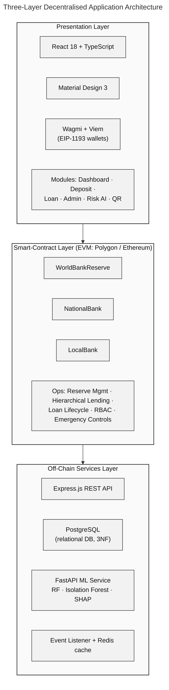

---
## Component Architecture Diagram
<!-- Diagram 2 of 32 | Source: `fig-component-architecture.mmd` | Rendered PDF: `fig-component-architecture.pdf` -->
| Field | Value |
| --- | --- |
| **Source file** | `fig-component-architecture.mmd` |
| **Rendered PDF** | `fig-component-architecture.pdf` |
| **Thesis labels** | `fig:component-diagram` |
| **Chapter** | Chapter 3 — System Architecture and Design |
| **Section** | High-Level Architecture |
| **Caption (summary)** | Component diagram showing interactions between presentation, smart contracts, backend services, and external systems. |

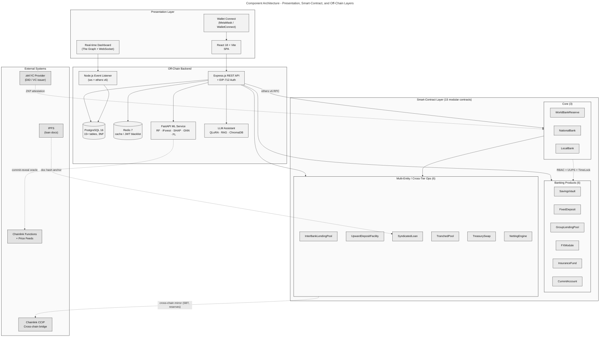

---
## Layered Blockchain and Application Stack
<!-- Diagram 3 of 32 | Source: `fig-blockchain-stack.mmd` | Rendered PDF: `fig-blockchain-stack.pdf` -->
| Field | Value |
| --- | --- |
| **Source file** | `fig-blockchain-stack.mmd` |
| **Rendered PDF** | `fig-blockchain-stack.pdf` |
| **Thesis labels** | `fig:blockchain-stack` |
| **Chapter** | Chapter 3 — System Architecture and Design |
| **Section** | Blockchain Platform Selection |
| **Caption (summary)** | Layered blockchain and application stack from L1 settlement through L5 presentation. |

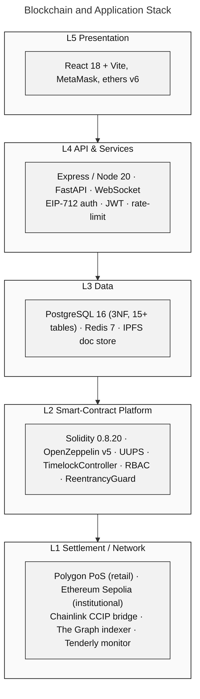

---
## Core System Graph / Core ERD
<!-- Diagram 4 of 32 | Source: `fig-erd-core.mmd` | Rendered PDF: `fig-erd-core.pdf` -->
| Field | Value |
| --- | --- |
| **Source file** | `fig-erd-core.mmd` |
| **Rendered PDF** | `fig-erd-core.pdf` |
| **Thesis labels** | `fig:core-system-graph, fig:erd (same PDF used twice in thesis)` |
| **Chapter** | Chapter 3 — System Architecture and Design |
| **Section** | Data Model and Database Design |
| **Caption (summary)** | Core system graph and core Entity-Relationship Diagram (20-entity lending and governance model). |

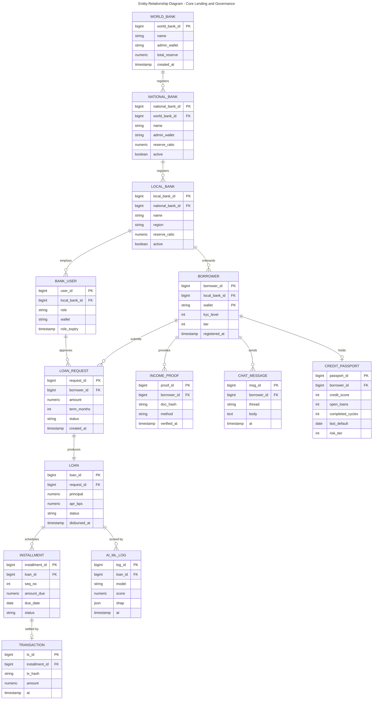

---
## Extended ERD
<!-- Diagram 5 of 32 | Source: `fig-erd-extended.mmd` | Rendered PDF: `fig-erd-extended.pdf` -->
| Field | Value |
| --- | --- |
| **Source file** | `fig-erd-extended.mmd` |
| **Rendered PDF** | `fig-erd-extended.pdf` |
| **Thesis labels** | `fig:erd-extended` |
| **Chapter** | Chapter 3 — System Architecture and Design |
| **Section** | Data Model and Database Design |
| **Caption (summary)** | Extended ERD entities: banking products and multi-entity / cross-tier operational entities. |

```mermaid
---
title: ERD - Extended Banking Products and Multi-Entity Operations (v15)
---
erDiagram
    BORROWER ||--o{ SAVINGS_ACCOUNT : owns
    BORROWER ||--o{ FIXED_DEPOSIT : owns
    BORROWER ||--o{ CURRENT_ACCOUNT : owns
    LOCAL_BANK ||--o{ LOAN_GROUP : hosts
    LOAN_GROUP ||--o{ GROUP_MEMBER : "has"
    BORROWER ||--o{ GROUP_MEMBER : "is"
    LOCAL_BANK ||--o{ INSURANCE_FUND : maintains

    LOCAL_BANK ||--o{ INTERBANK_LOAN : "lender / borrower"
    NATIONAL_BANK ||--o{ INTERBANK_LOAN : "lender / borrower"
    LOCAL_BANK ||--o{ UPWARD_DEPOSIT : "depositor"
    NATIONAL_BANK ||--o{ UPWARD_DEPOSIT : "depositor"

    NATIONAL_BANK ||--o{ SYNDICATE : "lead-arranges"
    SYNDICATE ||--o{ SYNDICATE_MEMBER : "has"
    LOCAL_BANK ||--o{ SYNDICATE_MEMBER : "subscribes"
    SYNDICATE ||--o| LOAN : funds

    LOCAL_BANK ||--o{ TRANCHED_POOL : operates
    TRANCHED_POOL ||--o{ LOAN : funds

    NATIONAL_BANK ||--o{ TREASURY_SWAP : executes
    LOCAL_BANK ||--o{ TREASURY_SWAP : executes

    NATIONAL_BANK ||--o{ NETTING_BATCH : coordinates
    NETTING_BATCH ||--o{ NETTING_ENTRY : contains
    LOCAL_BANK  ||--o{ NETTING_ENTRY : settles

    SAVINGS_ACCOUNT {
        bigint account_id PK
        bigint borrower_id FK
        numeric balance
        numeric yield_bps
        timestamp opened_at
    }
    FIXED_DEPOSIT {
        bigint deposit_id PK
        bigint borrower_id FK
        numeric principal
        int term_days
        numeric apy_bps
        date maturity
    }
    CURRENT_ACCOUNT {
        bigint account_id PK
        bigint borrower_id FK
        numeric balance
    }
    LOAN_GROUP {
        bigint group_id PK
        bigint local_bank_id FK
        int member_count
        numeric shared_collateral
        string status
    }
    GROUP_MEMBER {
        bigint group_id FK
        bigint borrower_id FK
        numeric share
        string consent_sig
    }
    INSURANCE_FUND {
        bigint fund_id PK
        bigint local_bank_id FK
        numeric balance
        numeric premium_bps
    }
    INTERBANK_LOAN {
        bigint loan_id PK
        int    tier
        bigint lender_bank_id FK
        bigint borrower_bank_id FK
        numeric principal
        int    maturity_code
        numeric rate_bps
        string status
        timestamp settled_at
    }
    UPWARD_DEPOSIT {
        bigint deposit_id PK
        bigint depositing_bank_id FK
        bigint parent_bank_id FK
        numeric principal
        numeric yield_owed
        timestamp created_at
    }
    SYNDICATE {
        bigint syndicate_id PK
        bigint lead_arranger_id FK
        bigint borrower_id
        numeric total_amount
        string  doc_hash
        string  status
    }
    SYNDICATE_MEMBER {
        bigint syndicate_id FK
        bigint lender_bank_id FK
        numeric commitment
        int     share_bps
        timestamp confirmed_at
    }
    TRANCHED_POOL {
        bigint pool_id PK
        bigint local_bank_id FK
        numeric senior_principal
        numeric junior_principal
        int    subordination_bps
        string status
    }
    TREASURY_SWAP {
        bigint swap_id PK
        bigint bank_id FK
        string asset_from
        string asset_to
        numeric amount_from
        numeric amount_to
        numeric oracle_reading
        int spread_bps
    }
    NETTING_BATCH {
        bigint batch_id PK
        int    tier
        bigint coordinator_id
        string batch_root
        timestamp settled_at
    }
    NETTING_ENTRY {
        bigint batch_id FK
        bigint src_bank_id FK
        bigint dst_bank_id FK
        numeric net_amount
    }
```

---
## Enhanced Entity-Relationship (EER) Model
<!-- Diagram 6 of 32 | Source: `fig-eer-model.mmd` | Rendered PDF: `fig-eer-model.pdf` -->
| Field | Value |
| --- | --- |
| **Source file** | `fig-eer-model.mmd` |
| **Rendered PDF** | `fig-eer-model.pdf` |
| **Thesis labels** | `fig:eer` |
| **Chapter** | Chapter 3 — System Architecture and Design |
| **Section** | Data Model and Database Design |
| **Caption (summary)** | EER model with generalization/specialization, weak entities, and participation constraints. |

```mermaid
---
title: EER Model - Generalization, Specialization, Weak Entities, and Aggregation
---
flowchart TB
    classDef strong fill:#F2F2F2,stroke:#1F1F1F,stroke-width:1.4px,color:#111111
    classDef weak   fill:#F2F2F2,stroke:#1F1F1F,stroke-width:1.4px,color:#111111,stroke-dasharray:4 3
    classDef multi  fill:#E2E2E2,stroke:#1F1F1F,stroke-width:1px,color:#111111
    classDef agg    fill:#FAFAFA,stroke:#1F1F1F,stroke-width:1.2px,color:#111111
    classDef rel    fill:#FFFFFF,stroke:#1F1F1F,stroke-width:1px,color:#111111

    subgraph S[" Specialization: BANK_USER hierarchy "]
        BU["BANK_USER<br/>(superclass)"]:::strong
        NB["NationalBankAdmin"]:::strong
        LBA["LocalBankAdmin"]:::strong
        AP["Approver"]:::strong
        BU --> |"d, total"| NB
        BU --> LBA
        BU --> AP
    end

    subgraph W[" Weak entity & multi-valued attribute "]
        LOAN2["LOAN"]:::strong
        IN["INSTALLMENT<br/>(weak — identifying)"]:::weak
        LOAN2 ==> IN
        BR2["BORROWER"]:::strong
        IP["{INCOME_PROOF}<br/>(multi-valued)"]:::multi
        BR2 -.-> IP
    end

    subgraph A[" Aggregation: loan-centric cluster "]
        direction LR
        BRr["BORROWER"]:::strong
        LRr["LOAN_REQUEST"]:::strong
        APRV["APPROVAL"]:::rel
        AGG["LOAN-CENTRIC<br/>aggregation"]:::agg
        AILM["AI_ML_LOG"]:::strong
        BRr --> LRr --> APRV --> AGG
        AGG -.-> AILM
    end

    subgraph C[" Participation constraints "]
        LRc["LOAN_REQUEST"]:::strong
        Lc["LOAN"]:::strong
        LRc ==> |"total — 1..1"| Lc
        BRc["BORROWER"]:::strong
        SBT["CREDIT_PASSPORT (SBT)"]:::strong
        BRc -- "partial — 0..1" --> SBT
    end
```

---
## Compliance and Identity Stack
<!-- Diagram 7 of 32 | Source: `fig-compliance-identity.mmd` | Rendered PDF: `fig-compliance-identity.pdf` -->
| Field | Value |
| --- | --- |
| **Source file** | `fig-compliance-identity.mmd` |
| **Rendered PDF** | `fig-compliance-identity.pdf` |
| **Thesis labels** | `fig:compliance-identity` |
| **Chapter** | Chapter 3 — System Architecture and Design |
| **Section** | Digital Identity System → ZKP KYC and zkAML Compliance Architecture |
| **Caption (summary)** | Compliance and identity stack: zkKYC, zkAML, tiered KYC ladder, ERC-4337 onboarding. |

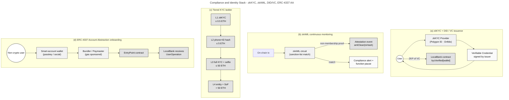

---
## Tiered Borrower Access Model
<!-- Diagram 8 of 32 | Source: `fig-tier-model.mmd` | Rendered PDF: `fig-tier-model.pdf` -->
| Field | Value |
| --- | --- |
| **Source file** | `fig-tier-model.mmd` |
| **Rendered PDF** | `fig-tier-model.pdf` |
| **Thesis labels** | `fig:tier-model` |
| **Chapter** | Chapter 3 — System Architecture and Design |
| **Section** | User Taxonomy and Onboarding Flows → Tiered Risk-Based KYC |
| **Caption (summary)** | Tiered borrower access model with KYC levels, loan bands, and SBT loan caps. |

```mermaid
---
title: Tiered Borrower Access Model (T1–T4 with KYC level and loan band)
---
flowchart LR
    classDef tier fill:#F2F2F2,stroke:#1F1F1F,stroke-width:1.2px,color:#111111
    classDef cap  fill:#FAFAFA,stroke:#1F1F1F,stroke-width:1px,color:#111111

    T1["<b>Tier 1 — Wholesale / Sovereign</b><br/>KYC L4 + multisig<br/>1,000+ ETH band<br/>Originated at NB / WB"]:::tier
    T2["<b>Tier 2 — Institutional</b><br/>KYC L3 + entity docs<br/>100–1,000 ETH<br/>Originated at NB / LB"]:::tier
    T3["<b>Tier 3 — SME</b><br/>KYC L2 + income proof<br/>10–100 ETH<br/>Originated at LB"]:::tier
    T4["<b>Tier 4 — Retail / Group</b><br/>KYC L1 (zkKYC, optional)<br/>0.1–10 ETH (USDC denominated)<br/>Originated at LB (Group pool)"]:::tier

    T1 --> T2 --> T3 --> T4

    subgraph RULES[" Access rules "]
        direction TB
        R1["KYC level monotone non-increasing<br/>down the tier ladder"]:::cap
        R2["Loan band ceiling enforced on-chain<br/>via borrowerLevel[wallet]"]:::cap
        R3["Stablecoin-first at T4<br/>(USDC, per §1.2)"]:::cap
        R4["SBT carries openLoans, completedCycles,<br/>simultaneous-loan cap"]:::cap
    end
    T4 -. "borrows under" .-> RULES
```

---
## Multi-Entity and Cross-Tier Capital Operations
<!-- Diagram 9 of 32 | Source: `fig-multi-entity-ops.mmd` | Rendered PDF: `fig-multi-entity-ops.pdf` -->
| Field | Value |
| --- | --- |
| **Source file** | `fig-multi-entity-ops.mmd` |
| **Rendered PDF** | `fig-multi-entity-ops.pdf` |
| **Thesis labels** | `fig:multi-entity-ops` |
| **Chapter** | Chapter 3 — System Architecture and Design |
| **Section** | Multi-Entity and Cross-Tier Capital Operations |
| **Caption (summary)** | InterBankLendingPool, UpwardDepositFacility, SyndicatedLoan, TranchedPool, TreasurySwap, NettingEngine. |

```mermaid
---
title: Multi-Entity and Cross-Tier Capital Operations
---
flowchart TB
    classDef bank fill:#F2F2F2,stroke:#1F1F1F,stroke-width:1px,color:#111111
    classDef contract fill:#E2E2E2,stroke:#1F1F1F,stroke-width:1.2px,color:#111111
    classDef flow fill:#FAFAFA,stroke:#1F1F1F,stroke-width:1px,color:#111111
    classDef note fill:#FFFFFF,stroke:#1F1F1F,stroke-width:1px,color:#111111,stroke-dasharray:3 3

    subgraph A[" (a) InterBankLendingPool · same-tier "]
        direction LR
        S1["LB-A (surplus)"]:::bank -- "deposit" --> IBLP["IBLP_LB"]:::contract
        S2["LB-B (deficit)"]:::bank -- "borrow" --> IBLP
        IBLP -- "kinked rate r_IB(U) ≤ r_down - δ" --> S2
        IBLP -. "default cascade<br/>buffer → InsuranceFund → parent" .-> S3["Cascade"]:::note
    end

    subgraph B[" (b) UpwardDepositFacility "]
        direction LR
        LB1["LB"]:::bank -- "excess reserves" --> UDF1["UDF_NB"]:::contract --> NB1["NB"]:::bank
        NB1 -- "excess reserves" --> UDF2["UDF_WB"]:::contract --> WB1["WB Reserve"]:::bank
        UDF1 -. "yield strictly &lt; downward rate" .-> Note1["Asymmetric rate"]:::note
    end

    subgraph C[" (c) SyndicatedLoan "]
        direction LR
        LA["Lead Arranger (NB)"]:::bank --> SYN["SyndicatedLoan"]:::contract
        CL1["Co-Lender 1"]:::bank --> SYN
        CL2["Co-Lender 2"]:::bank --> SYN
        CL3["Co-Lender 3 (LB)"]:::bank --> SYN
        SYN -- "unanimous consent → atomic disbursement" --> BR["Institutional borrower"]:::bank
        BR -. "pro-rata interest + recovery" .-> SYN
    end

    subgraph D[" (d) TranchedPool · senior / junior "]
        direction LR
        SR["Senior depositors"]:::bank -- "low yield · 1st-loss protected" --> TP["TranchedPool"]:::contract
        JR["Junior depositors"]:::bank -- "high yield · 1st-loss absorbed" --> TP
        TP -- "waterfall: snr int → jr int → snr pri → jr pri" --> BR2["Borrower pool"]:::bank
    end

    subgraph E[" (e) TreasurySwap "]
        direction LR
        NB2["NB treasury (ETH)"]:::bank -- "swap(asset_from, asset_to, amount)" --> TS["TreasurySwap"]:::contract
        TS -- "Chainlink oracle + 5–10 bps spread" --> LB2["LB treasury (USDC)"]:::bank
        TS -. "post-swap ratio invariant enforced" .-> Note2["ratio check"]:::note
    end

    subgraph F[" (f) NettingEngine · multilateral "]
        direction LR
        Q1["Queued IBLP / TreasurySwap orders"]:::flow --> SC["Settlement Coordinator<br/>(off-chain)"]:::contract
        SC -- "Merkle root" --> NE["NettingEngine"]:::contract
        NE -- "settleBatch · single tx" --> RES["Net debit / credit applied"]:::flow
        RES -. "challenge window for disputeBatch" .-> Note3["O(n) vs O(n²)"]:::note
    end
```

---
## Use-Case Diagram (Nine-Actor Taxonomy)
<!-- Diagram 10 of 32 | Source: `fig-usecase-actors.mmd` | Rendered PDF: `fig-usecase-actors.pdf` -->
| Field | Value |
| --- | --- |
| **Source file** | `fig-usecase-actors.mmd` |
| **Rendered PDF** | `fig-usecase-actors.pdf` |
| **Thesis labels** | `fig:usecase` |
| **Chapter** | Chapter 3 — System Architecture and Design |
| **Section** | System Modeling → Use Case Diagram |
| **Caption (summary)** | Use-case diagram with five primary and four secondary actors mapped to 20 use cases. |

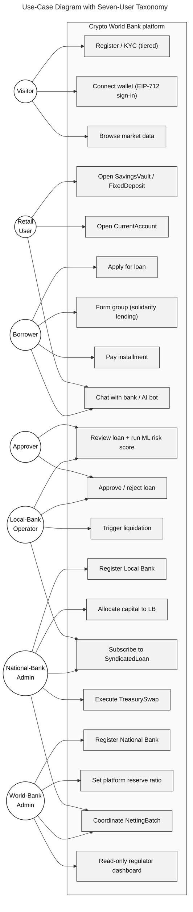

---
## Lending Activity Flows
<!-- Diagram 11 of 32 | Source: `fig-activity-lending.mmd` | Rendered PDF: `fig-activity-lending.pdf` -->
| Field | Value |
| --- | --- |
| **Source file** | `fig-activity-lending.mmd` |
| **Rendered PDF** | `fig-activity-lending.pdf` |
| **Thesis labels** | `fig:act-lending, fig:act-loan, fig:act-hierarchy` |
| **Chapter** | Chapter 3 — System Architecture and Design |
| **Section** | System Modeling → Activity Diagrams |
| **Caption (summary)** | Loan request/repayment, hierarchical capital flow, borrowing-limit enforcement via credit passport. |

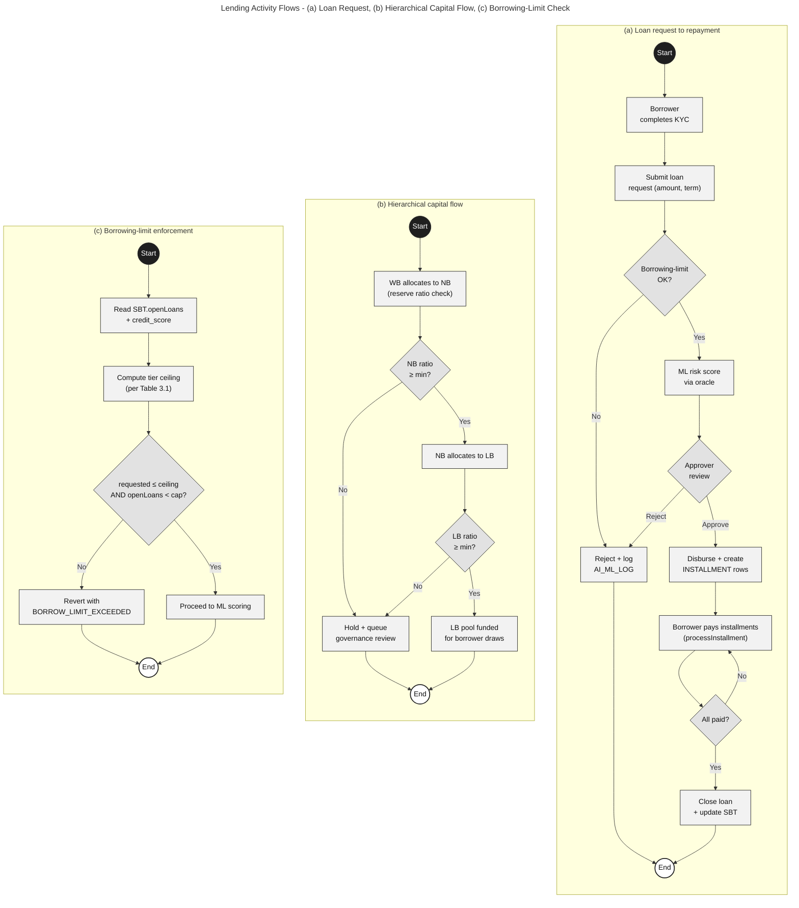

---
## Onboarding and Identity Activity Flows
<!-- Diagram 12 of 32 | Source: `fig-activity-onboarding-id.mmd` | Rendered PDF: `fig-activity-onboarding-id.pdf` -->
| Field | Value |
| --- | --- |
| **Source file** | `fig-activity-onboarding-id.mmd` |
| **Rendered PDF** | `fig-activity-onboarding-id.pdf` |
| **Thesis labels** | `fig:act-onboarding, fig:act-income, fig:act-profile` |
| **Chapter** | Chapter 3 — System Architecture and Design |
| **Section** | System Modeling → Activity Diagrams |
| **Caption (summary)** | Income verification, profile management, tiered risk-based KYC ladder. |

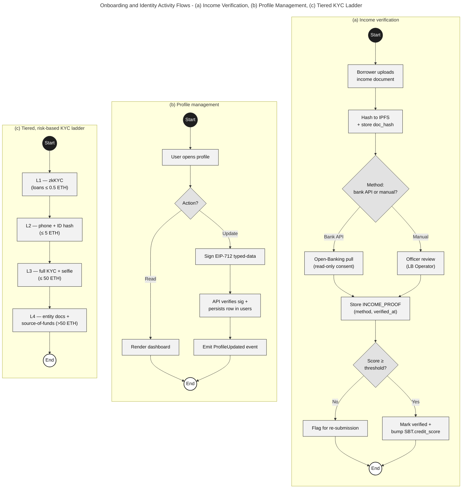

---
## Auxiliary Activity Flows
<!-- Diagram 13 of 32 | Source: `fig-activity-aux.mmd` | Rendered PDF: `fig-activity-aux.pdf` -->
| Field | Value |
| --- | --- |
| **Source file** | `fig-activity-aux.mmd` |
| **Rendered PDF** | `fig-activity-aux.pdf` |
| **Thesis labels** | `fig:act-aux, fig:act-chat, fig:act-aichatbot, fig:act-market` |
| **Chapter** | Chapter 3 — System Architecture and Design |
| **Section** | System Modeling → Activity Diagrams |
| **Caption (summary)** | Client–bank chat, RAG-augmented AI chatbot, live market-data retrieval. |

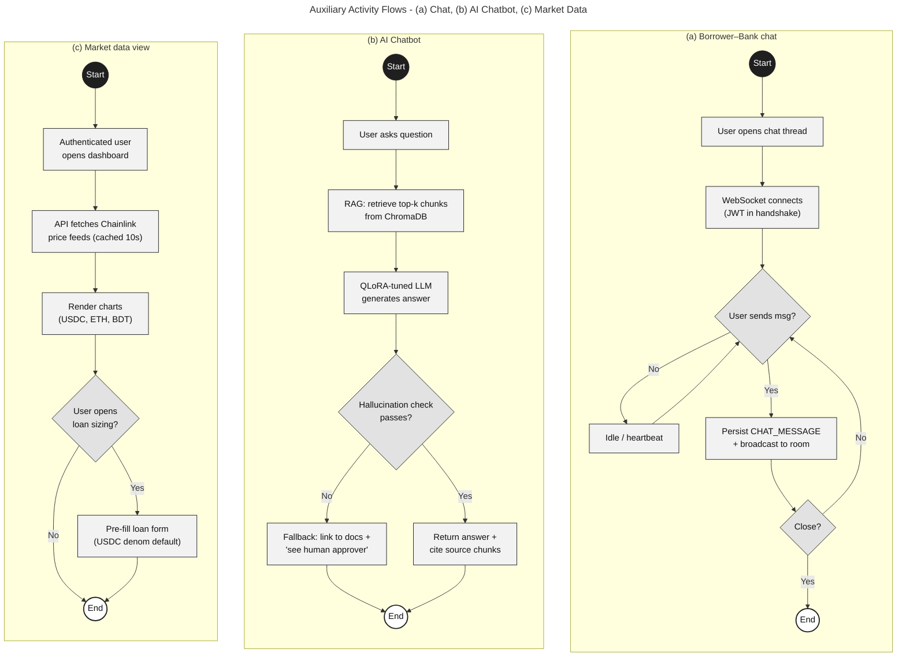

---
## Data-Flow Diagram Suite
<!-- Diagram 14 of 32 | Source: `fig-dfd-suite.mmd` | Rendered PDF: `fig-dfd-suite.pdf` -->
| Field | Value |
| --- | --- |
| **Source file** | `fig-dfd-suite.mmd` |
| **Rendered PDF** | `fig-dfd-suite.pdf` |
| **Thesis labels** | `fig:dfd-suite, fig:dfd-context, fig:dfd-level1a, fig:dfd-level1b` |
| **Chapter** | Chapter 3 — System Architecture and Design |
| **Section** | System Modeling → Data Flow Diagrams |
| **Caption (summary)** | DFD Level-0 context view and Level-1 decompositions for lending and deposit subsystems. |

```mermaid
---
title: Data-Flow Diagrams - Context (Level-0) and Level-1 Decomposition
---
flowchart TB
    classDef ext   fill:#FFFFFF,stroke:#1F1F1F,stroke-width:1.4px,color:#111111
    classDef proc  fill:#F2F2F2,stroke:#1F1F1F,stroke-width:1px,color:#111111
    classDef store fill:#FAFAFA,stroke:#1F1F1F,stroke-width:1px,color:#111111,stroke-dasharray:2 2
    classDef sys   fill:#E2E2E2,stroke:#1F1F1F,stroke-width:1.4px,color:#111111

    subgraph L0[" Level-0 Context Diagram "]
        direction LR
        BORR(("Borrower")):::ext
        APV(("Approver / LB Operator")):::ext
        REG(("Regulator")):::ext
        ORA(("Chainlink<br/>Oracle / CCIP")):::ext
        KYCp(("zkKYC<br/>Provider")):::ext
        CWB["Crypto World Bank<br/>Platform"]:::sys
        BORR -- "loan req / installment / chat" --> CWB
        CWB  -- "status / disbursement / receipts" --> BORR
        APV  -- "review / approve / reject" --> CWB
        CWB  -- "queue / ML score / audit" --> APV
        REG  <-- "read-only audit feed" --> CWB
        ORA  <-- "price + cross-chain msgs" --> CWB
        KYCp -- "VC / ZKP attestation" --> CWB
    end

    subgraph L1[" Level-1: Core Lending Subsystem "]
        direction LR
        P1["P1.1 Loan Origination<br/>(Express API)"]:::proc
        P1b["P1.2 ML Risk Scoring<br/>(FastAPI)"]:::proc
        P1c["P1.3 Disbursement<br/>(LocalBank contract)"]:::proc
        P1d["P1.4 Installment Engine<br/>(scheduler + chain)"]:::proc
        D1[("D1 PostgreSQL<br/>loans, installments")]:::store
        D2[("D2 On-chain state<br/>(EVM)")]:::store
        D3[("D3 AI_ML_LOG")]:::store
        P1 --> P1b --> P1c --> D2
        P1 --> D1
        P1d --> D1
        P1d --> D2
        P1b --> D3
    end

    subgraph L1B[" Level-1: Deposit, IBLP, FX, Netting "]
        direction LR
        Q1["Q1.1 SavingsVault /<br/>FixedDeposit"]:::proc
        Q2["Q1.2 InterBankLendingPool"]:::proc
        Q3["Q1.3 TreasurySwap (FX)"]:::proc
        Q4["Q1.4 NettingEngine /<br/>Coordinator"]:::proc
        E1[("E1 deposits, accounts")]:::store
        E2[("E2 interbank_loan,<br/>upward_deposit")]:::store
        E3[("E3 treasury_swap")]:::store
        E4[("E4 netting_batch,<br/>netting_entry")]:::store
        Q1 --> E1
        Q2 --> E2
        Q3 --> E3
        Q4 --> E4
    end
```

---
## Loan-Approval Sequence (with Reject Path)
<!-- Diagram 15 of 32 | Source: `fig-seq-loan-flow.mmd` | Rendered PDF: `fig-seq-loan-flow.pdf` -->
| Field | Value |
| --- | --- |
| **Source file** | `fig-seq-loan-flow.mmd` |
| **Rendered PDF** | `fig-seq-loan-flow.pdf` |
| **Thesis labels** | `fig:seq-loan-flow, fig:seq-loan, fig:seq-reject` |
| **Chapter** | Chapter 3 — System Architecture and Design |
| **Section** | System Modeling → Sequence Diagrams |
| **Caption (summary)** | Loan approval flow with ML oracle commit-reveal and reject alternative. |

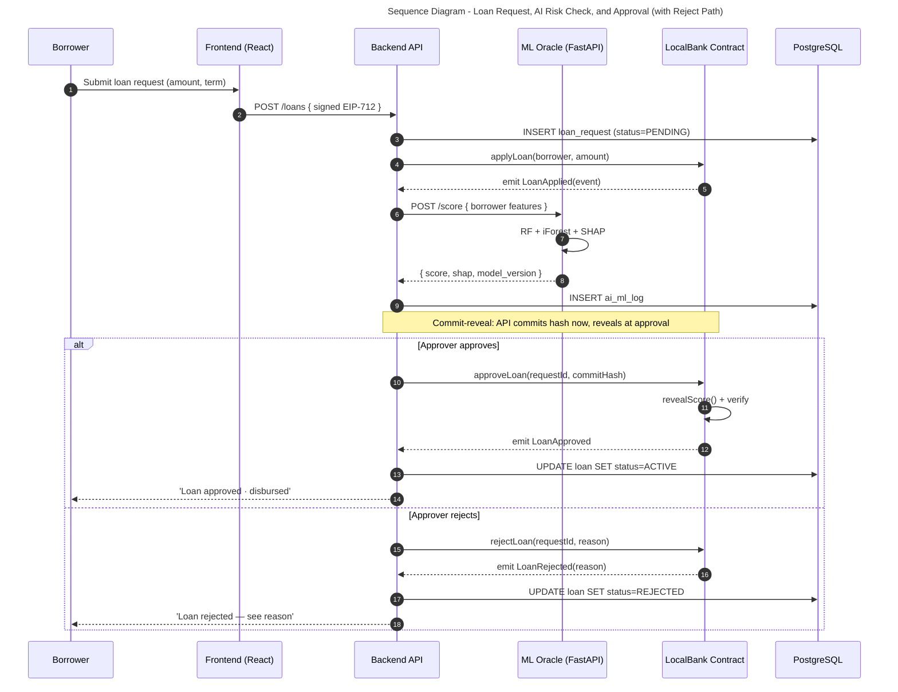

---
## Installment Payment and Income Verification Sequences
<!-- Diagram 16 of 32 | Source: `fig-seq-installment-income.mmd` | Rendered PDF: `fig-seq-installment-income.pdf` -->
| Field | Value |
| --- | --- |
| **Source file** | `fig-seq-installment-income.mmd` |
| **Rendered PDF** | `fig-seq-installment-income.pdf` |
| **Thesis labels** | `fig:seq-installment-income, fig:seq-installment, fig:seq-income` |
| **Chapter** | Chapter 3 — System Architecture and Design |
| **Section** | System Modeling → Sequence Diagrams |
| **Caption (summary)** | Installment payment loop (CEI pattern) and income verification sequences. |

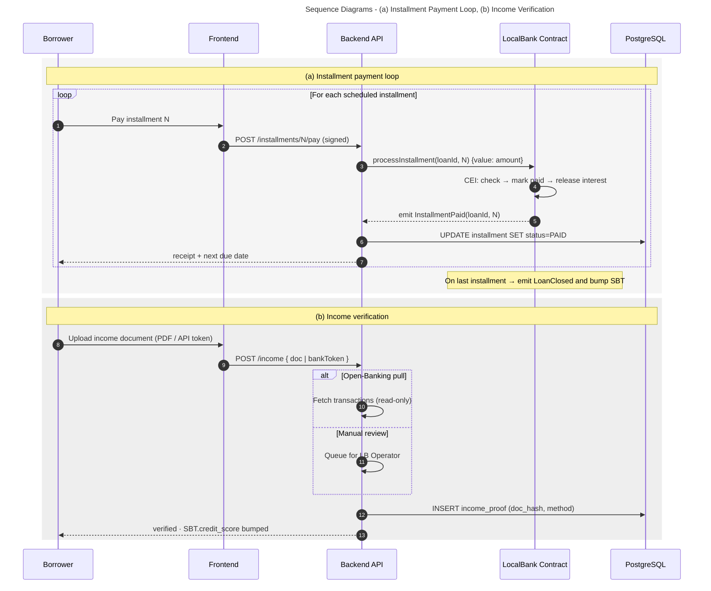

---
## Hierarchical Capital, Market Data, and Borrowing-Limit Sequences
<!-- Diagram 17 of 32 | Source: `fig-seq-banking-data.mmd` | Rendered PDF: `fig-seq-banking-data.pdf` -->
| Field | Value |
| --- | --- |
| **Source file** | `fig-seq-banking-data.mmd` |
| **Rendered PDF** | `fig-seq-banking-data.pdf` |
| **Thesis labels** | `fig:seq-banking-data, fig:seq-hierarchy, fig:seq-marketdata, fig:seq-borrowlimit` |
| **Chapter** | Chapter 3 — System Architecture and Design |
| **Section** | System Modeling → Sequence Diagrams |
| **Caption (summary)** | Hierarchical capital flow, Chainlink market-data retrieval, borrowing-limit calculation. |

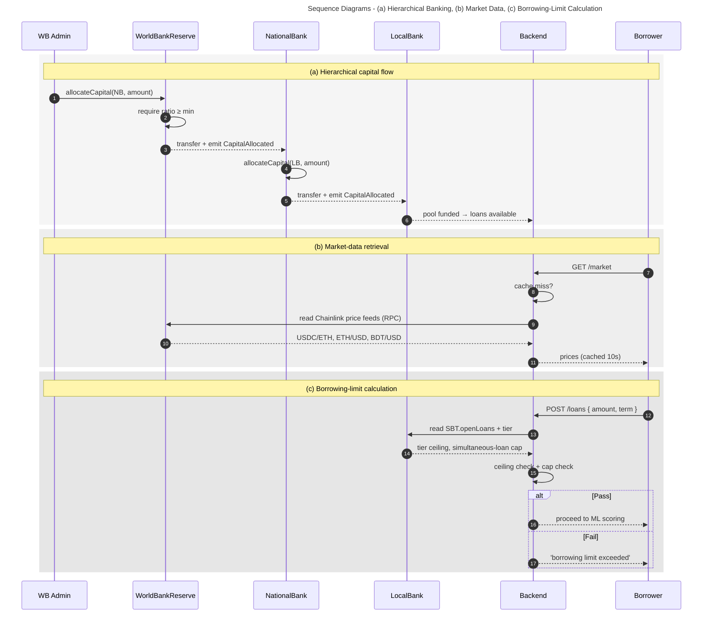

---
## Chat and AI Chatbot Sequences
<!-- Diagram 18 of 32 | Source: `fig-seq-chat-chatbot.mmd` | Rendered PDF: `fig-seq-chat-chatbot.pdf` -->
| Field | Value |
| --- | --- |
| **Source file** | `fig-seq-chat-chatbot.mmd` |
| **Rendered PDF** | `fig-seq-chat-chatbot.pdf` |
| **Thesis labels** | `fig:seq-chat-bot, fig:seq-chat, fig:seq-aichatbot` |
| **Chapter** | Chapter 3 — System Architecture and Design |
| **Section** | System Modeling → Sequence Diagrams |
| **Caption (summary)** | Authenticated WebSocket chat and RAG-augmented AI chatbot pipeline. |

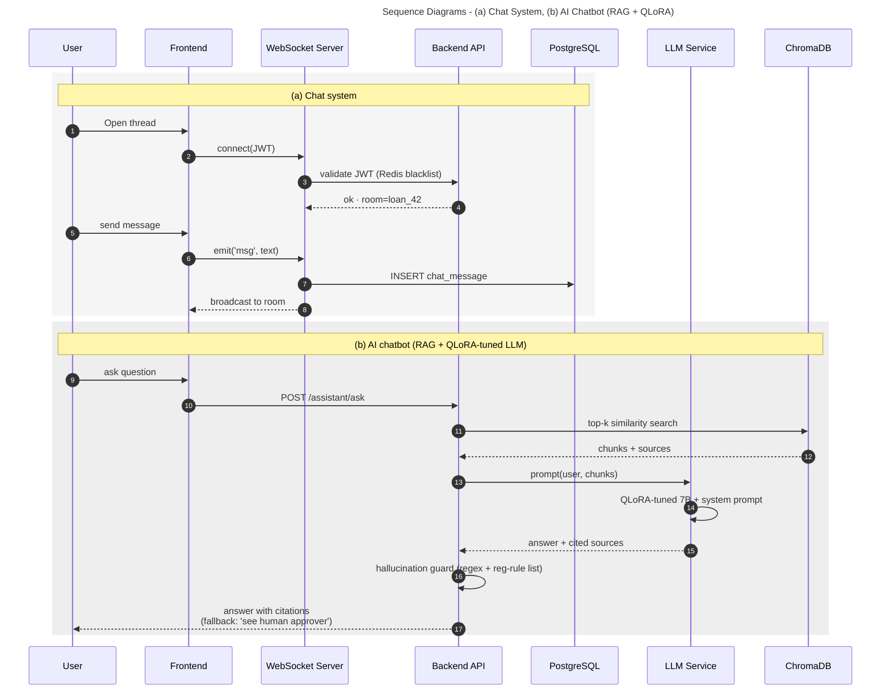

---
## Four-Tier Hierarchical Capital Flow
<!-- Diagram 19 of 32 | Source: `fig-hierarchical-banking.mmd` | Rendered PDF: `fig-hierarchical-banking.pdf` -->
| Field | Value |
| --- | --- |
| **Source file** | `fig-hierarchical-banking.mmd` |
| **Rendered PDF** | `fig-hierarchical-banking.pdf` |
| **Thesis labels** | `fig:four-tier` |
| **Chapter** | Chapter 3 — System Architecture and Design |
| **Section** | System Modeling → Four-Tier Capital Flow |
| **Caption (summary)** | Four-tier capital flow with cascading repayment, interbank pools, and upward repatriation. |

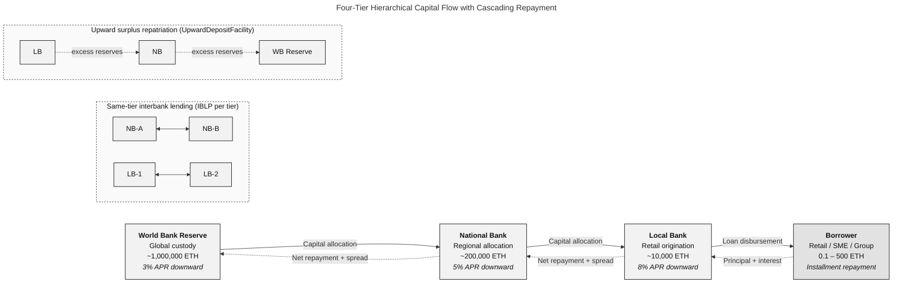

---
## Auxiliary Banking Modules
<!-- Diagram 20 of 32 | Source: `fig-banking-modules.mmd` | Rendered PDF: `fig-banking-modules.pdf` -->
| Field | Value |
| --- | --- |
| **Source file** | `fig-banking-modules.mmd` |
| **Rendered PDF** | `fig-banking-modules.pdf` |
| **Thesis labels** | `fig:banking-modules` |
| **Chapter** | Chapter 3 — System Architecture and Design |
| **Section** | Banking Product Suite |
| **Caption (summary)** | LiquidationEngine, SavingsVault/FixedDeposit, Credit Passport SBT, Cross-Chain Bridge. |

```mermaid
---
title: Auxiliary Banking Modules - Liquidation, SavingsVault, FixedDeposit, SBT, Bridge
---
flowchart TB
    classDef contract fill:#E2E2E2,stroke:#1F1F1F,stroke-width:1.2px,color:#111111
    classDef step  fill:#F2F2F2,stroke:#1F1F1F,stroke-width:1px,color:#111111
    classDef store fill:#FAFAFA,stroke:#1F1F1F,stroke-width:1px,color:#111111
    classDef note  fill:#FFFFFF,stroke:#1F1F1F,stroke-width:1px,color:#111111,stroke-dasharray:3 3

    subgraph A[" (a) LiquidationEngine "]
        direction LR
        L1["Loan ACTIVE"]:::step --> L2{Missed payment<br/>+ grace expired?}:::step
        L2 -- Yes --> L3["LiquidationEngine.trigger()"]:::contract
        L3 --> L4["Seize collateral · auction"]:::step
        L4 --> L5["Distribute to lenders<br/>+ liquidator bonus"]:::step
        L4 -. "shortfall → InsuranceFund" .-> L6["InsuranceFund"]:::contract
    end

    subgraph B[" (b) SavingsVault · FixedDeposit "]
        direction LR
        D1["Depositor"]:::step --> SV["SavingsVault<br/>variable yield = f(U)"]:::contract
        D1 --> FD["FixedDeposit<br/>30 / 90 / 180 / 365 d"]:::contract
        SV -.-> POOL[("Lending pool")]:::store
        FD -.-> POOL
        POOL -- "duration-matched lending" --> LB["LocalBank disbursement"]:::contract
    end

    subgraph C[" (c) On-chain Credit Passport (SBT) "]
        direction LR
        BR["Borrower wallet"]:::step --> SBT["CreditPassportSBT<br/>{credit_score, open_loans,<br/>completed_cycles, last_default, risk_tier}"]:::contract
        SBT -- "read" --> ALL["Any LB / GroupPool /<br/>third-party adopting contract"]:::step
        SBT -. "non-transferable · soulbound" .-> Note1["progressive lending<br/>across banks"]:::note
    end

    subgraph D[" (d) Cross-Chain Bridge "]
        direction LR
        POL["Polygon PoS<br/>(retail loans)"]:::contract --- CCIP["Chainlink CCIP"]:::contract --- ETH["Ethereum Sepolia<br/>(institutional)"]:::contract
        CCIP -. "(i) reserve-ratio updates<br/>(ii) SBT mirroring" .-> Note2["loan state stays<br/>on origin chain"]:::note
    end
```

---
## Five-Layer Defense-in-Depth Security Architecture
<!-- Diagram 21 of 32 | Source: `fig-defense-in-depth.mmd` | Rendered PDF: `fig-defense-in-depth.pdf` -->
| Field | Value |
| --- | --- |
| **Source file** | `fig-defense-in-depth.mmd` |
| **Rendered PDF** | `fig-defense-in-depth.pdf` |
| **Thesis labels** | `fig:defense-in-depth` |
| **Chapter** | Chapter 3 — System Architecture and Design |
| **Section** | Five-Layer Defense-in-Depth Security Architecture |
| **Caption (summary)** | Five-layer defense-in-depth stack from smart contracts through operations. |

```mermaid
---
title: Five-Layer Defense-in-Depth Security Architecture
---
flowchart TB
    classDef layer fill:#FAFAFA,stroke:#1F1F1F,stroke-width:1.4px,color:#111111
    classDef ctl   fill:#F2F2F2,stroke:#1F1F1F,stroke-width:1px,color:#111111

    subgraph L1[" Layer 1 · Smart Contract Security "]
        SC1["OpenZeppelin v5 · UUPS"]:::ctl
        SC2["TimelockController (24–48 h)"]:::ctl
        SC3["RBAC + role expiry"]:::ctl
        SC4["ReentrancyGuard · CEI"]:::ctl
        SC5["Slither · Mythril · Echidna"]:::ctl
        SC6["Foundry fuzz + invariants"]:::ctl
        SC7["Certora reserve proofs"]:::ctl
    end

    subgraph L2[" Layer 2 · Application Security "]
        AS1["EIP-712 signed login"]:::ctl
        AS2["JWT + Redis blacklist"]:::ctl
        AS3["Rate-limit · CORS · CSP"]:::ctl
        AS4["Input validation (zod / pydantic)"]:::ctl
        AS5["Secrets in HSM / Vault"]:::ctl
    end

    subgraph L3[" Layer 3 · AI / ML Security "]
        ML1["Commit-reveal oracle"]:::ctl
        ML2["Model registry · version pin"]:::ctl
        ML3["Adversarial input filters"]:::ctl
        ML4["SHAP explanation log"]:::ctl
        ML5["LLM hallucination guard"]:::ctl
    end

    subgraph L4[" Layer 4 · Runtime Monitoring "]
        RM1["Tenderly · alerts"]:::ctl
        RM2["The Graph indexer"]:::ctl
        RM3["WebSocket dashboard"]:::ctl
        RM4["Anomaly detector (iForest)"]:::ctl
    end

    subgraph L5[" Layer 5 · Operational Security "]
        OP1["Safe 3-of-5 multisig"]:::ctl
        OP2["Monthly key rotation"]:::ctl
        OP3["Bug-bounty programme"]:::ctl
        OP4["Incident-response runbook"]:::ctl
    end

    L5 --> L4 --> L3 --> L2 --> L1
    class L1,L2,L3,L4,L5 layer
```

---
## Smart-Contract Security Controls
<!-- Diagram 22 of 32 | Source: `fig-security-controls.mmd` | Rendered PDF: `fig-security-controls.pdf` -->
| Field | Value |
| --- | --- |
| **Source file** | `fig-security-controls.mmd` |
| **Rendered PDF** | `fig-security-controls.pdf` |
| **Thesis labels** | `fig:security-controls` |
| **Chapter** | Chapter 3 — System Architecture and Design |
| **Section** | Five-Layer Defense-in-Depth Security Architecture |
| **Caption (summary)** | UUPS upgrade path, EIP-712 sign-in, granular pause registry. |

```mermaid
---
title: Smart-Contract Security Controls - UUPS, TimeLock, EIP-712, Granular Pause
---
flowchart TB
    classDef ctl    fill:#F2F2F2,stroke:#1F1F1F,stroke-width:1px,color:#111111
    classDef step   fill:#FAFAFA,stroke:#1F1F1F,stroke-width:1px,color:#111111
    classDef actor  fill:#FFFFFF,stroke:#1F1F1F,stroke-width:1.4px,color:#111111
    classDef state  fill:#E2E2E2,stroke:#1F1F1F,stroke-width:1px,color:#111111

    subgraph A[" (a) UUPS upgrade path "]
        direction TB
        U1["Proposer (Safe 3-of-5)"]:::actor --> U2["upgradeTo(newImpl)<br/>onlyRole(WB_ADMIN)"]:::step
        U2 --> U3["TimeLock 24–48 h"]:::state
        U3 --> U4["Implementation contract<br/>holds _authorizeUpgrade"]:::ctl
        U4 --> U5["State preserved · proxy<br/>now delegates to newImpl"]:::state
    end

    subgraph B[" (b) EIP-712 sign-in "]
        direction TB
        E1["Client builds<br/>typed-data v4 payload"]:::step --> E2["Wallet signs<br/>(domain · types · message)"]:::actor
        E2 --> E3["API verifies sig<br/>(recoverAddress)"]:::ctl
        E3 --> E4["Issue short-lived JWT<br/>(15 min) + refresh"]:::ctl
    end

    subgraph C[" (c) Granular per-function pause "]
        direction TB
        P1["WB Admin"]:::actor --> P2["pauseFunction(LOAN_DISBURSEMENT)"]:::step
        P2 --> P3["mapping(bytes32 ⇒ bool) functionPaused"]:::ctl
        P3 -. "DEPOSITS, WITHDRAWALS remain live" .-> P4["Other functions<br/>continue normally"]:::state
        P2 --> P5["emit FunctionPaused(actor, ts)<br/>· indexed by The Graph"]:::ctl
    end
```

---
## Agile / Scrum Process
<!-- Diagram 23 of 32 | Source: `fig-agile-process.mmd` | Rendered PDF: `fig-agile-process.pdf` -->
| Field | Value |
| --- | --- |
| **Source file** | `fig-agile-process.mmd` |
| **Rendered PDF** | `fig-agile-process.pdf` |
| **Thesis labels** | `fig:agile-process` |
| **Chapter** | Chapter 4 — Methodology |
| **Section** | Development Methodology |
| **Caption (summary)** | Agile/Scrum process with two-week iterations, ceremonies, and phase-submission gate. |

```mermaid
---
title: Agile / Scrum Process with Sprint Submission Cycle
---
flowchart LR
    classDef step fill:#F2F2F2,stroke:#1F1F1F,stroke-width:1px,color:#111111
    classDef cer  fill:#E2E2E2,stroke:#1F1F1F,stroke-width:1px,color:#111111
    classDef art  fill:#FAFAFA,stroke:#1F1F1F,stroke-width:1px,color:#111111
    classDef loop fill:#FFFFFF,stroke:#1F1F1F,stroke-width:1.4px,color:#111111

    PB["Product Backlog<br/>(user stories + NFRs)"]:::art
    SP["Sprint Planning"]:::cer
    SB["Sprint Backlog"]:::art
    DEV["Development<br/>(2-week iterations)"]:::step
    DSM["Daily Stand-up"]:::cer
    REV["Sprint Review<br/>(demo)"]:::cer
    RET["Sprint Retrospective"]:::cer
    INC["Potentially-shippable<br/>Increment"]:::art
    SUB["Sprint Submission<br/>(report + PRs + CI green)"]:::art

    PB --> SP --> SB --> DEV --> REV --> RET --> SP
    DEV -.-> DSM -.-> DEV
    DEV --> INC --> SUB

    subgraph PT[" Sprint point estimates "]
        direction TB
        P1["Sprint 1 · 34 pts"]:::loop
        P2["Sprint 2 · 41 pts"]:::loop
        P3["Sprint 3 · 47 pts"]:::loop
    end
    SUB -.-> PT
```

---
## AI/ML Pipeline Wiring
<!-- Diagram 24 of 32 | Source: `fig-aiml-pipeline.mmd` | Rendered PDF: `fig-aiml-pipeline.pdf` -->
| Field | Value |
| --- | --- |
| **Source file** | `fig-aiml-pipeline.mmd` |
| **Rendered PDF** | `fig-aiml-pipeline.pdf` |
| **Thesis labels** | `fig:aiml-pipeline` |
| **Chapter** | Chapter 4 — Methodology |
| **Section** | Planned AI/ML Support and Risk-Score Wiring |
| **Caption (summary)** | Training pipeline, commit-reveal ML oracle, GNN extension, federated learning. |

```mermaid
---
title: AI / ML Pipeline - Training, Commit-Reveal Oracle, GNN, Federated Learning
---
flowchart TB
    classDef step fill:#F2F2F2,stroke:#1F1F1F,stroke-width:1px,color:#111111
    classDef store fill:#FAFAFA,stroke:#1F1F1F,stroke-width:1px,color:#111111
    classDef chain fill:#E2E2E2,stroke:#1F1F1F,stroke-width:1.2px,color:#111111
    classDef out  fill:#FFFFFF,stroke:#1F1F1F,stroke-width:1.4px,color:#111111

    subgraph A[" (a) Training pipeline "]
        direction LR
        DS[("Loan history + on-chain events")]:::store --> FE["Feature engineering<br/>(amount, tier, income, prior_defaults)"]:::step
        FE --> RF["Random Forest classifier"]:::step
        FE --> IF["Isolation Forest<br/>(anomaly)"]:::step
        RF --> SH["SHAP · explainable AI"]:::step
        IF --> SH
        SH --> REG["Model registry<br/>(version + hash)"]:::store
    end

    subgraph B[" (b) Commit-reveal ML oracle "]
        direction LR
        REG --> ML["FastAPI service"]:::step
        ML -- "commit(hash(score, salt))" --> SC["LocalBank contract"]:::chain
        SC -. "block N+k" .-> ML
        ML -- "reveal(score, salt)" --> SC
        SC -- "verify hash · gate approval" --> OUT["LoanApproved event"]:::out
    end

    subgraph C[" (c) GNN extension "]
        direction LR
        GR[("Wallet–wallet graph<br/>(loans, repayments, transfers)")]:::store --> GNN["GraphSAGE<br/>node + edge embeddings"]:::step
        GNN --> RF2["Augments RF feature vector<br/>(relational signal)"]:::step
        RF2 --> REG
    end

    subgraph D[" (d) Federated learning across tiers "]
        direction LR
        LBA["LB-A local trainer"]:::step --> AGG["Federated aggregator<br/>(NB tier)"]:::step
        LBB["LB-B local trainer"]:::step --> AGG
        LBC["LB-C local trainer"]:::step --> AGG
        AGG -- "secure-aggregated weights" --> GLOB["Global fraud detector"]:::out
        AGG -. "no raw data leaves LB; DP noise added" .-> Note["Privacy + locality"]:::out
    end
```

---
## Real-Time Dashboard and Runtime Monitoring Pipeline
<!-- Diagram 25 of 32 | Source: `fig-realtime-dashboard.mmd` | Rendered PDF: `fig-realtime-dashboard.pdf` -->
| Field | Value |
| --- | --- |
| **Source file** | `fig-realtime-dashboard.mmd` |
| **Rendered PDF** | `fig-realtime-dashboard.pdf` |
| **Thesis labels** | `fig:realtime-dashboard` |
| **Chapter** | Chapter 4 — Methodology |
| **Section** | Real-Time Dashboard Pipeline and Runtime Monitoring |
| **Caption (summary)** | Event indexing via The Graph, WebSocket dashboard, Tenderly alerts, anomaly detection. |

```mermaid
---
title: Real-Time Dashboard and Runtime Monitoring Pipeline
---
flowchart LR
    classDef chain fill:#E2E2E2,stroke:#1F1F1F,stroke-width:1.2px,color:#111111
    classDef step  fill:#F2F2F2,stroke:#1F1F1F,stroke-width:1px,color:#111111
    classDef store fill:#FAFAFA,stroke:#1F1F1F,stroke-width:1px,color:#111111
    classDef view  fill:#FFFFFF,stroke:#1F1F1F,stroke-width:1.4px,color:#111111

    SC["Smart contracts<br/>emit typed events"]:::chain --> GRP["The Graph subgraph<br/>(indexer)"]:::step
    SC --> TEN["Tenderly<br/>(runtime alerts)"]:::step
    GRP --> WS["WebSocket server<br/>(Node 20)"]:::step
    TEN -. "incident webhook" .-> OPS["Ops runbook +<br/>function pause"]:::store
    WS --> CACHE[("Redis cache<br/>(latest snapshot)")]:::store
    CACHE --> DASH["React dashboard<br/>(charts + alerts)"]:::view
    DASH --> REG["Read-only regulator view"]:::view
    GRP --> ANL["Anomaly detector<br/>(Isolation Forest)"]:::step
    ANL -. "alert" .-> OPS
```

---
## Transaction State Machine (Loan Lifecycle)
<!-- Diagram 26 of 32 | Source: `fig-tx-state-machine.mmd` | Rendered PDF: `fig-tx-state-machine.pdf` -->
| Field | Value |
| --- | --- |
| **Source file** | `fig-tx-state-machine.mmd` |
| **Rendered PDF** | `fig-tx-state-machine.pdf` |
| **Thesis labels** | `fig:tx-state-machine` |
| **Chapter** | Chapter 4 — Methodology |
| **Section** | Transaction-State Machine for Frontend UX |
| **Caption (summary)** | Loan lifecycle state machine from DRAFT through ACTIVE to CLOSED/DEFAULTED/LIQUIDATED. |

```mermaid
---
title: Transaction State Machine (Loan Lifecycle)
---
stateDiagram-v2
    [*] --> DRAFT
    DRAFT --> PENDING_KYC : Borrower submits
    PENDING_KYC --> REJECTED : KYC fails
    PENDING_KYC --> PENDING_LIMIT : KYC ok
    PENDING_LIMIT --> REJECTED : borrowing-limit fail
    PENDING_LIMIT --> PENDING_SCORE : limit ok
    PENDING_SCORE --> PENDING_APPROVAL : ML committed
    PENDING_APPROVAL --> REJECTED : approver rejects
    PENDING_APPROVAL --> ACTIVE : approver approves + reveal
    ACTIVE --> ACTIVE : processInstallment(N)
    ACTIVE --> DEFAULTED : missed beyond grace
    DEFAULTED --> LIQUIDATED : LiquidationEngine seizes
    DEFAULTED --> ACTIVE : cure within window
    ACTIVE --> CLOSED : final installment paid
    LIQUIDATED --> CLOSED : recovery distributed
    CLOSED --> [*]
```

---
## SDLC Stage Mapping with Implementation Phases
<!-- Diagram 27 of 32 | Source: `fig-sdlc-agile.mmd` | Rendered PDF: `fig-sdlc-agile.pdf` -->
| Field | Value |
| --- | --- |
| **Source file** | `fig-sdlc-agile.mmd` |
| **Rendered PDF** | `fig-sdlc-agile.pdf` |
| **Thesis labels** | `fig:methodology-technical, fig:sdlc-mapping` |
| **Chapter** | Chapter 4 — Methodology |
| **Section** | Evaluation Methodology (figure placed before Implementation Phase Plan) |
| **Caption (summary)** | SDLC stage mapping across four implementation phases with verification layers. |

```mermaid
---
title: SDLC Mapping with Agile / Scrum Sprint Plan
---
flowchart LR
    classDef phase fill:#E2E2E2,stroke:#1F1F1F,stroke-width:1.2px,color:#111111
    classDef sub   fill:#F2F2F2,stroke:#1F1F1F,stroke-width:1px,color:#111111
    classDef sprint fill:#FAFAFA,stroke:#1F1F1F,stroke-width:1.2px,color:#111111
    classDef note  fill:#FFFFFF,stroke:#1F1F1F,stroke-width:1px,color:#111111,stroke-dasharray:3 3

    REQ["Requirements"]:::phase --> ARC["Architecture"]:::phase --> DES["Design"]:::phase --> IMP["Implementation"]:::phase --> VER["Verification"]:::phase --> VAL["Validation"]:::phase --> MNT["Maintenance"]:::phase

    REQ -.-> RQ1["7-user taxonomy · 29 use cases ·<br/>functional / non-functional NFRs"]:::sub
    ARC -.-> AR1["4-tier hierarchy · 15 contracts ·<br/>3-layer system + 5-layer DiD"]:::sub
    DES -.-> DE1["ERD / EER · DFD L0–L1 ·<br/>Activity + Sequence + State"]:::sub

    subgraph SPR[" Final-thesis sprints "]
        direction TB
        S1["<b>Sprint 1</b><br/>Core contracts (WB · NB · LB) ·<br/>wallet auth · FE skeleton · PG schema"]:::sprint
        S2["<b>Sprint 2</b><br/>Lending services · SavingsVault ·<br/>FixedDeposit · GroupLendingPool ·<br/>InterBankPool · UpwardDeposit · TreasurySwap"]:::sprint
        S3["<b>Sprint 3</b><br/>ML wiring (RF · iForest · SHAP · GNN · FL) ·<br/>SyndicatedLoan · TranchedPool · NettingEngine ·<br/>Foundry invariants · Certora reserve proofs"]:::sprint
        S1 --> S2 --> S3
    end
    IMP --- SPR
    VER -.-> VE1["Foundry fuzz + invariant suite ·<br/>Slither / Mythril / Echidna · pytest"]:::sub
    VAL -.-> VA1["ABM economic simulation (Mesa) ·<br/>LLM eval protocol · regulator dashboard"]:::sub
    MNT -.-> MN1["Tenderly runtime · The Graph indexer ·<br/>monthly Safe key rotation"]:::sub
```

---
## Key Design Decisions and Alternatives
<!-- Diagram 28 of 32 | Source: `fig-design-decisions.mmd` | Rendered PDF: `fig-design-decisions.pdf` -->
| Field | Value |
| --- | --- |
| **Source file** | `fig-design-decisions.mmd` |
| **Rendered PDF** | `fig-design-decisions.pdf` |
| **Thesis labels** | `fig:design-decisions` |
| **Chapter** | Chapter 4 — Methodology |
| **Section** | Design Decisions and Alternatives |
| **Caption (summary)** | Evaluated alternatives for platform, chain, upgradeability, identity, ML oracle, and bridge. |

```mermaid
---
title: Key Design Decisions and Alternatives Considered
---
flowchart LR
    classDef topic fill:#E2E2E2,stroke:#1F1F1F,stroke-width:1.2px,color:#111111
    classDef pick  fill:#F2F2F2,stroke:#1F1F1F,stroke-width:1.4px,color:#111111
    classDef alt   fill:#FAFAFA,stroke:#1F1F1F,stroke-width:1px,color:#111111,stroke-dasharray:3 3

    T1["Smart-contract platform"]:::topic --> C1["EVM (Solidity)<br/>· tooling · audit ecosystem"]:::pick
    T1 --> C1a["Cosmos SDK"]:::alt
    T1 --> C1b["Solana / Anchor"]:::alt

    T2["Chain choice"]:::topic --> C2["Polygon (retail) +<br/>Sepolia (institutional)"]:::pick
    T2 --> C2a["Ethereum L1 only<br/>(gas-prohibitive)"]:::alt
    T2 --> C2b["Single L2 (Arbitrum)<br/>(deferred until v2)"]:::alt

    T3["Upgradeability"]:::topic --> C3["UUPS (ERC-1822)<br/>· cheap · RBAC-gated"]:::pick
    T3 --> C3a["Transparent Proxy<br/>(extra ProxyAdmin)"]:::alt
    T3 --> C3b["Immutable<br/>(no patch path)"]:::alt

    T4["Identity"]:::topic --> C4["DID / VC + zkKYC<br/>(privacy-preserving)"]:::pick
    T4 --> C4a["On-chain raw KYC<br/>(regulatory hazard)"]:::alt
    T4 --> C4b["Off-chain only<br/>(no on-chain audit)"]:::alt

    T5["Risk scoring oracle"]:::topic --> C5["Commit-reveal via<br/>Chainlink Functions"]:::pick
    T5 --> C5a["Trusted backend write<br/>(replay risk)"]:::alt
    T5 --> C5b["Pure on-chain ML<br/>(infeasible cost)"]:::alt

    T6["Bridge"]:::topic --> C6["Chainlink CCIP<br/>(reuse oracle trust)"]:::pick
    T6 --> C6a["LayerZero"]:::alt
    T6 --> C6b["Axelar GMP"]:::alt
```

---
## Annual Revenue Projection by Tier (xyChart)
<!-- Diagram 29 of 32 | Source: `fig-revenue-by-tier.mmd` | Rendered PDF: `fig-revenue-by-tier.pdf` -->
| Field | Value |
| --- | --- |
| **Source file** | `fig-revenue-by-tier.mmd` |
| **Rendered PDF** | `fig-revenue-by-tier.pdf` |
| **Thesis labels** | `fig:revenue-by-tier` |
| **Chapter** | Chapter 5 — Market Analysis and Feasibility |
| **Section** | Revenue Projection |
| **Caption (summary)** | Annual revenue projection at full 10-year deployment maturity (USD millions). |
| **Build note** | Mermaid xychart diagram; rendered to PDF via SVG + rsvg-convert (B&W post-processing). |

```mermaid
xychart-beta
    x-axis ["World Bank", "National Banks", "Local Banks", "Total"]
    y-axis "Revenue (USD m)" 0 --> 250
    bar [63.05, 51.55, 110.05, 224.65]
```

---
## Hierarchical Interest-Rate Spread (APR)
<!-- Diagram 30 of 32 | Source: `fig-apr-spread.mmd` | Rendered PDF: `fig-apr-spread.pdf` -->
| Field | Value |
| --- | --- |
| **Source file** | `fig-apr-spread.mmd` |
| **Rendered PDF** | `fig-apr-spread.pdf` |
| **Thesis labels** | `fig:apr-spread` |
| **Chapter** | Chapter 5 — Market Analysis and Feasibility |
| **Section** | Revenue Projection |
| **Caption (summary)** | Hierarchical interest-rate spread across the four-tier lending structure. |
| **Build note** | Mermaid xychart diagram; rendered to PDF via SVG + rsvg-convert (B&W post-processing). |

```mermaid
xychart-beta
    x-axis ["WB to NB", "NB to LB", "LB to Borrower"]
    y-axis "APR (%)" 0 --> 10
    bar [3, 5, 8]
```

---
## Autonomous AI Agent Request Path (Compact)
<!-- Diagram 31 of 32 | Source: `fig-local-llm-compact.mmd` | Rendered PDF: `fig-local-llm-compact.pdf` -->
| Field | Value |
| --- | --- |
| **Source file** | `fig-local-llm-compact.mmd` |
| **Rendered PDF** | `fig-local-llm-compact.pdf` |
| **Thesis labels** | `fig:local-llm-mermaid` |
| **Chapter** | Appendix — Technology Stack |
| **Section** | In-product assistant: local large language model (LLM) integration (prototype) |
| **Caption (summary)** | Compact end-to-end agent path: UI → API → MCP tools → Qwen3-8B → confirmation gate → on-chain tx. |

```mermaid
---
title: Local LLM Assistant — Compact Request Path
---
flowchart TB
    classDef node fill:#F2F2F2,stroke:#1F1F1F,stroke-width:1.2px,color:#111111

    UI["Web UI<br/>landing + in-app<br/>(Vite + React)"]:::node
    P["Vite dev proxy<br/>/api → :4000"]:::node
    S["CWB API<br/>POST /api/ai/chat/stream (SSE)"]:::node
    L["LM Studio<br/>/v1/chat/completions (stream)"]:::node
    R["Message rendering<br/>Markdown · math · GFM"]:::node

    UI -->|"browser fetch"| P
    P --> S
    S -->|"upstream"| L
    L -->|"token deltas"| S
    S -->|"SSE: token + meta + done"| P
    P -->|"incremental text"| R
```

---
## Autonomous AI Agent Data Flow (Expanded)
<!-- Diagram 32 of 32 | Source: `fig-local-llm.mmd` | Rendered PDF: `fig-local-llm.pdf` -->
| Field | Value |
| --- | --- |
| **Source file** | `fig-local-llm.mmd` |
| **Rendered PDF** | `fig-local-llm.pdf` |
| **Thesis labels** | `fig:local-llm-tikz` |
| **Chapter** | Appendix — Technology Stack |
| **Section** | In-product assistant: local large language model (LLM) integration (prototype) |
| **Caption (summary)** | Expanded agent data flow with component boundaries and EIP-7702 session-key signing. |

```mermaid
---
title: Local LLM Assistant — Component Data Flow
---
flowchart TB
    classDef ui   fill:#F2F2F2,stroke:#1F1F1F,stroke-width:1.2px,color:#111111
    classDef api  fill:#E2E2E2,stroke:#1F1F1F,stroke-width:1.2px,color:#111111
    classDef srv  fill:#FAFAFA,stroke:#1F1F1F,stroke-width:1.2px,color:#111111

    subgraph CLIENT[" Browser "]
        UI["Web UI (Vite + React)<br/>Landing assistant · in-app widget"]:::ui
    end

    subgraph SERVER[" CWB backend "]
        API["Express API<br/>POST /api/ai/chat/stream (SSE)<br/>optionalAuth · prompt shaping"]:::api
    end

    subgraph INFER[" Local inference "]
        LM["LM Studio · OpenAI-compatible<br/>127.0.0.1:1234<br/>/v1/chat/completions (stream)"]:::srv
    end

    UI -->|"transcript + feature context"| API
    API -->|"chat completions (stream)"| LM
    LM -->|"token deltas"| API
    API -->|"SSE tokens + metadata"| UI
```

---
