# New Diagrams for Pre-thesis Paper

Each diagram below is written in Mermaid. Render them at [mermaid.live](https://mermaid.live), take a screenshot, save as PNG in the `Diagrams/` folder, and add to the thesis at the indicated location.

---

## Diagram 1: Hierarchical vs Flat DeFi Architecture Comparison

**Where to add:** Chapter 1, Section 1.1 (Background), after the paragraph that describes how DeFi protocols employ flat pool-based architectures. Place as a new figure right before `\section{Rationale of the Study}`.

**Caption:** Architectural comparison between existing flat-pool DeFi lending protocols and the Crypto World Bank's hierarchical multi-tier model.

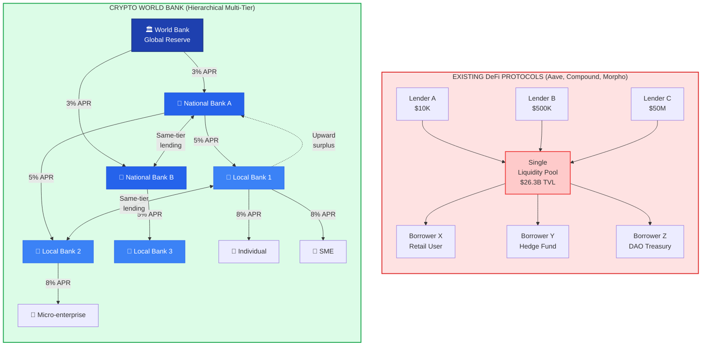

---

## Diagram 2: Cross-Tier Lending Flow Directions

**Where to add:** Chapter 1, Section 1.6.1 (Cross-Tier Lending System), after the subsection intro paragraph, before `\subsubsection{Same-Tier Lending}`.

**Caption:** Multi-directional capital flow in the Crypto World Bank: downward distribution (solid blue), same-tier interbank lending (dashed green), and upward surplus repatriation (dotted orange).

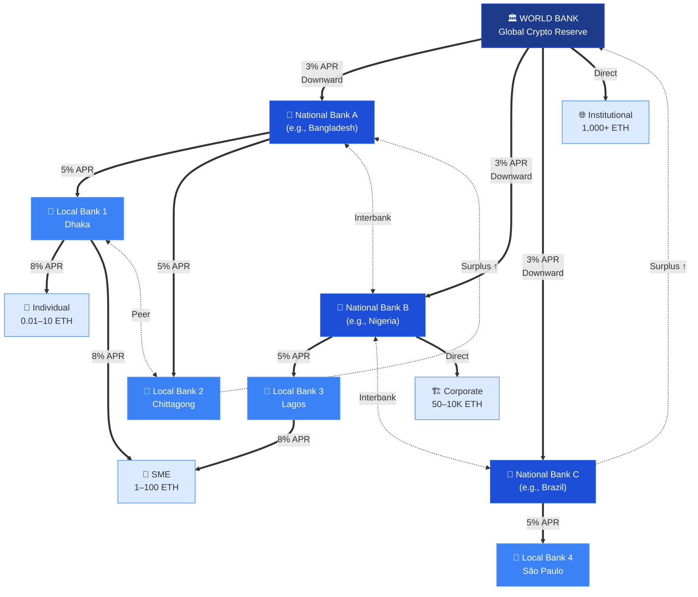

---

## Diagram 3: DeFi Lending TVL Comparison (Bar Chart)

**Where to add:** Chapter 5, Section 5.6 (Competitive Landscape), after the competitor longtable. Place as a new figure.

**Caption:** Total Value Locked comparison across major DeFi lending protocols and the Crypto World Bank's target market position (March 2026 data, sources: DefiLlama [13][27][29], Morpho [43], Fensory [30][31]).

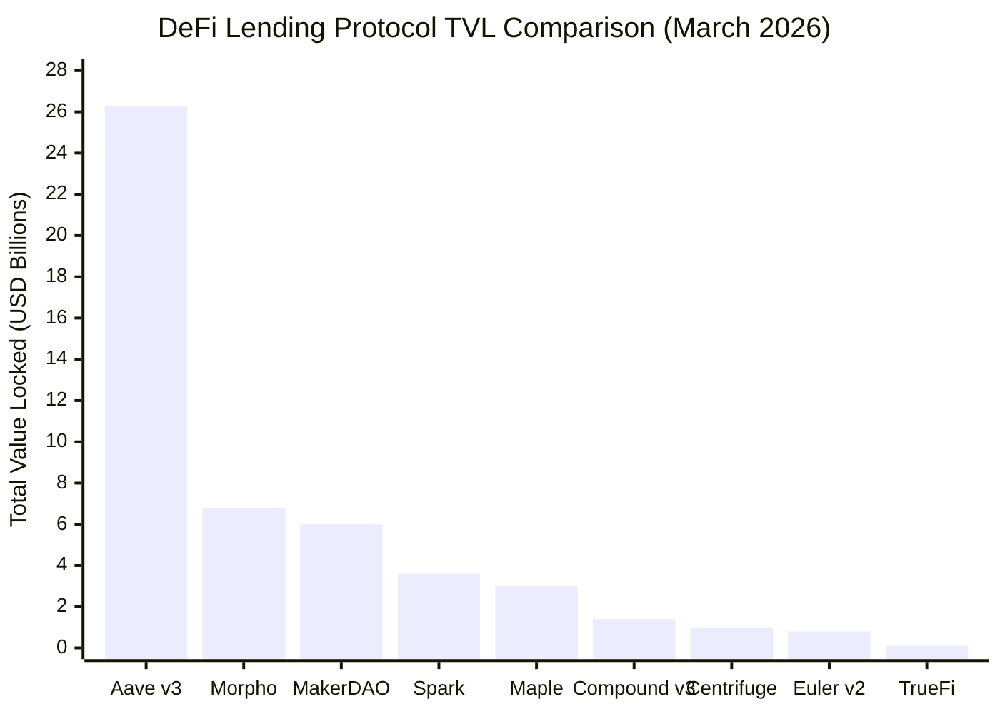

---

## Diagram 4: Correspondent Banking vs Crypto World Bank Settlement

**Where to add:** Chapter 2, after `\subsection{Correspondent Banking and Cross-Border Settlement}`, as a figure.

**Caption:** Settlement process comparison: traditional correspondent banking (top) versus Crypto World Bank on-chain settlement (bottom).

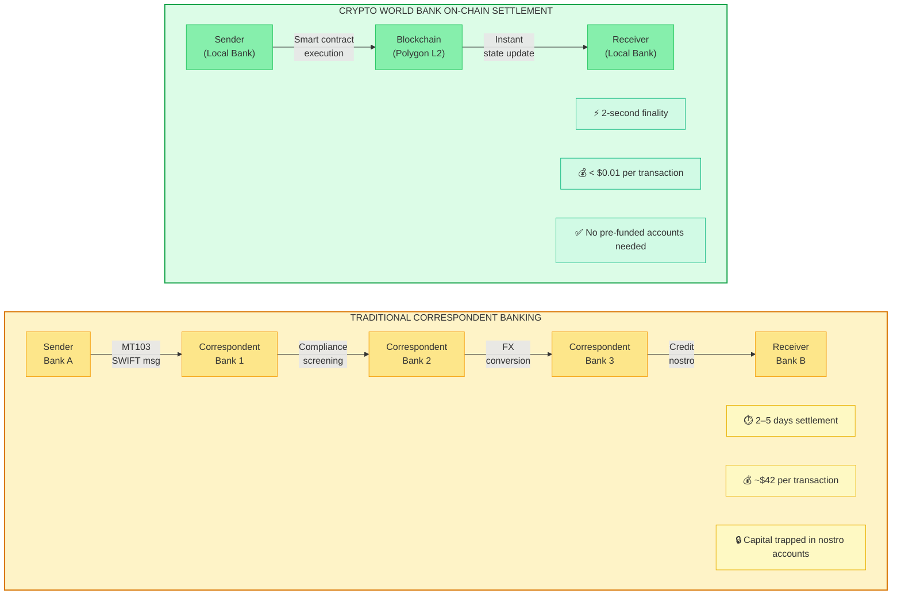

---

## Diagram 5: Global Financial Inclusion Gap

**Where to add:** Chapter 1, Section 1.1 (Background), after the paragraph mentioning 1.4 billion unbanked adults. Place as a new figure.

**Caption:** Scale of global financial exclusion and inefficiency: unbanked population, remittance fee losses, SME financing gap, and correspondent banking trapped capital (Sources: World Bank [14][26], IFC [20], BIS [24]).

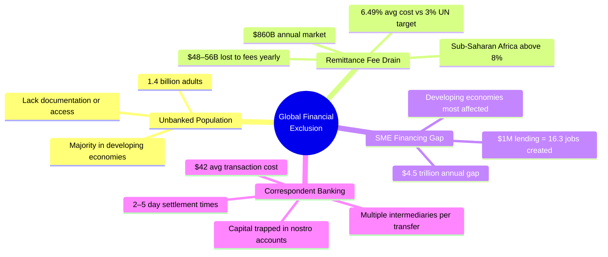

---

## Diagram 6: Competitive Feature Matrix (Heatmap Style)

**Where to add:** Chapter 5, Section 5.6 (Competitive Landscape), after the TVL bar chart figure. Place as a new figure.

**Caption:** Feature comparison across competitor categories. Green indicates the feature is present, red indicates absent, yellow indicates partial support.

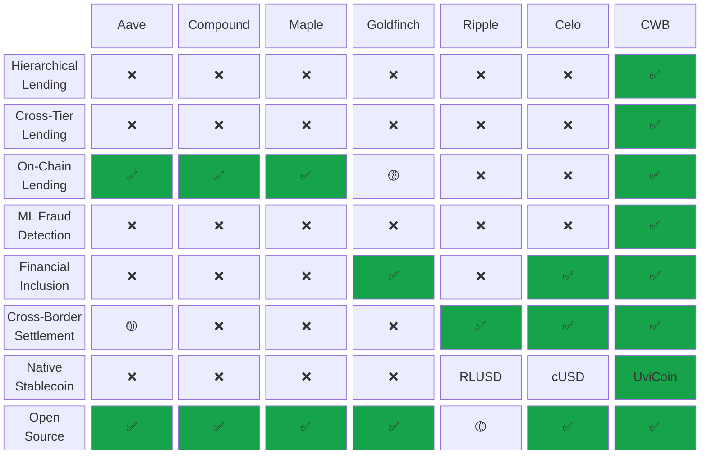

---

## Diagram 7: Interest Rate Waterfall Across Tiers

**Where to add:** Chapter 5, Section 5.9.1 (Transaction Economics: Interest Rates), after the existing bar chart. Place as a new figure showing the spread mechanics.

**Caption:** Interest rate spread and margin distribution across the four-tier lending hierarchy. Each tier retains its spread as net interest margin.

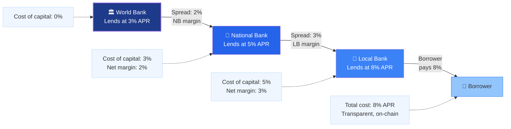

---

## Diagram 8: Market Sizing Funnel (TAM → SAM → SOM)

**Where to add:** Chapter 5, Section 5.1 (Market Sizing), after the market segments table. Place as a new figure.

**Caption:** Market sizing funnel from Total Addressable Market through Serviceable Obtainable Market, with constituent data sources.

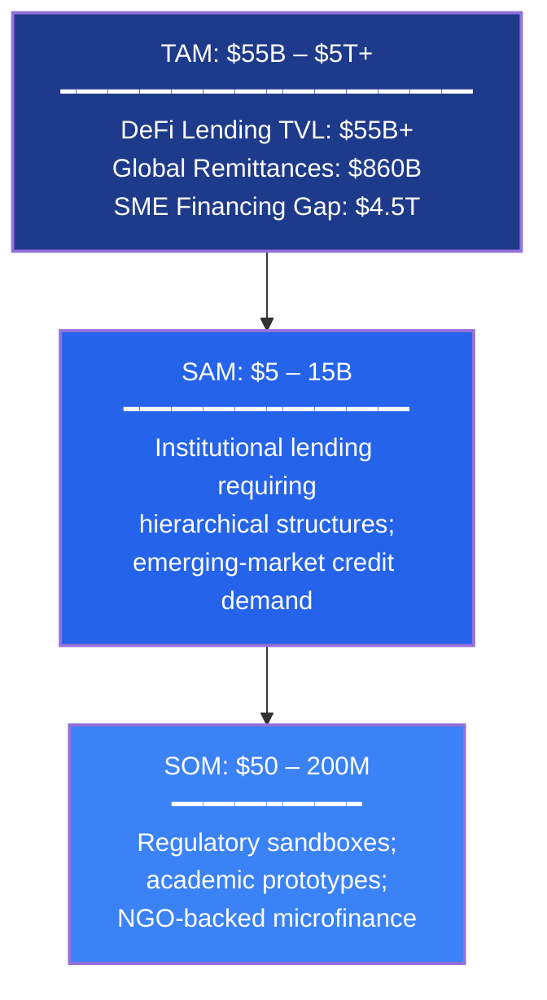

---

## Diagram 9: Institutional Blockchain Adoption Timeline

**Where to add:** Chapter 2, after `\subsection{Real-World Asset Tokenization and Institutional DeFi}`, as a figure.

**Caption:** Timeline of institutional blockchain adoption milestones demonstrating growing bank and institutional engagement with distributed ledger technology (2020–2026).

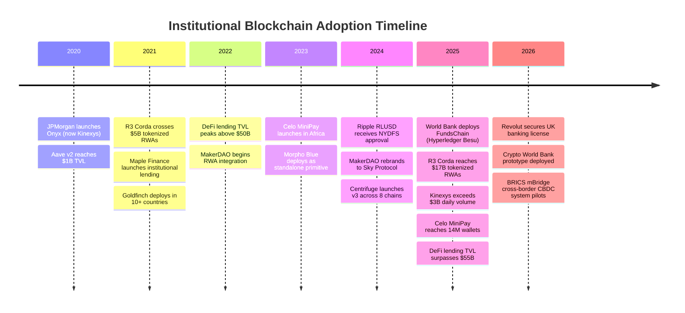

---

## Diagram 10: Monetary Policy Transmission — Traditional vs Crypto World Bank

**Where to add:** Chapter 2, after `\subsection{Monetary Policy Distribution and Financial Inequality}`, as a figure.

**Caption:** Comparison of monetary policy transmission in the traditional banking system (exhibiting the Cantillon Effect) versus the Crypto World Bank's transparent, algorithmic approach.

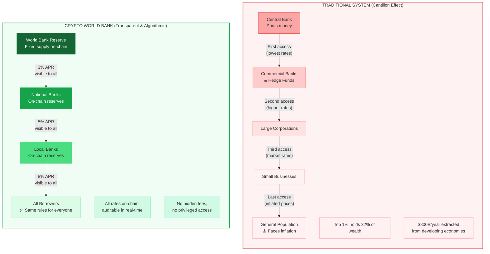

---

## Diagram 11: Competitor Architecture Classification

**Where to add:** Chapter 5, Section 5.6 (Competitive Landscape), at the end of the section before `\section{Risk Taxonomy}`. Place as a final summary figure for the competitive analysis.

**Caption:** Classification of competitors by architecture type and target user base. The Crypto World Bank uniquely occupies the intersection of hierarchical architecture and broad user coverage (institutional through retail).

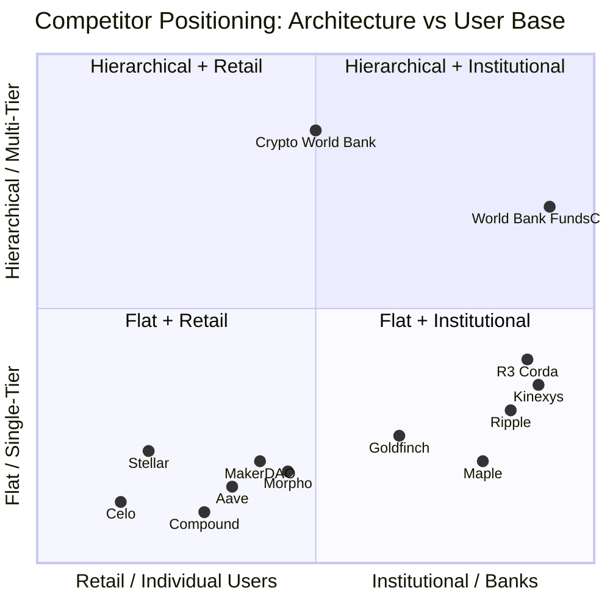

---

## Diagram 12: Go-to-Market Phased Roadmap

**Where to add:** Chapter 5, Section 5.9.3 (Value Proposition and Go-to-Market), after the existing go-to-market phases table. Place as a visual timeline figure.

**Caption:** Phased deployment roadmap from academic validation through production-scale multi-chain deployment with corresponding milestones, user acquisition targets, and revenue projections.

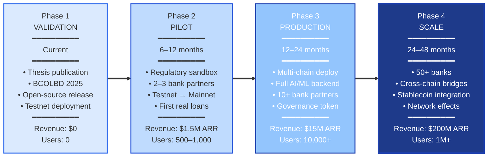

---

## Diagram 13: AI/ML Security Pipeline

**Where to add:** Chapter 3, Section 3.1 (High-Level Architecture), after the existing component diagram. Place as a new figure showing the AI/ML decision flow.

**Caption:** AI/ML security analytics pipeline: off-chain model inference integrated with on-chain lending decisions through the risk scoring API.

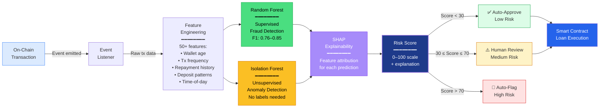

---

## Diagram 14: Borrower Tier Access Rules

**Where to add:** Chapter 1, Section 1.6.1 (Cross-Tier Lending System), after the borrower tier access table. Place as a visual figure complementing the table.

**Caption:** Tiered borrower access: different borrower classes access different levels of the lending hierarchy based on loan size and organizational type.

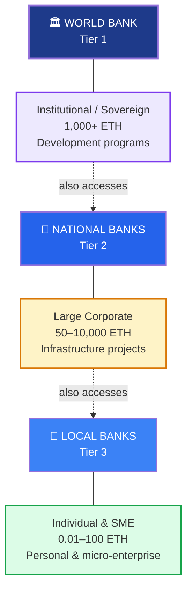

---

## Summary: Diagram Placement Guide

| # | Diagram | Thesis Location | Section |
|---|---------|----------------|---------|
| 1 | Flat vs Hierarchical Architecture | Chapter 1 | Before Section 1.2 (Rationale) |
| 2 | Cross-Tier Lending Flow | Chapter 1 | Section 1.6.1, before Same-Tier Lending |
| 3 | DeFi TVL Comparison Bar Chart | Chapter 5 | Section 5.6, after competitor table |
| 4 | Correspondent Banking vs CWB | Chapter 2 | After Correspondent Banking subsection |
| 5 | Financial Inclusion Gap Mindmap | Chapter 1 | Section 1.1, after unbanked paragraph |
| 6 | Feature Matrix (Heatmap) | Chapter 5 | Section 5.6, after TVL bar chart |
| 7 | Interest Rate Waterfall | Chapter 5 | Section 5.9.1, after existing bar chart |
| 8 | Market Sizing Funnel | Chapter 5 | Section 5.1, after market segments table |
| 9 | Institutional Adoption Timeline | Chapter 2 | After RWA Tokenization subsection |
| 10 | Cantillon Effect vs CWB | Chapter 2 | After Monetary Policy subsection |
| 11 | Competitor Quadrant Chart | Chapter 5 | Section 5.6, end of section |
| 12 | Go-to-Market Roadmap | Chapter 5 | Section 5.9.3, after phases table |
| 13 | AI/ML Security Pipeline | Chapter 3 | Section 3.1, after component diagram |
| 14 | Borrower Tier Access | Chapter 1 | Section 1.6.1, after borrower table |
