# New thesis diagrams — build source for mmdc PNG pipeline

Render: `cd Documentation && python3 tools/build_mermaid_pdfs.py`

---

## Financial Inclusion Gap

- **Rendered PNG:** `Diagrams/mermaid-pdf/financial-inclusion-gap.png`

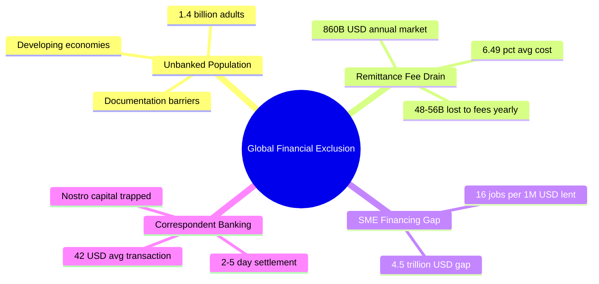

---

## Flat vs Hierarchical Architecture

- **Rendered PNG:** `Diagrams/mermaid-pdf/flat-vs-hierarchical.png`

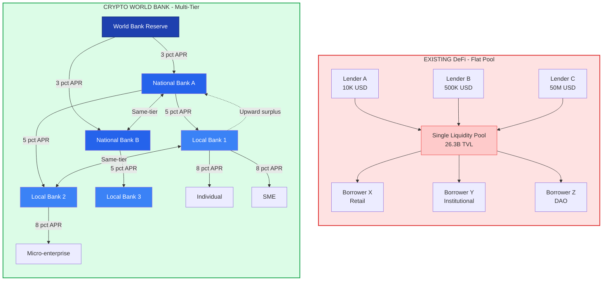

---

## Cross-Tier Lending Flow

- **Rendered PNG:** `Diagrams/mermaid-pdf/cross-tier-flow.png`

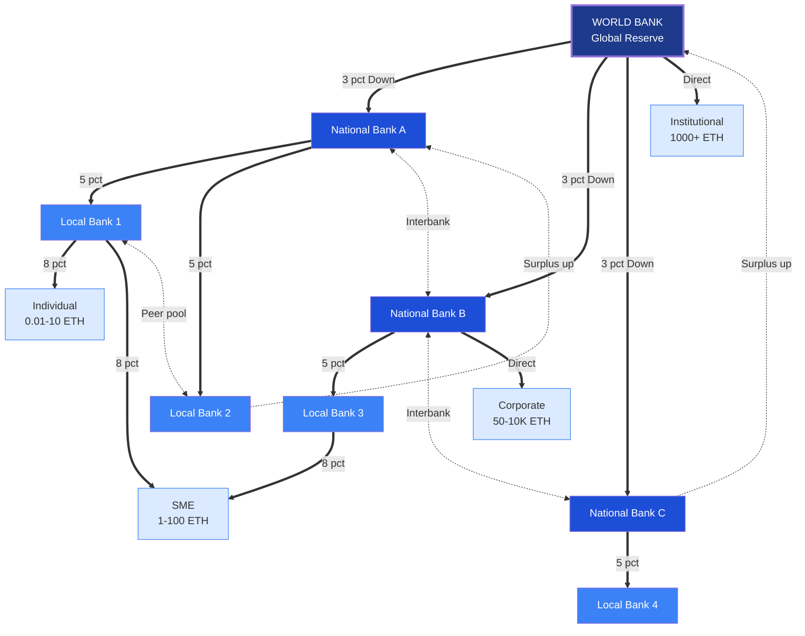

---

## Borrower Tier Access

- **Rendered PNG:** `Diagrams/mermaid-pdf/borrower-tier-access.png`

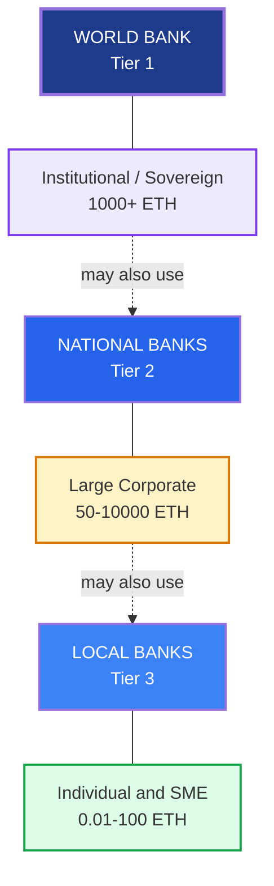

---

## Correspondent vs On-Chain Settlement

- **Rendered PNG:** `Diagrams/mermaid-pdf/correspondent-vs-onchain.png`

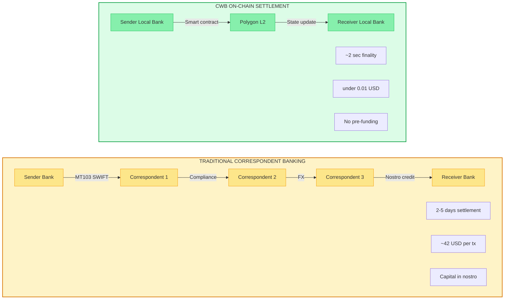

---

## Monetary Policy Comparison

- **Rendered PNG:** `Diagrams/mermaid-pdf/monetary-policy-comparison.png`

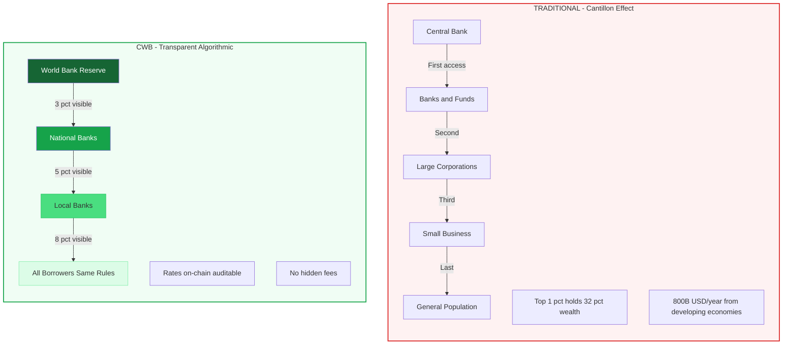

---

## Institutional Adoption Timeline

- **Rendered PNG:** `Diagrams/mermaid-pdf/institutional-adoption-timeline.png`

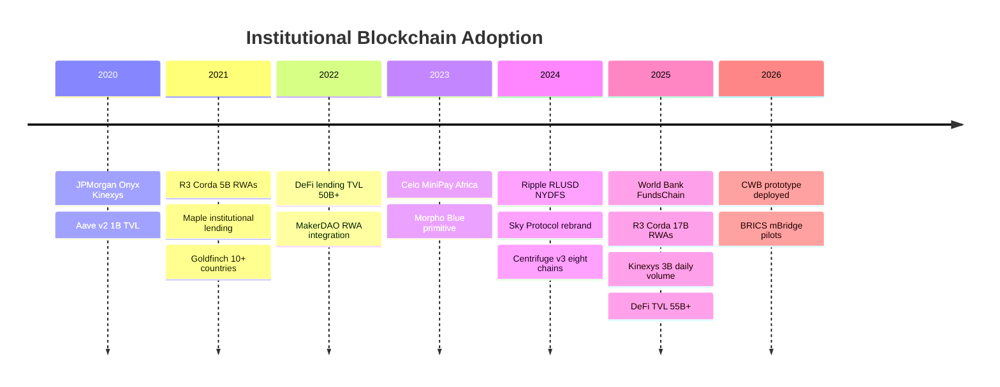

---

## AI/ML Security Pipeline

- **Rendered PNG:** `Diagrams/mermaid-pdf/aiml-security-pipeline.png`

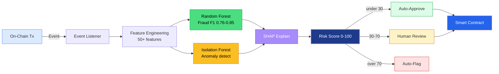

---

## Market Sizing Funnel

- **Rendered PNG:** `Diagrams/mermaid-pdf/market-sizing-funnel.png`

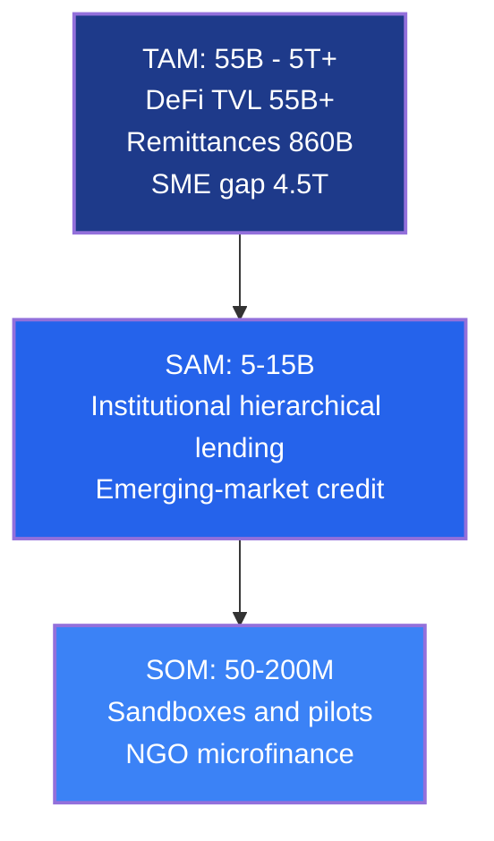

---

## DeFi TVL Comparison

- **Rendered PNG:** `Diagrams/mermaid-pdf/defi-tvl-comparison.png`

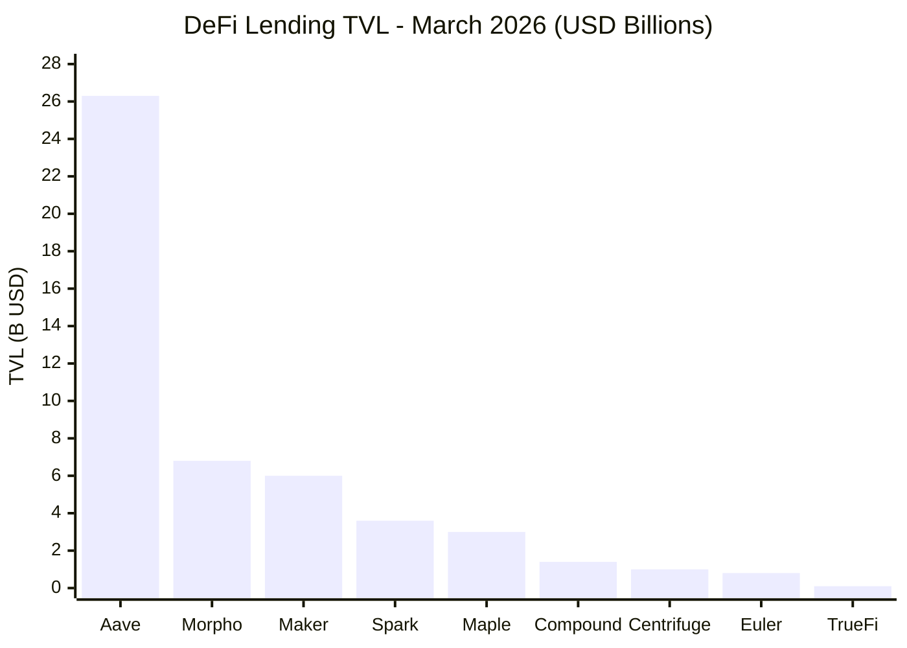

---

## Competitive Feature Matrix

- **Rendered PNG:** `Diagrams/mermaid-pdf/competitive-feature-matrix.png`

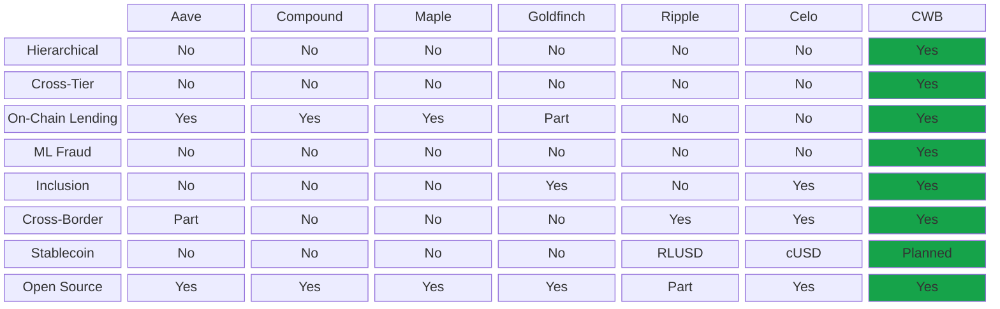

---

## Competitor Quadrant Chart

- **Rendered PNG:** `Diagrams/mermaid-pdf/competitor-quadrant.png`

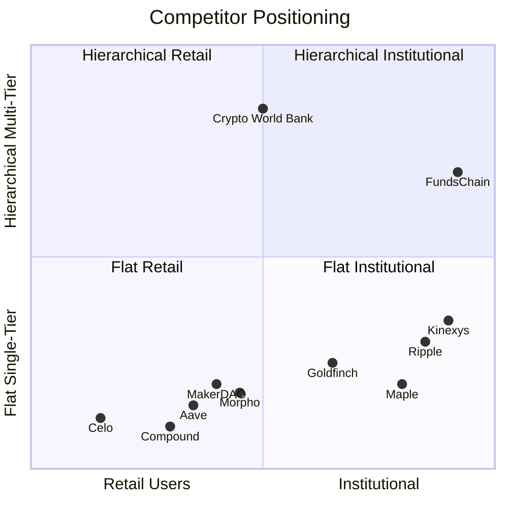

---

## Interest Rate Waterfall

- **Rendered PNG:** `Diagrams/mermaid-pdf/interest-rate-waterfall.png`

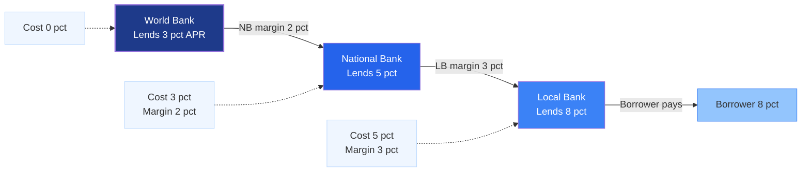

---

## Go-to-Market Roadmap

- **Rendered PNG:** `Diagrams/mermaid-pdf/gtm-roadmap.png`

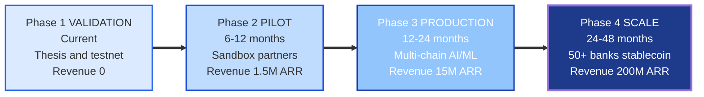

---

## Blockchain Stack Layers

- **Rendered PNG:** `Diagrams/mermaid-pdf/blockchain-stack-layers.png`

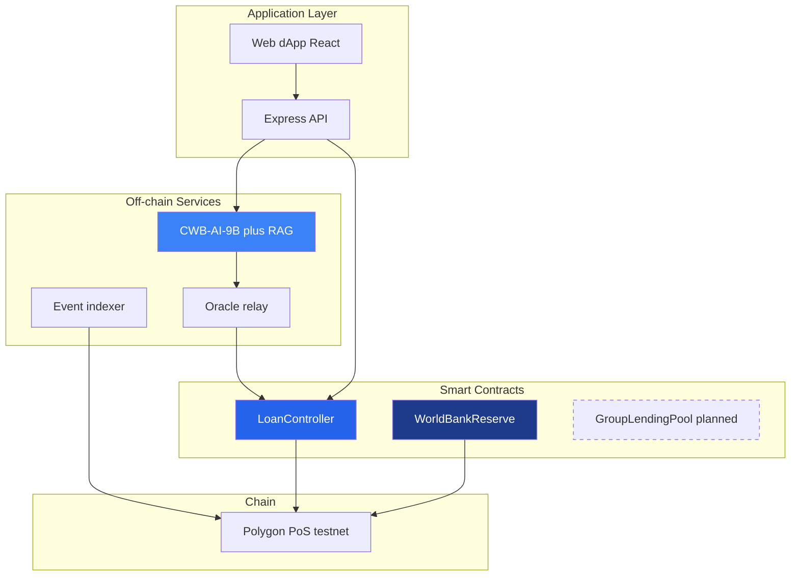

---

## Blockchain Transaction Lifecycle

- **Rendered PNG:** `Diagrams/mermaid-pdf/blockchain-tx-lifecycle.png`

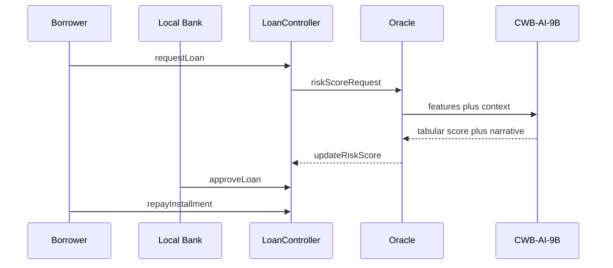

---

## AI Unified 9B Architecture

- **Rendered PNG:** `Diagrams/mermaid-pdf/ai-unified-9b-architecture.png`

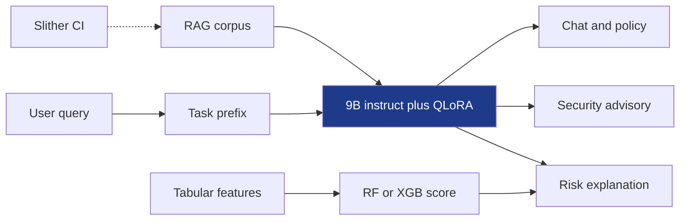

---

## AI Data Pipeline

- **Rendered PNG:** `Diagrams/mermaid-pdf/ai-data-pipeline.png`

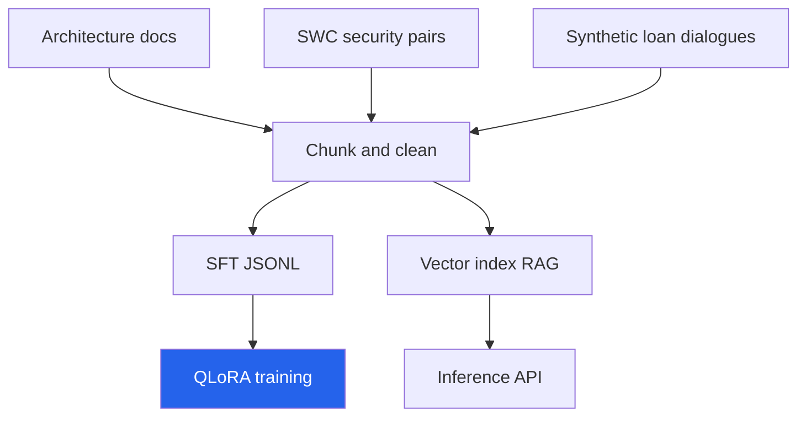

---

## AI QLoRA Training Flow

- **Rendered PNG:** `Diagrams/mermaid-pdf/ai-qlora-training-flow.png`

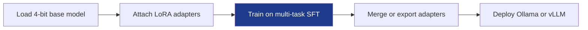

---

## AI Oracle Loan Sequence

- **Rendered PNG:** `Diagrams/mermaid-pdf/ai-oracle-loan-sequence.png`

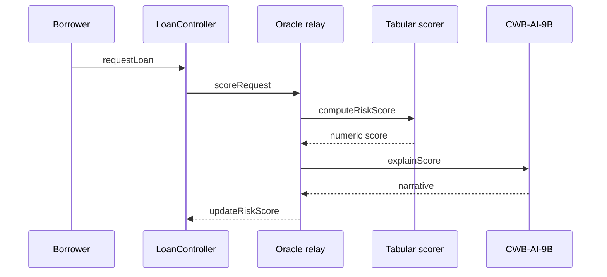

---

## AI Security CI Pipeline

- **Rendered PNG:** `Diagrams/mermaid-pdf/ai-security-ci-pipeline.png`

```mermaid
flowchart LR
  GIT[Git commit] --> SL[Slither static analysis]
  SL --> REP[Vulnerability report]
  REP --> RAG[Update RAG corpus]
  RAG --> LLM[9B security advisory]
  DEV[Developer] --> LLM
  style SL fill:#1E3A8A,color:#fff
```

---

## Activity Deposit Flow

- **Rendered PNG:** `Diagrams/mermaid-pdf/activity-deposit-flow.png`

```mermaid
flowchart TD
  A[Borrower opens savings] --> B[Local Bank validates KYC design]
  B --> C[Deposit to SavingsVault planned]
  C --> D[Accrue interest on-chain]
  D --> E[Statement via indexer]
  style C stroke-dasharray:5 5
```

---

## Activity Group Lending

- **Rendered PNG:** `Diagrams/mermaid-pdf/activity-group-lending.png`

```mermaid
flowchart TD
  A[Form group 3-20 borrowers] --> B[Pool collateral]
  B --> C[Multi-sig consent]
  C --> D[Submit group loan]
  D --> E{All members current?}
  E -->|Yes| F[Escalate to approver]
  E -->|No| G[Claim shared collateral planned]
  style G stroke-dasharray:5 5
```

---

## Activity FX Conversion

- **Rendered PNG:** `Diagrams/mermaid-pdf/activity-fx-conversion.png`

```mermaid
flowchart TD
  A[Loan denominated in stablecoin] --> B[Oracle price feed]
  B --> C[FXModule quote planned]
  C --> D[Borrower accepts rate]
  D --> E[Settle on-chain]
  style C stroke-dasharray:5 5
```

---

## Activity Interbank Liquidity

- **Rendered PNG:** `Diagrams/mermaid-pdf/activity-interbank-liquidity.png`

```mermaid
flowchart TD
  A[Local Bank liquidity shortfall] --> B[Request interbank pool]
  B --> C[National Bank approves]
  C --> D[Transfer via smart contract]
  D --> E[Repay with spread]
  style B stroke-dasharray:5 5
```
