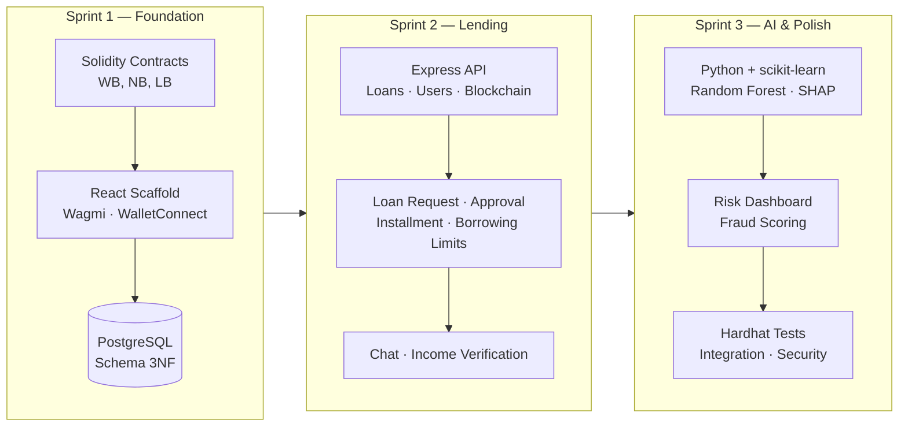

# Technical Methodology — Development Flow by Sprint

```mermaid
flowchart LR
    subgraph Sprint1["Sprint 1 — Foundation"]
        S1_SC[Solidity Contracts\nWB, NB, LB]
        S1_FE[React Scaffold\nWagmi · WalletConnect]
        S1_DB[(PostgreSQL\nSchema 3NF)]
        S1_SC --> S1_FE
        S1_FE --> S1_DB
    end
    
    subgraph Sprint2["Sprint 2 — Lending"]
        S2_API[Express API\nLoans · Users · Blockchain]
        S2_LOAN[Loan Request · Approval\nInstallment · Borrowing Limits]
        S2_CHAT[Chat · Income Verification]
        S2_API --> S2_LOAN --> S2_CHAT
    end
    
    subgraph Sprint3["Sprint 3 — AI & Polish"]
        S3_ML[Python + scikit-learn\nRandom Forest · SHAP]
        S3_RISK[Risk Dashboard\nFraud Scoring]
        S3_TEST[Hardhat Tests\nIntegration · Security]
        S3_ML --> S3_RISK --> S3_TEST
    end
    
    Sprint1 --> Sprint2 --> Sprint3
```
