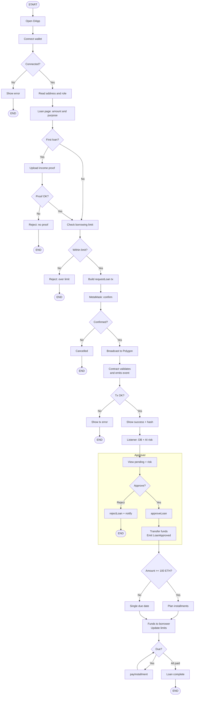
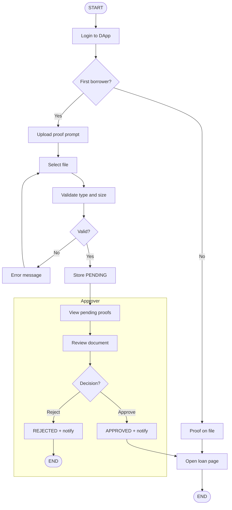
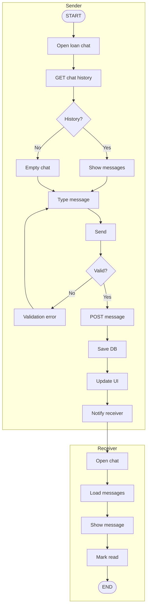
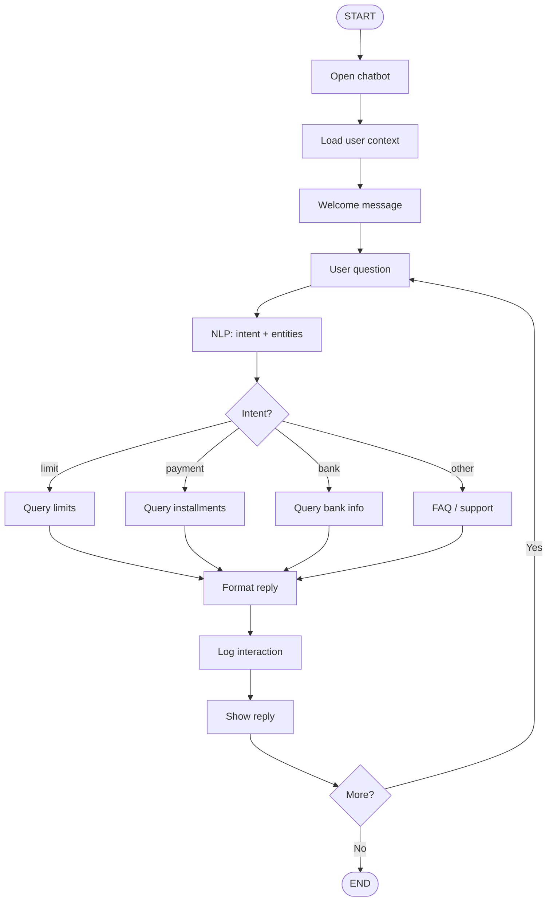
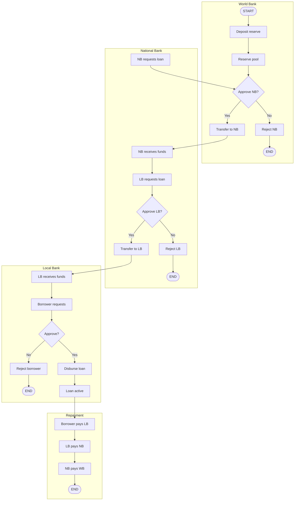
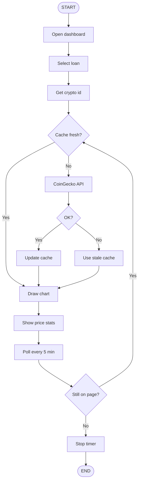
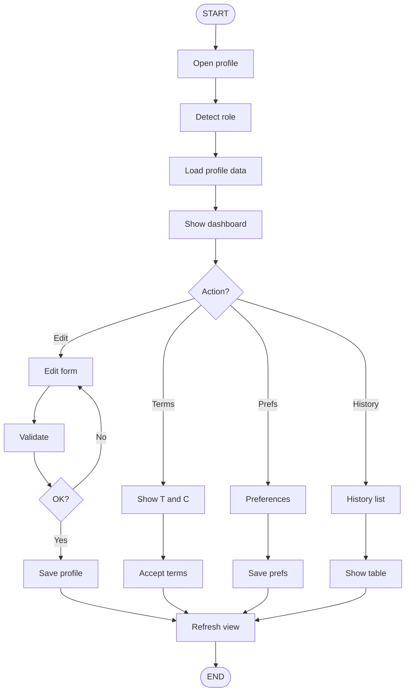

# Activity Diagrams (Mermaid) — shortened labels for thesis PDF

Labels are kept short so text fits boxes when rendered with `htmlLabels: false` (SVG text, PDF-safe).

---

## Loan Request to Repayment Flow

---

## Income Verification Flow

---

## Chat System Flow

---

## AI Chatbot Interaction Flow

---

## Hierarchical Banking Flow

---

## Market Data Viewing Flow

---

## Profile Management Flow

