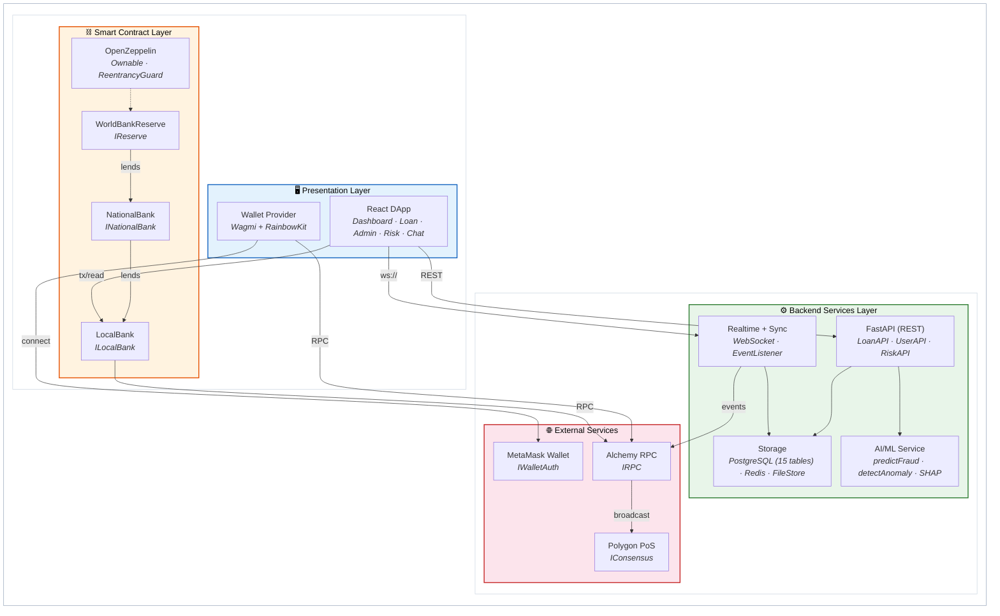

# Component Diagram (Mermaid)
## Crypto World Bank System (A4 one-page)

---

## How to View

- **In Cursor/VS Code:** Open this file and use `Ctrl+Shift+V` (or `Cmd+Shift+V` on Mac) for Markdown preview
- **Online:** Copy the Mermaid block below and paste at [mermaid.live](https://mermaid.live)

---

---

## Subsystem Summary (thesis-focused)

| Layer | Components | Responsibility |
|-------|-----------|----------------|
| **Presentation** | React DApp + Wallet Provider | UI + wallet connection + user actions |
| **Smart Contract** | WorldBankReserve → NationalBank → LocalBank (+ OpenZeppelin) | On-chain hierarchical lending logic |
| **Backend Services** | FastAPI, Realtime/Sync, AI/ML, Storage | Off-chain processing, persistence, risk scoring, chat/events |
| **External** | MetaMask, Alchemy RPC, Polygon PoS | Wallet auth + chain + RPC provider |
