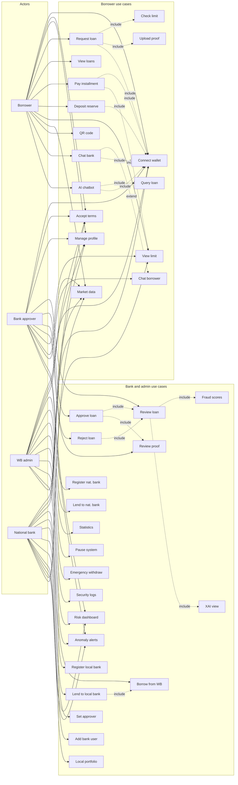
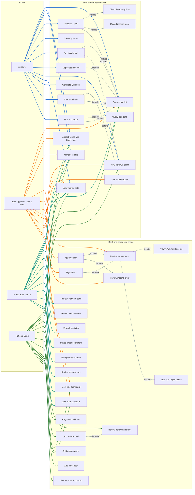

# Use Case Diagram (Mermaid)
## Crypto World Bank System

Aligned with **Pre-thesis v4 .tex**: four actors (Borrower, Bank Approver, World Bank Admin, National Bank); the thesis cites **29** use cases in the published figure, while this Mermaid chart keeps **separate nodes** for sub-flows (e.g. UC04a/b, UC07a/b) so **«include»** edges are visible—**31 nodes** total.

**Contract mapping (Appendix B, thesis):** World Bank Reserve (reserves, national registration, pause, emergency, statistics); National Bank (local registration, borrow/lend in hierarchy); Local Bank (loan lifecycle, approvers, bank users)—**Bank Approver** represents the Local Bank approver role.

---

## How to View

- **In Cursor/VS Code:** Open this file and use `Ctrl+Shift+V` (or `Cmd+Shift+V` on Mac) for Markdown preview
- **Online:** Copy the Mermaid block below and paste at [mermaid.live](https://mermaid.live)
- **Association arrow colors (full diagram):** **Borrower** blue, **Bank Approver** orange, **World Bank Admin** teal, **National Bank** green; **«include» / «extend»** blue-gray; spacer guides light gray. Implemented with Mermaid `linkStyle` (edge order must stay as in the source).
- **Two-column layout (VS Code):** The diagram uses a horizontal **lane** (actors | spacer | use cases) and **dagre** (not ELK) so the extension tends to keep **actors in one band on the left** and **all use cases on the right**, with a **wide spacer** between. If it still looks flat, zoom the preview or paste into [mermaid.live](https://mermaid.live).
- **diagrams.net (draw.io):** Built-in **Arrange → Insert → Mermaid** is limited. Prefer **importing an image or SVG** from [mermaid.live](https://mermaid.live) (see **Same diagram in draw.io without Mermaid import** below), or use the **Simplified diagram** block as a last resort.

---

## Full diagram (thesis PDF — flat layout, short labels)

---

## Same diagram in draw.io without Mermaid import

These paths avoid draw.io’s Mermaid parser but still give you the **same** graph (full diagram with packages, includes, styling).

### 1. Import SVG or PNG from mermaid.live (recommended)

1. Open [mermaid.live](https://mermaid.live).
2. Paste the **Full diagram** code block from this file (everything inside that fence, including `%%{init}%%` if you want the same spacing).
3. **Actions → Export SVG** (best for scaling) or **PNG** (simplest; pick a high resolution if offered).
4. In draw.io: **File → Import from → Device…** (or drag the file onto the canvas).
5. **SVG:** Select the imported group → **Arrange → Ungroup** (repeat until you get separate shapes/text). Text sometimes becomes paths, so heavy editing is easier if you keep the SVG as one grouped object and only add annotations on top.
6. **PNG:** Treat as a single figure; **right-click → Lock** if you draw arrows or notes on top.

### 2. Use the thesis figure as a base layer

The LaTeX thesis already references **`Documentation/Diagrams/CSE471/Usecase diagram.png`**. In draw.io: **Insert → Image**, place it, resize, then **Lock** the image and add any extra labels or callouts in vector form on unlocked layers.

### 3. Rebuild with native UML shapes (full editability)

In draw.io’s shape panel, search for **use case** and **actor**. Recreate actors and ovals using the **same names and relationships** as in the Mermaid source (and the **Simplified** block’s node list is a flat checklist of every use case node). «include»/«extend» can be **dashed connectors** with text labels. Splitting across **two pages** (e.g. borrower-facing vs bank / admin) keeps the canvas manageable.

---

## Simplified diagram for diagrams.net (draw.io) import

This variant is tuned for **draw.io → Arrange → Insert → Mermaid**: **flat** `flowchart LR`, **only three top-level subgraphs** (no CANVAS / USECASES / spacer / inner packages), **minimal** `%%{init}%%` (font size + spacing only—strip that line if draw.io complains), **no emoji**, **no « »** in edge labels, **no node `fill` `style` lines** (package colors). **`linkStyle`** lines tint **actor association** and stereotype edges for VS Code / mermaid.live; draw.io may ignore or mishandle them—use **SVG export** from mermaid.live if you need the colors there.

**Steps:** [app.diagrams.net](https://app.diagrams.net) → **Arrange** → **Insert** → **Mermaid** → paste everything inside the code fence below (from `%%{init}` / `flowchart` through the last line before the closing fence).

**After import:** Ungroup if needed (**Edit** or right-click), drag boxes, and apply colors manually. If anything is still missing or wrong, use **Same diagram in draw.io without Mermaid import** above instead of fighting the importer.

---

## Actors (4)

| Actor | Role (thesis) |
|-------|----------------|
| **Borrower** | Tier 4 — requests loans, repays installments, deposits, chat, AI chatbot, market/limit views |
| **Bank Approver** | Local Bank approver — reviews/approves/rejects loans, income proof, AI/ML & XAI, chat with borrower, risk views |
| **World Bank Admin** | Tier 1 owner — national bank registration, lend to national banks, statistics, pause/unpause, emergency withdraw, security logs |
| **National Bank** | Tier 2 — local bank registration, borrow from WB, lend to local banks, approver/user management, portfolio, limits/market context |

## Relationships

| Type | Meaning |
|------|---------|
| `«include»` | Required sub-behaviour (always part of the base use case) |
| `«extend»` | Optional behaviour under a condition |
| **Solid actor → UC** | Association (actor participates in that use case); in the **full** diagram, color encodes actor: Borrower **blue** (`#1565d2`), Bank Approver **orange** (`#ef6c00`), World Bank Admin **teal** (`#00897b`), National Bank **green** (`#2e7d32`); «include»/«extend» links use **blue-gray** (`#546e7a`). |

### Extra «include» edges (vs. earlier diagram)

| Edge | Rationale (thesis / design) |
|------|----------------------------|
| UC04, UC06, UC11, UC15, UC17 → UC01 | Wallet-based identity (§3.5 digital identity) |
| UC06 → UC12 | Installment flow respects borrowing limits (borrowing-limit engine) |
| UC08, UC09 → UC07 | Decisions follow review of the loan request |
| UC08 → UC10 | Approval path uses income verification when applicable |
| UC28 → UC27 | Lending to local banks is funded after borrowing from World Bank reserve |

## Use case counts

- **Thesis figure:** 29 consolidated use cases.
- **This diagram:** 31 nodes (UC04a/b, UC07a/b, UC17a as separate ellipses for «include» clarity).

---

## Use Cases by actor (association summary)

- **Borrower:** UC01–UC06, UC11–UC15, UC17 (12 direct associations; sub-flows via «include»).
- **Bank Approver:** UC01–UC03, UC07–UC10, UC12–UC13, UC16, UC18–UC19 (13).
- **World Bank Admin:** UC01–UC03, UC13, UC18–UC25 (13).
- **National Bank:** UC01–UC03, UC12, UC13, UC18–UC19, UC26–UC31 (14).

*Totals count repeated use cases across actors (shared platform features: wallet, terms, profile, monitoring).*
