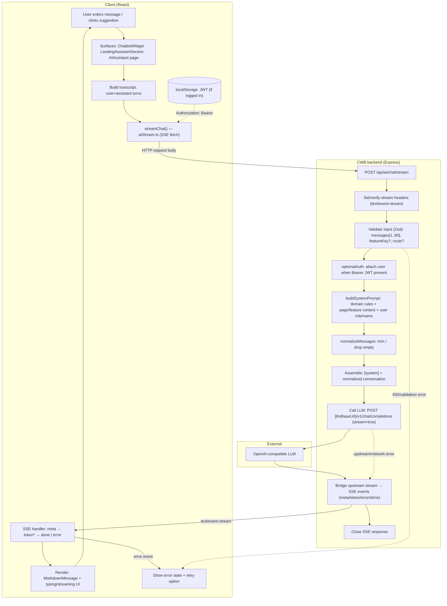
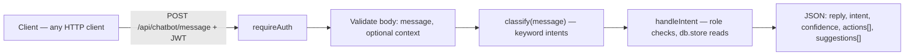

# Crypto World Bank — assistant / chatbot flows

This note matches the current codebase: the **in-product assistant** (widget, landing section, AI Assistant page) uses **streaming LLM** via `/api/ai/chat/stream`. A separate **rule-based intent API** exists at `/api/chatbot` for structured replies (not used by the React UI today). **Peer messaging** uses `/api/chat/threads` and is not part of these assistant flows.

---

## 1. End-to-end flow (Mermaid)

Use this block in tools that render Mermaid (or export to PNG/SVG for LaTeX, e.g. [Mermaid Live Editor](https://mermaid.live) or `mmdc`).

---

## 2. Rule-based intent chatbot (backend API only)

Optional path for deterministic, database-backed answers (keyword `classify` → `handleIntent`); response is JSON, not streamed.

`GET /api/chatbot/welcome` returns a greeting and role-tailored suggestion chips (same router).

---

## 3. High-level sequence (text, for thesis captions)

**Streaming assistant**

1. User submits text in the UI; the client builds the chat transcript and calls `streamChat`.
2. The client sends `POST /api/ai/chat/stream` with `messages`, optional `featureKey` (from route), `route`, and `roleHint`; it adds `Authorization` when a session token exists.
3. The backend optionally resolves the user from JWT, builds a **system prompt** (CWB hierarchy, safety/limitations, current page context, user role/name).
4. The backend forwards the conversation to the configured **OpenAI-compatible** endpoint with `stream: true`.
5. Tokens from the model are relayed to the browser as **Server-Sent Events** until `done` or an error; the UI appends tokens to the assistant bubble and shows the model id from `meta`.

**Intent API**

1. Authenticated `POST /api/chatbot/message` runs keyword classification, then handlers that read in-memory `db` state (limits, loans, banks) and return structured text plus deep links (`actions`) and follow-up prompts (`suggestions`).
