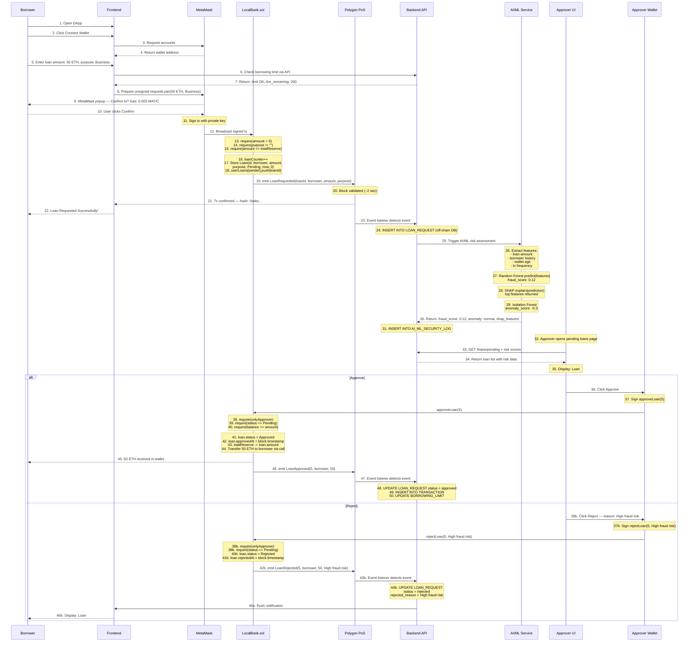
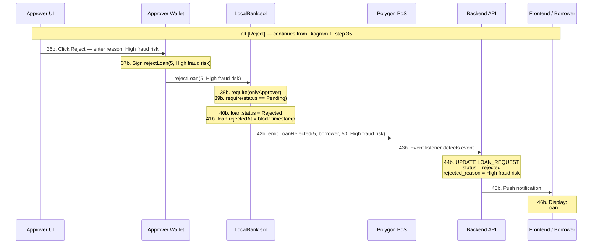
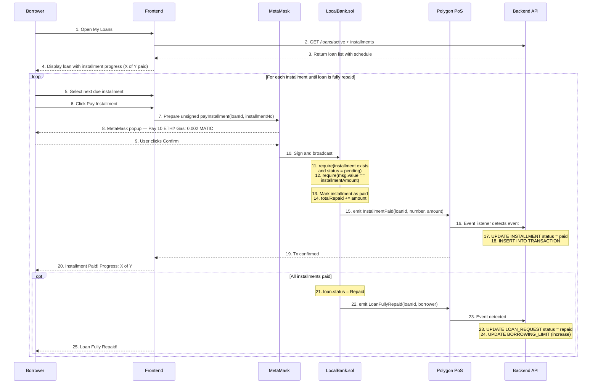
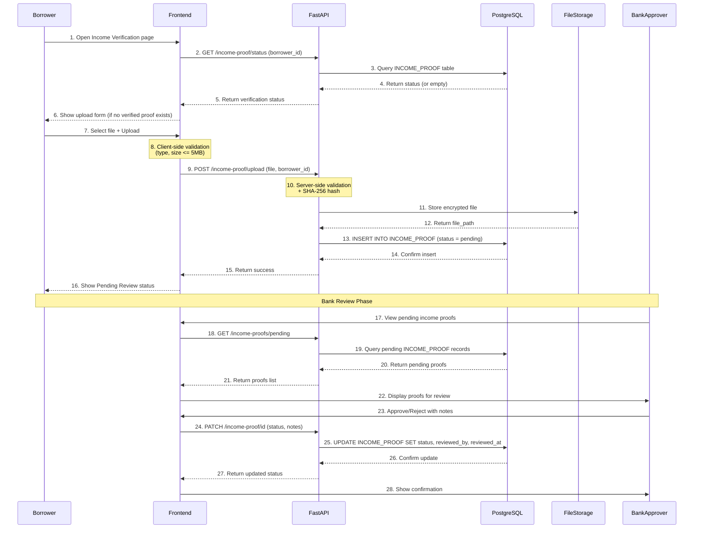
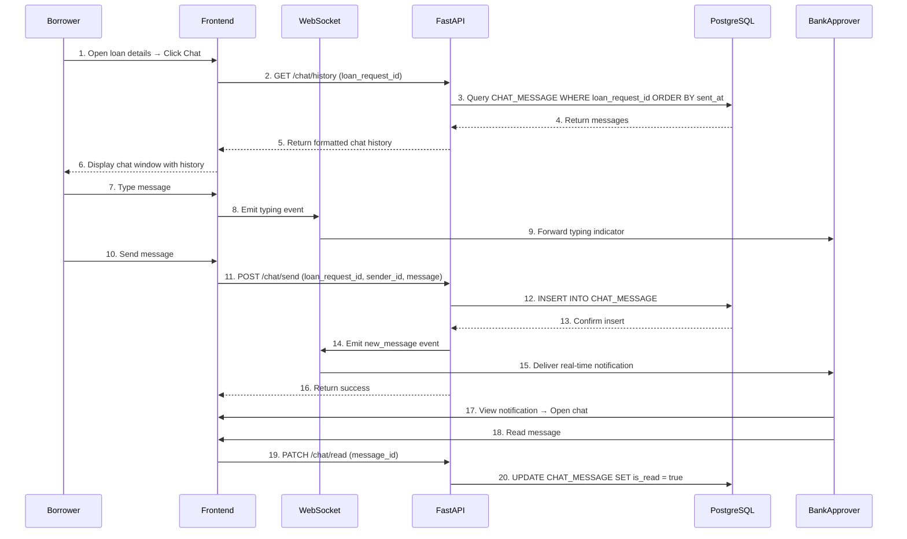
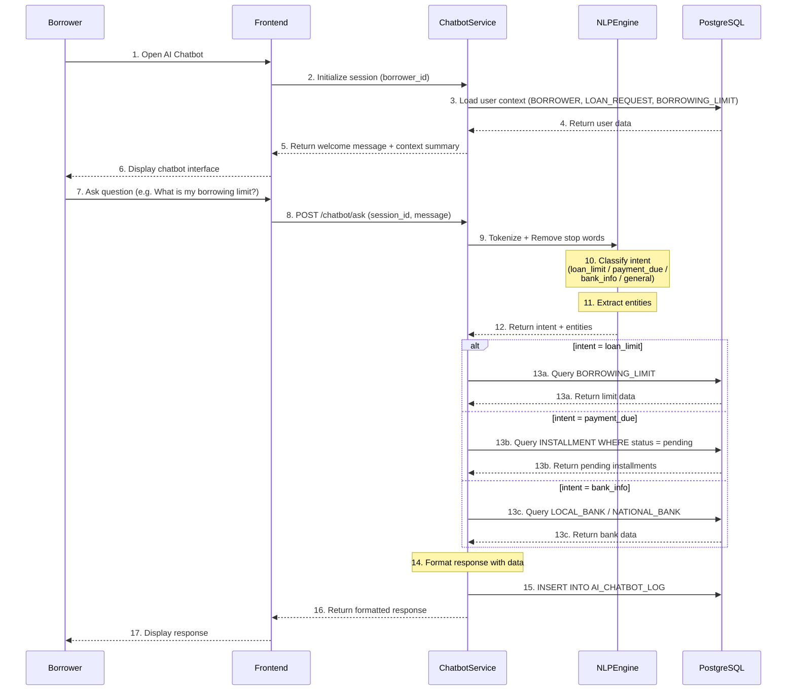
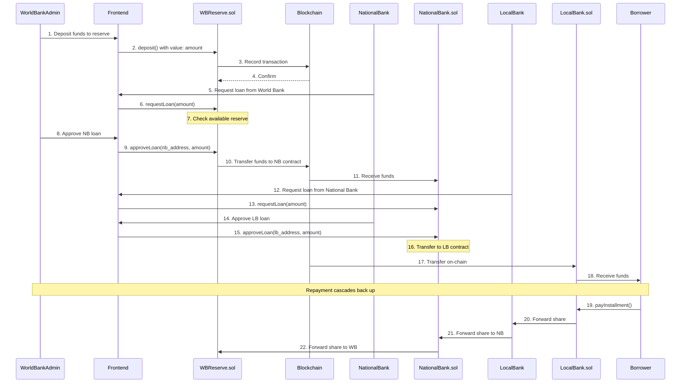
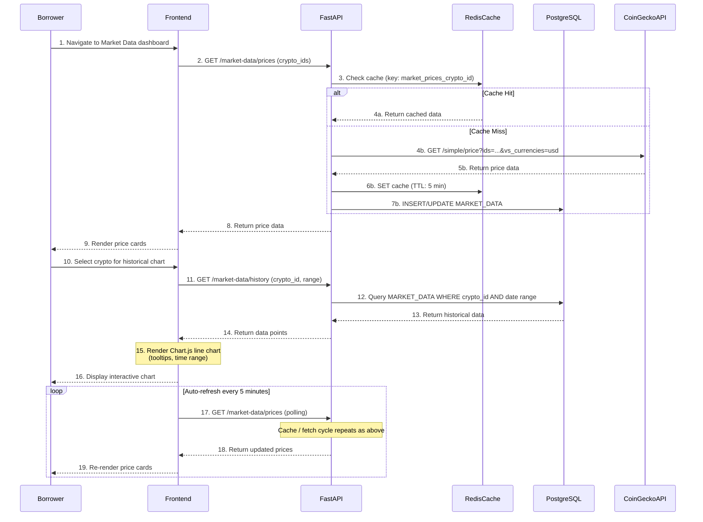
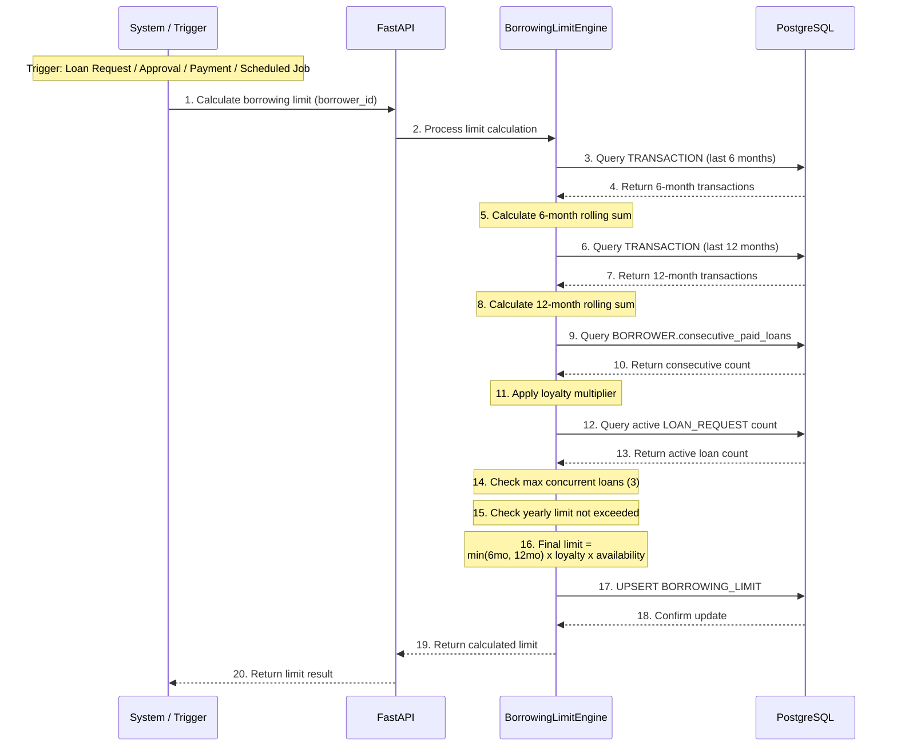

# Sequence Diagrams

## Crypto World Bank System

---

### Sequence Diagram 1: Loan Request, AI Risk Check, and Approval Decision

> **UML Fragments used:** This flow contains an **alt [Approve / Reject]** fragment at the approver decision point (step 36). The Approve path is shown in steps 36–50 and the Reject alternative in steps 36b–46b. A **loop** for installment payments follows in **Diagram 2**.

> **UML Fragments:** Steps 36–50 above show the **[Approve]** path of an **alt [Approve / Reject]** fragment. The **[Reject]** alternative is also shown above and expanded in Diagram 1B below. A **loop** fragment for installment repayments follows in Diagram 2.

---

### Sequence Diagram 1B: Reject Path — alt [Reject]

> Continues from step 35 of Diagram 1 (approver reviews loan with AI risk data). This shows the alternative path where the approver **rejects** the loan request.

---

### Sequence Diagram 2: Installment Payment Loop

> After a loan is approved (Diagram 1, steps 36–50), the borrower repays through installments. This diagram uses a **loop** fragment to show the repeating payment cycle and an **opt** fragment for the loan completion check.

---

### Sequence Diagram 3: Income Verification

> **Participants:** Borrower, Frontend, FastAPI, PostgreSQL, FileStorage, BankApprover. This diagram covers the full income-proof upload lifecycle — from the borrower uploading a document, through server-side validation and storage, to a bank approver reviewing and deciding on the proof.

---

### Sequence Diagram 4: Chat System

> **Participants:** Borrower, Frontend, WebSocket, FastAPI, PostgreSQL, BankApprover. This diagram covers the real-time chat between a borrower and a bank approver on a specific loan request, including chat history loading, typing indicators, real-time message delivery, and read receipts.

---

### Sequence Diagram 5: AI Chatbot Interaction

> **Participants:** Borrower, Frontend, ChatbotService, NLPEngine, PostgreSQL. This diagram shows the AI chatbot session lifecycle — initialisation with user context, natural-language question processing via the NLP engine (intent classification and entity extraction), conditional data retrieval based on intent, and response formatting.

---

### Sequence Diagram 6: Hierarchical Banking (World Bank → National Bank → Local Bank → Borrower)

> **Participants:** WorldBankAdmin, Frontend, SmartContract (WorldBankReserve.sol), Blockchain, NationalBank, SmartContract (NationalBank.sol), LocalBank, SmartContract (LocalBank.sol), Borrower. This diagram illustrates the three-tier fund flow — deposit into the world-bank reserve, cascading loan approvals down through national and local banks, and repayment cascading back up.

---

### Sequence Diagram 7: Market Data Retrieval

> **Participants:** Borrower, Frontend, FastAPI, RedisCache, PostgreSQL, CoinGeckoAPI. This diagram shows how live cryptocurrency prices are fetched (with a Redis caching layer and CoinGecko as the external source), how historical chart data is queried, and the auto-refresh polling mechanism.

---

### Sequence Diagram 8: Borrowing Limit Calculation

> **Participants:** System/Trigger, FastAPI, PostgreSQL, BorrowingLimitEngine. This diagram shows the borrowing-limit recalculation triggered by events such as a new loan request, approval, payment, or a scheduled cron job. The engine gathers 6-month and 12-month transaction history, applies a loyalty multiplier, enforces concurrent-loan and yearly caps, and persists the result.

