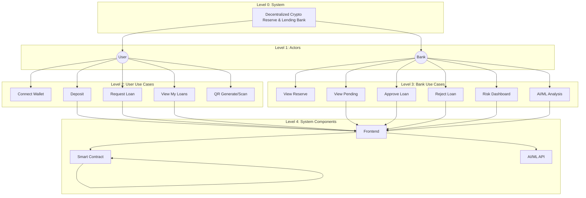

# Use Case & Data Flow Diagrams

**Decentralized Crypto Reserve & Lending Bank**  
**Top-Down Progressive Tree — Fully Detailed**

---

## 1. System Overview (Top Level)

```
┌─────────────────────────────────────────────────────────────────────────────┐
│                    DECENTRALIZED CRYPTO RESERVE & LENDING BANK               │
│                              (Root / Level 0)                                │
└─────────────────────────────────────────────────────────────────────────────┘
                                        │
                    ┌───────────────────┼───────────────────┐
                    │                   │                   │
                    ▼                   ▼                   ▼
            ┌───────────────┐   ┌───────────────┐   ┌───────────────┐
            │     USER      │   │     BANK      │   │    SYSTEM     │
            │   (Actor)     │   │   (Actor)     │   │  (Backend)    │
            └───────┬───────┘   └───────┬───────┘   └───────┬───────┘
                    │                   │                   │
                    │                   │                   │
         (See Tree 2)          (See Tree 3)          (See Tree 4)
```

---

## 2. User Flow — Top-Down Progressive Tree

```
USER (Actor)
│
├── 1. CONNECT WALLET
│   │
│   ├── 1.1 User clicks "Connect Wallet" in AppBar
│   │   │
│   │   ├── 1.1.1 Frontend renders ConnectButton (RainbowKit)
│   │   │
│   │   ├── 1.1.2 User selects MetaMask or WalletConnect
│   │   │   │
│   │   │   ├── 1.1.2a MetaMask
│   │   │   │   ├── Browser extension prompts approval
│   │   │   │   ├── User approves
│   │   │   │   └── Wagmi stores connection state
│   │   │   │
│   │   │   └── 1.1.2b WalletConnect
│   │   │       ├── QR code or deep link shown
│   │   │       ├── User scans with mobile wallet
│   │   │       └── Connection established
│   │   │
│   │   └── 1.1.3 Frontend receives address, chainId
│   │       └── useAccount(), useRole() update
│   │
│   └── 1.2 Outcome: Wallet connected, address displayed in AppBar
│
├── 2. DEPOSIT TO RESERVE
│   │
│   ├── 2.1 User navigates to Deposit page
│   │
│   ├── 2.2 User enters amount (ETH/MATIC)
│   │   │
│   │   └── 2.2.1 Frontend validates: amount > 0
│   │
│   ├── 2.3 User clicks "Deposit"
│   │   │
│   │   ├── 2.3.1 Frontend calls contract.write.depositToReserve({ value: parseEther(amount) })
│   │   │
│   │   ├── 2.3.2 Wallet (MetaMask) prompts for transaction
│   │   │   ├── User confirms → tx sent
│   │   │   └── User rejects → flow stops
│   │   │
│   │   ├── 2.3.3 Smart Contract receives call
│   │   │   ├── Checks: msg.value > 0, !paused
│   │   │   ├── totalReserve += msg.value
│   │   │   ├── userDeposits[msg.sender] += msg.value
│   │   │   └── Emit ReserveDeposited(depositor, amount, timestamp)
│   │   │
│   │   └── 2.3.4 Frontend awaits tx confirmation
│   │       └── Refreshes stats (getStats, getUserDeposits)
│   │
│   └── 2.4 Outcome: Success alert, dashboard shows updated reserve
│
├── 3. REQUEST LOAN
│   │
│   ├── 3.1 User navigates to Loan page → "Request Loan" tab
│   │
│   ├── 3.2 User enters amount and purpose
│   │   │
│   │   └── 3.2.1 Frontend validates: amount > 0, purpose non-empty
│   │
│   ├── 3.3 User clicks "Request Loan"
│   │   │
│   │   ├── 3.3.1 Frontend calls contract.write.requestLoan([parseEther(amount), purpose])
│   │   │
│   │   ├── 3.3.2 Wallet prompts for transaction
│   │   │   ├── User confirms → tx sent
│   │   │   └── User rejects → flow stops
│   │   │
│   │   ├── 3.3.3 Smart Contract receives call
│   │   │   ├── loanCounter++
│   │   │   ├── Create Loan{ id, borrower, amount, purpose, Pending, requestedAt }
│   │   │   ├── loans[id] = loan
│   │   │   ├── userLoans[borrower].push(id)
│   │   │   └── Emit LoanRequested(loanId, borrower, amount, purpose)
│   │   │
│   │   └── 3.3.4 Frontend refreshes userLoans
│   │
│   └── 3.4 Outcome: Loan appears in "My Loans" as Pending
│
├── 4. VIEW MY LOANS
│   │
│   ├── 4.1 User navigates to Loan page → "My Loans" tab
│   │
│   ├── 4.2 Frontend calls contract.read.getUserLoans([address])
│   │   │
│   │   └── 4.2.1 Returns array of loan IDs
│   │
│   ├── 4.3 For each ID, Frontend calls contract.read.getLoan([id])
│   │   │
│   │   └── 4.3.1 Returns Loan{ id, borrower, amount, purpose, status, requestedAt, approvedAt }
│   │
│   ├── 4.4 Frontend maps status to label
│   │   ├── 0 → Pending
│   │   ├── 1 → Approved
│   │   ├── 2 → Rejected
│   │   └── 3 → Paid
│   │
│   └── 4.5 Outcome: List of loans with status chips displayed
│
└── 5. GENERATE / SCAN QR
    │
    ├── 5.1 GENERATE
    │   │
    │   ├── 5.1.1 User navigates to QR page → "Generate" tab
    │   │
    │   ├── 5.1.2 User selects type: Wallet | Loan Page | Contract Address
    │   │   │
    │   │   ├── Wallet → QR encodes connected wallet address
    │   │   ├── Loan Page → QR encodes app URL + /loan
    │   │   └── Contract → QR encodes contract address
    │   │
    │   ├── 5.1.3 Frontend renders QR via qrcode.react
    │   │
    │   └── 5.1.4 Outcome: QR displayed, user can download/share
    │
    │
    └── 5.2 SCAN
        │
        ├── 5.2.1 User navigates to QR page → "Scan" tab
        │
        ├── 5.2.2 User pastes QR content (from phone camera or manual input)
        │
        ├── 5.2.3 Frontend parses content
        │   ├── If address → show "Add to wallet" or "View"
        │   ├── If URL → offer to navigate
        │   └── Else → display raw content
        │
        └── 5.2.4 Outcome: Action based on content type
```

---

## 3. Bank Flow — Top-Down Progressive Tree

```
BANK (Actor) — Contract Owner or Demo Bank
│
├── 1. VIEW RESERVE & STATS
│   │
│   ├── 1.1 Bank navigates to Dashboard or Bank page
│   │
│   ├── 1.2 Frontend calls contract.read.getStats()
│   │   │
│   │   └── 1.2.1 Returns [totalReserve, totalLoans, pendingLoans, approvedLoans]
│   │
│   ├── 1.3 (If Demo Mode) Frontend uses mock: 1M ETH total, reserve left, disbursed
│   │
│   └── 1.4 Outcome: Cards showing Total Reserve, Reserve Left, Total Disbursed
│
├── 2. VIEW WHO TOOK HOW MUCH
│   │
│   ├── 2.1 Bank on Bank page, Demo Mode or real
│   │
│   ├── 2.2 (Real) Frontend would aggregate from getLoan() for approved loans
│   │   (Currently: Demo shows mock table)
│   │
│   ├── 2.3 Table columns: User (Borrower) | Amount (ETH) | Purpose | Status
│   │
│   └── 2.4 Outcome: Table of approved loans
│
├── 3. VIEW PENDING LOANS
│   │
│   ├── 3.1 Bank navigates to Bank page
│   │
│   ├── 3.2 Frontend calls contract.read.getPendingLoans() [owner only]
│   │   │
│   │   └── 3.2.1 Returns Loan[] where status == Pending
│   │
│   ├── 3.3 (Demo) Frontend uses demoPendingLoans state
│   │
│   ├── 3.4 For each loan, display:
│   │   ├── Amount, purpose, borrower address
│   │   ├── Fraud risk chip (mock or from AI/ML)
│   │   └── Approve / Reject buttons
│   │
│   └── 3.5 Outcome: List of pending loans with actions
│
├── 4. APPROVE LOAN
│   │
│   ├── 4.1 Bank clicks "Approve" on a pending loan
│   │
│   ├── 4.2 Frontend shows confirmation dialog
│   │   ├── Bank confirms → proceed
│   │   └── Bank cancels → flow stops
│   │
│   ├── 4.3 Frontend calls contract.write.approveLoan([loanId])
│   │
│   ├── 4.4 Wallet prompts for transaction
│   │   ├── Bank confirms → tx sent
│   │   └── Bank rejects → flow stops
│   │
│   ├── 4.5 Smart Contract receives call
│   │   ├── Checks: onlyOwner, loan exists, status == Pending
│   │   ├── loan.status = Approved
│   │   ├── loan.approvedAt = block.timestamp
│   │   ├── Transfer amount to borrower: payable(borrower).call{value: amount}
│   │   └── Emit LoanApproved(loanId, borrower, amount)
│   │
│   ├── 4.6 Frontend refreshes pending loans, stats
│   │
│   └── 4.7 Outcome: Loan removed from pending, borrower receives funds
│
├── 5. REJECT LOAN
│   │
│   ├── 5.1 Bank clicks "Reject" on a pending loan
│   │
│   ├── 5.2 Frontend shows confirmation dialog
│   │
│   ├── 5.3 Frontend calls contract.write.rejectLoan([loanId])
│   │
│   ├── 5.4 Smart Contract receives call
│   │   ├── Checks: onlyOwner, loan exists
│   │   ├── loan.status = Rejected
│   │   └── Emit LoanRejected(loanId, borrower)
│   │
│   ├── 5.5 Frontend refreshes pending loans
│   │
│   └── 5.6 Outcome: Loan removed from pending, status = Rejected for borrower
│
├── 6. VIEW RISK DASHBOARD
│   │
│   ├── 6.1 Bank navigates to Risk AI page (bank-only)
│   │
│   ├── 6.2 Frontend displays:
│   │   ├── Risk score cards (Fraud, Anomaly, Attack, RL status)
│   │   ├── Tabs: Alerts | Detections | Analytics
│   │   ├── Recent security alerts (mock)
│   │   ├── Detection history table (mock)
│   │   └── Performance metrics (mock)
│   │
│   └── 6.3 Outcome: Full risk dashboard visible
│
└── 7. VIEW AI/ML ANALYSIS (per loan)
    │
    ├── 7.1 Bank on Bank page, clicks "Show AI/ML Analysis" on a loan
    │
    ├── 7.2 Frontend expands section showing:
    │   │
    │   ├── 7.2.1 RL Recommendation card
    │   │   ├── Action: approve / reject / review
    │   │   ├── Confidence %
    │   │   ├── Expected reward
    │   │   └── Reasoning text
    │   │
    │   └── 7.2.2 XAI Explanation card
    │       ├── Decision: approve / reject / flag
    │       ├── Confidence %
    │       ├── Reasoning paragraph
    │       └── Top contributing factors (SHAP-style)
    │
    └── 7.3 Outcome: Bank sees AI justification before Approve/Reject
```

---

## 4. Data Flow — Top-Down Progressive Tree

```
DATA FLOW (Top → Down: User Action to Blockchain)
│
├── FLOW A: DEPOSIT
│   │
│   ├── L1 User
│   │   └── Enters amount, clicks Deposit
│   │
│   ├── L2 Frontend
│   │   ├── Validates amount
│   │   ├── Prepares tx: depositToReserve, value = amount
│   │   └── Calls walletClient.sendTransaction
│   │
│   ├── L3 Wallet (MetaMask/WalletConnect)
│   │   ├── Prompts user
│   │   ├── Signs tx
│   │   └── Broadcasts to RPC (Sepolia/Mumbai)
│   │
│   ├── L4 Blockchain (EVM)
│   │   ├── Executes contract call
│   │   └── Updates state
│   │
│   ├── L5 Smart Contract
│   │   ├── totalReserve += msg.value
│   │   ├── userDeposits[msg.sender] += msg.value
│   │   └── Emit ReserveDeposited
│   │
│   ├── L6 Frontend (read-back)
│   │   ├── getStats() → totalReserve, loans counts
│   │   └── getUserDeposits(address) → user balance
│   │
│   └── L7 User
│       └── Sees success, updated dashboard
│
├── FLOW B: REQUEST LOAN
│   │
│   ├── L1 User
│   │   └── Enters amount, purpose, clicks Request Loan
│   │
│   ├── L2 Frontend
│   │   ├── Validates amount, purpose
│   │   └── Prepares tx: requestLoan(amount, purpose)
│   │
│   ├── L3 Wallet → L4 Blockchain → L5 Smart Contract
│   │   ├── loanCounter++
│   │   ├── loans[id] = Loan{Pending, ...}
│   │   ├── userLoans[borrower].push(id)
│   │   └── Emit LoanRequested
│   │
│   ├── L6 Frontend
│   │   └── getUserLoans(), getLoan() → refresh My Loans
│   │
│   └── L7 User
│       └── Sees loan in My Loans, status Pending
│
├── FLOW C: APPROVE LOAN
│   │
│   ├── L1 Bank
│   │   └── Clicks Approve, confirms dialog
│   │
│   ├── L2 Frontend
│   │   └── Prepares tx: approveLoan(loanId)
│   │
│   ├── L3 Wallet → L4 Blockchain → L5 Smart Contract
│   │   ├── loan.status = Approved
│   │   ├── payable(borrower).call{value: amount}
│   │   └── Emit LoanApproved
│   │
│   ├── L6 Frontend
│   │   ├── getPendingLoans() → refreshed list
│   │   └── getStats() → updated counts
│   │
│   └── L7 Bank + User
│       ├── Bank: Pending list updated
│       └── User: Loan status → Approved, funds received
│
└── FLOW D: AI/ML RISK CHECK (Planned)
    │
    ├── L1 Bank
    │   └── Views loan, optionally clicks "Analyze Risk"
    │
    ├── L2 Frontend
    │   └── POST /api/fraud/check-loan { wallet, amount, purpose }
    │
    ├── L3 AI/ML Backend (FastAPI)
    │   ├── Fetch wallet history from DB/cache (if any)
    │   ├── Build feature vector
    │   └── Run Random Forest inference
    │
    ├── L4 Model
    │   └── Returns fraud score (0–1)
    │
    ├── L5 SHAP
    │   └── Returns top contributing features
    │
    ├── L6 AI/ML Backend
    │   └── Returns { score, recommendation, explanation, features }
    │
    ├── L7 Frontend
    │   └── Renders RiskScoreCard, XAIExplanation
    │
    └── L8 Bank
        └── Sees risk score and explanation before Approve/Reject
```

---

## 5. Mermaid — Top-Down Progressive Tree



---

## 6. Data Flow — Vertical Progressive (ASCII)

```
┌─────────────────────────────────────────────────────────────────────────────┐
│  LAYER 0: USER / BANK ACTION                                                  │
│  (Click Deposit | Request Loan | Approve | Reject | View)                    │
└─────────────────────────────────────────────────────────────────────────────┘
                                        │
                                        ▼
┌─────────────────────────────────────────────────────────────────────────────┐
│  LAYER 1: FRONTEND (React)                                                    │
│  • Validate input  • Prepare tx or API call  • Call useContract / fetch       │
└─────────────────────────────────────────────────────────────────────────────┘
                                        │
                    ┌───────────────────┼───────────────────┐
                    ▼                   ▼                   ▼
┌───────────────────────┐   ┌───────────────────────┐   ┌───────────────────────┐
│  LAYER 2a: WALLET     │   │  LAYER 2b: READ        │   │  LAYER 2c: AI/ML      │
│  • Sign tx            │   │  • getStats()          │   │  • POST /fraud/check  │
│  • Broadcast          │   │  • getLoan()           │   │  • Get score + XAI    │
└───────────┬───────────┘   │  • getPendingLoans()   │   └───────────┬───────────┘
            │               └───────────┬───────────┘               │
            ▼                           ▼                           │
┌───────────────────────────────────────────────────────────────────┴───────────┐
│  LAYER 3: SMART CONTRACT (On-Chain)                                             │
│  • depositToReserve  • requestLoan  • approveLoan  • rejectLoan                 │
│  • State: totalReserve, loans, userDeposits, userLoans                         │
└─────────────────────────────────────────────────────────────────────────────────┘
                                        │
                                        ▼
┌─────────────────────────────────────────────────────────────────────────────┐
│  LAYER 4: BLOCKCHAIN (EVM)                                                     │
│  • Execute  • Persist state  • Emit events (ReserveDeposited, LoanRequested…)   │
└─────────────────────────────────────────────────────────────────────────────┘
                                        │
                                        ▼
┌─────────────────────────────────────────────────────────────────────────────┐
│  LAYER 5: FEEDBACK TO USER/BANK                                                │
│  • Tx confirmation  • Refreshed data  • UI update  • Success/Error alert        │
└─────────────────────────────────────────────────────────────────────────────┘
```

---

## 7. Use Case Summary Table

| Actor | Use Case | Description |
|-------|----------|-------------|
| User | Connect Wallet | Link MetaMask/WalletConnect |
| User | Deposit to Reserve | Send ETH/MATIC to contract |
| User | Request Loan | Submit amount + purpose |
| User | View My Loans | See loan status (Pending/Approved/Rejected) |
| User | Generate/Scan QR | Share wallet, contract, or loan info |
| Bank | View Reserve & Stats | Total reserve, disbursed, pending |
| Bank | View Who Took How Much | Table of approved loans |
| Bank | View Pending Loans | List awaiting approval |
| Bank | Approve Loan | Release funds to borrower |
| Bank | Reject Loan | Deny loan request |
| Bank | View Risk Dashboard | AI/ML alerts, scores, detections |
| Bank | View AI/ML Analysis | XAI, RL recommendations per loan |

---

*To view Mermaid diagrams: VS Code (Mermaid extension), GitHub, or [mermaid.live](https://mermaid.live).*
