# Use Case & Data Flow Diagrams

**Decentralized Crypto Reserve & Lending Bank**  
**Top-Down Progressive Tree — Fully Detailed**

---

## 1. System Overview (Top Level)

```
┌──────────────────────────────────────────────────────────────────────────────────┐
│                   DECENTRALIZED CRYPTO RESERVE & LENDING BANK                    │
│                             (Root / Level 0)                                     │
│                                                                                  │
│   Actors: 4          Use Cases: 29          Data Stores: 11                      │
│   Layers: Presentation → Smart Contract → Backend Services → Blockchain          │
└──────────────────────────────────────────────────────────────────────────────────┘
                                        │
            ┌───────────────┬───────────┼───────────┬───────────────┐
            │               │           │           │               │
            ▼               ▼           ▼           ▼               ▼
    ┌───────────────┐ ┌───────────────┐ │ ┌───────────────┐ ┌───────────────┐
    │   BORROWER    │ │ BANK APPROVER │ │ │  WORLD BANK   │ │  NATIONAL     │
    │   (Actor)     │ │   (Actor)     │ │ │    ADMIN      │ │    BANK       │
    │               │ │               │ │ │   (Actor)     │ │   (Actor)     │
    │  13 use cases │ │  11 use cases │ │ │  6 use cases  │ │  6 use cases  │
    └───────┬───────┘ └───────┬───────┘ │ └───────┬───────┘ └───────┬───────┘
            │               │           │           │               │
     (See §2)        (See §3)    (See §4)    (See §11.6)     (See §11.6)
```

**Actors (4):**

| Actor | Role | Use Case Count |
|-------|------|----------------|
| Borrower | End user — deposits, requests loans, pays installments, chats, uses AI chatbot | 13 |
| Bank Approver | Reviews/approves/rejects loans, reviews income proofs, uses AI risk data | 11 |
| World Bank Admin | System owner — manages banks, pauses system, emergency controls | 6 |
| National Bank | Mid-tier bank — borrows from World Bank, lends to Local Banks, manages approvers | 6 |

**Use Cases (29 total):**

| # | Use Case | Primary Actor(s) |
|---|----------|-------------------|
| 1 | Connect Wallet | Borrower, Bank Approver |
| 2 | Accept Terms & Conditions | Borrower |
| 3 | Manage Profile | Borrower, Bank Approver |
| 4 | Request Loan | Borrower |
| 5 | Check Borrowing Limit (<<include>>) | System |
| 6 | Upload Income Proof (<<include>>) | Borrower |
| 7 | View My Loans | Borrower |
| 8 | Pay Installment | Borrower |
| 9 | Deposit to Reserve | Borrower |
| 10 | View Borrowing Limit | Borrower |
| 11 | View Market Data | Borrower |
| 12 | Generate QR Code | Borrower |
| 13 | Chat with Bank | Borrower |
| 14 | Use AI Chatbot | Borrower |
| 15 | Review Loan Request | Bank Approver |
| 16 | View AI/ML Fraud Scores (<<include>>) | Bank Approver |
| 17 | View XAI Explanations (<<include>>) | Bank Approver |
| 18 | Approve Loan | Bank Approver |
| 19 | Reject Loan | Bank Approver |
| 20 | Review Income Proof | Bank Approver |
| 21 | Chat with Borrower | Bank Approver |
| 22 | View Risk Dashboard | Bank Approver |
| 23 | View Anomaly Alerts | Bank Approver |
| 24 | Register National Bank | World Bank Admin |
| 25 | Lend to National Bank | World Bank Admin |
| 26 | View All Statistics | World Bank Admin |
| 27 | Pause / Unpause System | World Bank Admin |
| 28 | Emergency Withdraw | World Bank Admin |
| 29 | Review Security Logs | World Bank Admin |

*National Bank actor use cases (Register Local Bank, Borrow from World Bank, Lend to Local Bank, Set Bank Approver, Add Bank User, View Local Bank Portfolio) overlap with system-level administration.*

---

## 2. Borrower Flow — Top-Down Progressive Tree

```
BORROWER (Actor)
│
├── 1. CONNECT WALLET
│   ├── 1.1 User clicks "Connect Wallet" in AppBar
│   │   ├── 1.1.1 Frontend renders ConnectButton (RainbowKit)
│   │   ├── 1.1.2 User selects MetaMask or WalletConnect
│   │   │   ├── 1.1.2a MetaMask → Browser extension prompts approval → Wagmi stores state
│   │   │   └── 1.1.2b WalletConnect → QR code / deep link → Mobile wallet scans
│   │   └── 1.1.3 Frontend receives address, chainId → useAccount(), useRole() update
│   └── 1.2 Outcome: Wallet connected, address displayed in AppBar
│
├── 2. ACCEPT TERMS & CONDITIONS
│   ├── 2.1 First-time user redirected to Terms page
│   ├── 2.2 User reads and scrolls through terms
│   ├── 2.3 User clicks "Accept" → POST /profile/accept-terms
│   ├── 2.4 Backend stores acceptance (borrower_id, version, timestamp) in PROFILE_SETTINGS
│   └── 2.5 Outcome: User can proceed to use full platform
│
├── 3. MANAGE PROFILE
│   ├── 3.1 User navigates to Profile page
│   ├── 3.2 Frontend loads profile data from backend (GET /profile/{wallet_address})
│   ├── 3.3 User edits preferences (display name, notifications, theme)
│   ├── 3.4 User saves → PATCH /profile/{id} → UPDATE PROFILE_SETTINGS
│   └── 3.5 Outcome: Profile updated, preferences stored
│
├── 4. DEPOSIT TO RESERVE
│   ├── 4.1 User navigates to Deposit page
│   ├── 4.2 User enters amount (ETH/MATIC) → Frontend validates: amount > 0
│   ├── 4.3 User clicks "Deposit"
│   │   ├── 4.3.1 Frontend calls contract.write.depositToReserve({ value: parseEther(amount) })
│   │   ├── 4.3.2 Wallet prompts → User confirms → tx sent (or rejects → flow stops)
│   │   ├── 4.3.3 Smart Contract: totalReserve += msg.value, userDeposits[sender] += msg.value
│   │   │   └── Emit ReserveDeposited(depositor, amount, timestamp)
│   │   └── 4.3.4 Frontend awaits tx confirmation → refreshes stats
│   └── 4.4 Outcome: Success alert, dashboard shows updated reserve
│
├── 5. REQUEST LOAN (See §5 — Loan Request Flow)
│
├── 6. VIEW MY LOANS
│   ├── 6.1 User navigates to Loan page → "My Loans" tab
│   ├── 6.2 Frontend calls contract.read.getUserLoans([address])
│   │   └── Returns array of loan IDs
│   ├── 6.3 For each ID, Frontend calls contract.read.getLoan([id])
│   │   └── Returns Loan{ id, borrower, amount, purpose, status, requestedAt, approvedAt }
│   ├── 6.4 Frontend maps status: 0→Pending, 1→Approved, 2→Rejected, 3→Paid
│   └── 6.5 Outcome: List of loans with status chips displayed
│
├── 7. PAY INSTALLMENT (See §9 — Installment Payment Flow)
│
├── 8. VIEW BORROWING LIMIT (See §12 — Borrowing Limit Flow)
│
├── 9. VIEW MARKET DATA (See §11 — Market Data Flow)
│
├── 10. GENERATE / SCAN QR
│   ├── 10.1 GENERATE
│   │   ├── 10.1.1 User navigates to QR page → "Generate" tab
│   │   ├── 10.1.2 User selects type: Wallet | Loan Page | Contract Address
│   │   │   ├── Wallet → QR encodes connected wallet address
│   │   │   ├── Loan Page → QR encodes app URL + /loan
│   │   │   └── Contract → QR encodes contract address
│   │   ├── 10.1.3 Frontend renders QR via qrcode.react
│   │   └── 10.1.4 Outcome: QR displayed, user can download/share
│   └── 10.2 SCAN
│       ├── 10.2.1 User navigates to QR page → "Scan" tab
│       ├── 10.2.2 User pastes QR content
│       ├── 10.2.3 Frontend parses: address → "View", URL → navigate, else → raw display
│       └── 10.2.4 Outcome: Action based on content type
│
├── 11. CHAT WITH BANK (See §7 — Chat System Flow)
│
├── 12. USE AI CHATBOT (See §8 — AI Chatbot Flow)
│
└── 13. UPLOAD INCOME PROOF (See §6 — Income Verification Flow)
```

---

## 3. Bank Approver Flow — Top-Down Progressive Tree

```
BANK APPROVER (Actor)
│
├── 1. VIEW RESERVE & STATS
│   ├── 1.1 Bank navigates to Dashboard or Bank page
│   ├── 1.2 Frontend calls contract.read.getStats()
│   │   └── Returns [totalReserve, totalLoans, pendingLoans, approvedLoans]
│   ├── 1.3 (If Demo Mode) Frontend uses mock: 1M ETH total, reserve left, disbursed
│   └── 1.4 Outcome: Cards showing Total Reserve, Reserve Left, Total Disbursed
│
├── 2. VIEW WHO TOOK HOW MUCH
│   ├── 2.1 Bank on Bank page (Demo Mode or real)
│   ├── 2.2 (Real) Frontend aggregates from getLoan() for approved loans
│   ├── 2.3 Table columns: User (Borrower) | Amount (ETH) | Purpose | Status
│   └── 2.4 Outcome: Table of approved loans
│
├── 3. VIEW PENDING LOANS
│   ├── 3.1 Bank navigates to Bank page
│   ├── 3.2 Frontend calls contract.read.getPendingLoans() [owner only]
│   │   └── Returns Loan[] where status == Pending
│   ├── 3.3 For each loan: Amount, purpose, borrower address, fraud risk chip
│   │   └── Approve / Reject buttons
│   └── 3.4 Outcome: List of pending loans with actions
│
├── 4. APPROVE LOAN
│   ├── 4.1 Bank clicks "Approve" on a pending loan
│   ├── 4.2 Frontend shows confirmation dialog → Bank confirms or cancels
│   ├── 4.3 Frontend calls contract.write.approveLoan([loanId])
│   ├── 4.4 Wallet prompts → Bank confirms → tx sent
│   ├── 4.5 Smart Contract:
│   │   ├── Checks: onlyOwner, loan exists, status == Pending
│   │   ├── loan.status = Approved, loan.approvedAt = block.timestamp
│   │   ├── Transfer amount to borrower: payable(borrower).call{value: amount}
│   │   └── Emit LoanApproved(loanId, borrower, amount)
│   ├── 4.6 Frontend refreshes pending loans, stats
│   └── 4.7 Outcome: Loan removed from pending, borrower receives funds
│
├── 5. REJECT LOAN
│   ├── 5.1 Bank clicks "Reject" → confirmation dialog
│   ├── 5.2 Frontend calls contract.write.rejectLoan([loanId])
│   ├── 5.3 Smart Contract: loan.status = Rejected → Emit LoanRejected
│   ├── 5.4 Frontend refreshes pending loans
│   └── 5.5 Outcome: Loan removed from pending, status = Rejected for borrower
│
├── 6. REVIEW INCOME PROOF (See §6 — Income Verification Flow)
│
├── 7. CHAT WITH BORROWER (See §7 — Chat System Flow)
│
├── 8. VIEW RISK DASHBOARD
│   ├── 8.1 Bank navigates to Risk AI page (bank-only)
│   ├── 8.2 Frontend displays:
│   │   ├── Risk score cards (Fraud, Anomaly, Attack, RL status)
│   │   ├── Tabs: Alerts | Detections | Analytics
│   │   ├── Recent security alerts
│   │   ├── Detection history table
│   │   └── Performance metrics
│   └── 8.3 Outcome: Full risk dashboard visible
│
├── 9. VIEW ANOMALY ALERTS
│   ├── 9.1 Bank opens Anomaly Alerts tab on Risk Dashboard
│   ├── 9.2 Frontend fetches from AI/ML service (anomaly scores per transaction)
│   └── 9.3 Outcome: Flagged transactions with severity levels displayed
│
└── 10. VIEW AI/ML ANALYSIS (per loan)
    ├── 10.1 Bank on Bank page, clicks "Show AI/ML Analysis" on a loan
    ├── 10.2 Frontend expands showing:
    │   ├── RL Recommendation card (Action, Confidence %, Expected reward, Reasoning)
    │   └── XAI Explanation card (Decision, Confidence %, Reasoning, SHAP factors)
    └── 10.3 Outcome: Bank sees AI justification before Approve/Reject
```

---

## 4. System Backend Flow — Top-Down Progressive Tree

```
SYSTEM (Backend Services)
│
├── 1. EVENT LISTENER
│   ├── Listens to on-chain events from Polygon PoS
│   ├── Persists to PostgreSQL: LOAN_REQUEST, TRANSACTION, INSTALLMENT
│   └── Triggers borrowing limit recalculation on relevant events
│
├── 2. AI/ML RISK ASSESSMENT
│   ├── POST /api/fraud/check-loan receives { wallet, amount, purpose }
│   ├── Random Forest model returns fraud score (0–1)
│   ├── Isolation Forest detects anomalies
│   ├── SHAP returns top contributing features
│   └── Results persisted to AI_ML_SECURITY_LOG
│
├── 3. BORROWING LIMIT ENGINE
│   ├── Triggered by: loan request, approval, payment, scheduled cron
│   ├── Queries 6-month and 12-month TRANSACTION history
│   ├── Applies loyalty multiplier (3+ consecutive paid loans)
│   ├── Enforces max concurrent loans (3) and yearly cap
│   └── UPSERT BORROWING_LIMIT record
│
├── 4. MARKET DATA SERVICE
│   ├── Fetches from CoinGecko API → caches in Redis (TTL: 5 min)
│   ├── Persists historical data to MARKET_DATA table
│   └── Serves to frontend via GET /market-data/prices
│
├── 5. CHATBOT SERVICE
│   ├── NLP intent classification (loan_limit, payment_due, bank_info, general)
│   ├── Entity extraction → conditional DB queries
│   ├── Response generation → logs to AI_CHATBOT_LOG
│   └── Serves via POST /chatbot/ask
│
├── 6. CHAT / WEBSOCKET SERVICE
│   ├── Real-time messaging between borrower and bank approver
│   ├── Typing indicators, read receipts
│   └── Messages persisted to CHAT_MESSAGE table
│
├── 7. INCOME PROOF SERVICE
│   ├── Upload endpoint: POST /income-proof/upload
│   ├── Server-side validation + SHA-256 hash
│   ├── Encrypted file → FileStorage, metadata → INCOME_PROOF table
│   └── Review endpoint: PATCH /income-proof/{id} (status, notes)
│
└── 8. PROFILE SERVICE
    ├── CRUD for user profiles (all roles)
    ├── Terms acceptance tracking (version, timestamp)
    └── Preferences storage in PROFILE_SETTINGS table
```

---

## 5. Flow 1: Loan Request Flow

### 5.1 User Flow

```
LOAN REQUEST — Step-by-Step User Actions
│
├── Step 1: Borrower opens DApp, connects wallet (RainbowKit / MetaMask)
│
├── Step 2: Borrower navigates to Loan page → "Request Loan" tab
│
├── Step 3: Borrower enters loan amount (e.g., 50 ETH) and purpose (e.g., "Business")
│   └── Frontend validates: amount > 0, purpose non-empty
│
├── Step 4: Frontend checks borrowing limit via API
│   ├── GET /borrowing-limit/{borrower_id}
│   └── Returns: 6m_remaining, 12m_remaining, concurrent_loans
│   └── If limit exceeded → error message, flow stops
│
├── Step 5: Borrower clicks "Request Loan"
│   └── MetaMask popup: "Confirm tx? Gas: ~0.003 MATIC"
│
├── Step 6: Borrower confirms transaction in wallet
│   └── Wallet signs tx with private key, broadcasts to Polygon PoS
│
├── Step 7: Smart Contract executes
│   ├── require(amount > 0)
│   ├── require(purpose != "")
│   ├── require(amount <= totalReserve)
│   ├── loanCounter++
│   ├── loans[id] = Loan{ id, borrower, amount, purpose, Pending, now, 0 }
│   ├── userLoans[borrower].push(loanId)
│   └── emit LoanRequested(loanId, borrower, amount, purpose)
│
├── Step 8: Frontend receives tx confirmation
│   └── Refreshes getUserLoans() → loan appears in "My Loans" as Pending
│
└── Step 9: Outcome
    ├── Borrower sees loan in "My Loans" with status: Pending
    └── Bank Approver sees loan in "Pending Loans" list
```

### 5.2 Data Flow

```
DATA FLOW: LOAN REQUEST
│
├── L1 Borrower
│   └── Enters amount + purpose, clicks "Request Loan"
│
├── L2 Frontend (React)
│   ├── Validates input (amount > 0, purpose non-empty)
│   ├── Calls GET /borrowing-limit/{borrower_id} → Backend API
│   ├── Prepares unsigned tx: requestLoan(amount, purpose)
│   └── Sends to wallet for signing
│
├── L3 Wallet (MetaMask)
│   ├── Prompts user for confirmation
│   ├── Signs tx with private key
│   └── Broadcasts signed tx to Polygon RPC
│
├── L4 Smart Contract (LocalBank.sol)
│   ├── Validates: amount, purpose, reserve availability
│   ├── Creates Loan struct, updates mappings
│   └── Emits LoanRequested event
│
├── L5 Blockchain (Polygon PoS)
│   ├── Executes contract call
│   ├── Persists state changes
│   └── Propagates event to listeners
│
├── L6 Backend (Event Listener → FastAPI → PostgreSQL)
│   ├── Detects LoanRequested event
│   ├── INSERT INTO LOAN_REQUEST (loan_id, borrower, amount, purpose, status='pending')
│   ├── INSERT INTO TRANSACTION (tx_hash, type='loan_request', amount)
│   └── Triggers borrowing limit recalculation
│
└── L7 Frontend (Read-back)
    ├── getUserLoans(address) → refreshed loan list
    └── Displays new loan with Pending status
```

### 5.3 Key Data Stores

| Store | Table | Data Written |
|-------|-------|-------------|
| On-chain | LocalBank.sol `loans` mapping | Loan struct (id, borrower, amount, purpose, status, timestamps) |
| On-chain | LocalBank.sol `userLoans` mapping | Array of loan IDs per borrower |
| PostgreSQL | LOAN_REQUEST | loan_id, borrower_address, amount, purpose, status, requested_at |
| PostgreSQL | TRANSACTION | tx_hash, block_number, type, amount, from_address, timestamp |
| PostgreSQL | BORROWING_LIMIT | Updated remaining limits (6-month, 12-month) |

---

## 6. Flow 2: Income Verification Flow

### 6.1 User Flow

```
INCOME VERIFICATION — Step-by-Step User Actions
│
├── Phase A: Borrower Upload
│   │
│   ├── Step 1: Borrower opens Income Verification page
│   │
│   ├── Step 2: Frontend checks existing proof status
│   │   └── GET /income-proof/status (borrower_id)
│   │   └── If already verified → show "Verified" badge, no upload needed
│   │
│   ├── Step 3: Show upload form (if no verified proof exists)
│   │
│   ├── Step 4: Borrower selects file (PDF, JPG, PNG)
│   │   └── Client-side validation: file type allowed, size ≤ 5 MB
│   │
│   ├── Step 5: Borrower clicks "Upload"
│   │   └── POST /income-proof/upload (file, borrower_id)
│   │
│   ├── Step 6: Server processes upload
│   │   ├── Server-side validation (type, size, content)
│   │   ├── SHA-256 hash computed for integrity
│   │   ├── File encrypted and stored in FileStorage
│   │   ├── INSERT INTO INCOME_PROOF (borrower_id, file_hash, file_path, status='pending')
│   │   └── Links proof to BORROWER record
│   │
│   └── Step 7: Borrower sees "Pending Review" status
│
├── Phase B: Bank Review
│   │
│   ├── Step 8: Bank Approver navigates to Income Proofs review page
│   │
│   ├── Step 9: Frontend fetches pending proofs
│   │   └── GET /income-proofs/pending
│   │   └── Returns list with borrower info, file metadata, upload date
│   │
│   ├── Step 10: Bank Approver opens a proof for review
│   │   └── Views document (retrieved from FileStorage)
│   │
│   ├── Step 11: Bank Approver clicks "Approve" or "Reject" with optional notes
│   │   └── PATCH /income-proof/{id} (status='approved'|'rejected', notes, reviewed_by)
│   │
│   ├── Step 12: Backend updates record
│   │   └── UPDATE INCOME_PROOF SET status, reviewed_by, reviewed_at, notes
│   │
│   └── Step 13: Confirmation shown to Bank Approver
│
└── Outcome
    ├── Approved → Borrower can proceed with loan requests
    └── Rejected → Borrower notified, can re-upload
```

### 6.2 Data Flow

```
DATA FLOW: INCOME VERIFICATION
│
├── L1 Borrower
│   └── Selects file, clicks Upload
│
├── L2 Frontend (React)
│   ├── Client-side validation (type: PDF/JPG/PNG, size ≤ 5 MB)
│   └── POST /income-proof/upload (multipart form: file + borrower_id)
│
├── L3 FastAPI (Backend)
│   ├── Server-side validation + SHA-256 hash computation
│   ├── Encrypts file → stores in FileStorage → receives file_path
│   ├── INSERT INTO INCOME_PROOF (borrower_id, file_hash, file_path, status='pending')
│   └── UPDATE BORROWER SET income_proof_id (links proof to borrower)
│
├── L4 FileStorage
│   └── Stores encrypted document, returns storage path
│
├── L5 Bank Approver (via Frontend)
│   ├── GET /income-proofs/pending → query INCOME_PROOF WHERE status='pending'
│   ├── Reviews document
│   └── PATCH /income-proof/{id} → UPDATE INCOME_PROOF (status, reviewed_by, reviewed_at)
│
└── L6 Borrower (Notification)
    └── Next page load shows updated verification status
```

### 6.3 Key Data Stores

| Store | Table | Data Written |
|-------|-------|-------------|
| PostgreSQL | INCOME_PROOF | borrower_id, file_hash, file_path, status, reviewed_by, reviewed_at, notes |
| PostgreSQL | BORROWER | income_proof_id (foreign key link) |
| FileStorage | Encrypted files | Actual document bytes (encrypted at rest) |

---

## 7. Flow 3: Chat System Flow

### 7.1 User Flow

```
CHAT SYSTEM — Step-by-Step User Actions
│
├── Phase A: Borrower Initiates Chat
│   │
│   ├── Step 1: Borrower opens loan details → clicks "Chat"
│   │
│   ├── Step 2: Frontend loads chat history
│   │   └── GET /chat/history (loan_request_id)
│   │   └── Returns messages ordered by sent_at
│   │
│   ├── Step 3: Display chat window with previous messages
│   │
│   ├── Step 4: Borrower types message
│   │   └── Frontend emits "typing" event via WebSocket
│   │   └── Bank Approver sees typing indicator in real-time
│   │
│   ├── Step 5: Borrower clicks "Send"
│   │   └── POST /chat/send (loan_request_id, sender_id, message)
│   │   └── INSERT INTO CHAT_MESSAGE (loan_request_id, sender_id, message, sent_at)
│   │
│   └── Step 6: WebSocket emits "new_message" event
│       └── Bank Approver receives real-time notification
│
├── Phase B: Bank Approver Responds
│   │
│   ├── Step 7: Bank Approver sees notification → opens chat
│   │
│   ├── Step 8: Bank reads message
│   │   └── PATCH /chat/read (message_id)
│   │   └── UPDATE CHAT_MESSAGE SET is_read=true
│   │
│   ├── Step 9: Bank types and sends reply
│   │   └── Same flow: POST /chat/send → INSERT → WebSocket → Borrower notified
│   │
│   └── Step 10: Borrower sees reply in real-time
│
└── Outcome
    ├── Both parties can communicate about specific loan requests
    ├── Message history persisted and retrievable
    └── Unread counts displayed in navigation
```

### 7.2 Data Flow

```
DATA FLOW: CHAT SYSTEM
│
├── L1 Sender (Borrower or Bank Approver)
│   └── Types message, clicks Send
│
├── L2 Frontend (React)
│   ├── Emits "typing" event via WebSocket (real-time indicator)
│   └── POST /chat/send (loan_request_id, sender_id, message_text)
│
├── L3 FastAPI (Backend)
│   ├── Validates message (non-empty, authorized sender)
│   ├── INSERT INTO CHAT_MESSAGE (loan_request_id, sender_id, message, sent_at, is_read=false)
│   └── Queries LOAN_REQUEST for context (loan amount, status)
│
├── L4 WebSocket Service
│   ├── Receives "new_message" event from FastAPI
│   ├── Forwards to recipient's active WebSocket connection
│   └── Delivers typing indicators bidirectionally
│
├── L5 PostgreSQL
│   └── CHAT_MESSAGE table: persistent message storage
│
└── L6 Recipient (via Frontend)
    ├── Receives real-time notification via WebSocket
    ├── Chat window updates with new message
    └── PATCH /chat/read → UPDATE CHAT_MESSAGE SET is_read=true
```

### 7.3 Key Data Stores

| Store | Table | Data Written |
|-------|-------|-------------|
| PostgreSQL | CHAT_MESSAGE | id, loan_request_id, sender_id, message, sent_at, is_read |
| PostgreSQL | LOAN_REQUEST | Referenced for chat context (loan amount, purpose, status) |
| In-memory | WebSocket connections | Active session map (user_id → socket) |

---

## 8. Flow 4: AI Chatbot Flow

### 8.1 User Flow

```
AI CHATBOT — Step-by-Step User Actions
│
├── Step 1: Borrower opens AI Chatbot page
│
├── Step 2: Frontend initializes session
│   └── POST /chatbot/init (borrower_id)
│   └── ChatbotService loads user context from:
│       ├── BORROWER table (profile data)
│       ├── LOAN_REQUEST table (active loans)
│       └── BORROWING_LIMIT table (current limits)
│
├── Step 3: Chatbot displays welcome message + context summary
│   └── e.g., "Hi! You have 2 active loans. Your borrowing limit is 200 ETH."
│
├── Step 4: Borrower asks a question
│   └── e.g., "What is my borrowing limit?"
│   └── e.g., "How much do I owe this month?"
│   └── e.g., "Which bank should I contact?"
│
├── Step 5: Frontend sends question
│   └── POST /chatbot/ask (session_id, message)
│
├── Step 6: ChatbotService processes question
│   ├── NLP Engine tokenizes + removes stop words
│   ├── Intent classification:
│   │   ├── loan_limit → Query BORROWING_LIMIT
│   │   ├── payment_due → Query INSTALLMENT WHERE status='pending'
│   │   ├── bank_info → Query LOCAL_BANK / NATIONAL_BANK
│   │   └── general → Use pre-trained response templates
│   ├── Entity extraction (dates, amounts, bank names)
│   └── Conditional DB query based on intent
│
├── Step 7: ChatbotService formats response with retrieved data
│   └── INSERT INTO AI_CHATBOT_LOG (session_id, question, intent, response, timestamp)
│
├── Step 8: Frontend displays formatted response
│
└── Outcome
    ├── Borrower gets instant, context-aware answers
    ├── All interactions logged for improvement
    └── Session persists for follow-up questions
```

### 8.2 Data Flow

```
DATA FLOW: AI CHATBOT
│
├── L1 Borrower
│   └── Types question in chatbot interface
│
├── L2 Frontend (React)
│   └── POST /chatbot/ask (session_id, message_text)
│
├── L3 ChatbotService (Backend)
│   ├── Forwards to NLP Engine for processing
│   └── Receives intent + extracted entities
│
├── L4 NLP Engine
│   ├── Tokenize → Remove stop words
│   ├── Classify intent (loan_limit | payment_due | bank_info | general)
│   └── Extract entities (dates, amounts, bank names)
│
├── L5 PostgreSQL (Conditional Query)
│   ├── [loan_limit] → SELECT FROM BORROWING_LIMIT WHERE borrower_id
│   ├── [payment_due] → SELECT FROM INSTALLMENT WHERE borrower_id AND status='pending'
│   ├── [bank_info] → SELECT FROM LOCAL_BANK / NATIONAL_BANK
│   └── [general] → No DB query, use response templates
│
├── L6 ChatbotService
│   ├── Formats human-readable response with data
│   └── INSERT INTO AI_CHATBOT_LOG (session_id, question, intent, entities, response)
│
└── L7 Frontend
    └── Renders response in chat bubble format
```

### 8.3 Key Data Stores

| Store | Table | Data Read/Written |
|-------|-------|-------------------|
| PostgreSQL | BORROWER | Read: profile context for session init |
| PostgreSQL | LOAN_REQUEST | Read: active loan data |
| PostgreSQL | BORROWING_LIMIT | Read: current limits (for loan_limit intent) |
| PostgreSQL | INSTALLMENT | Read: pending payments (for payment_due intent) |
| PostgreSQL | LOCAL_BANK / NATIONAL_BANK | Read: bank info (for bank_info intent) |
| PostgreSQL | AI_CHATBOT_LOG | Write: question, intent, response, timestamp |

---

## 9. Flow 5: Installment Payment Flow

### 9.1 User Flow

```
INSTALLMENT PAYMENT — Step-by-Step User Actions
│
├── Step 1: Borrower opens "My Loans" page
│
├── Step 2: Frontend fetches active loans with installment schedules
│   └── GET /loans/active + installments
│   └── Returns loan list with schedule (X of Y paid, next due date)
│
├── Step 3: Borrower views loan with installment progress bar
│   └── e.g., "Loan #42: 50 ETH — 3 of 5 installments paid — Next: 10 ETH due Feb 28"
│
├── Step 4: [Loop] For each installment until fully repaid:
│   │
│   ├── Step 4.1: Borrower selects next due installment
│   │
│   ├── Step 4.2: Borrower clicks "Pay Installment"
│   │
│   ├── Step 4.3: Frontend prepares unsigned tx
│   │   └── payInstallment(loanId, installmentNo) with { value: installmentAmount }
│   │
│   ├── Step 4.4: MetaMask popup: "Pay 10 ETH? Gas: ~0.002 MATIC"
│   │   └── User confirms → wallet signs & broadcasts
│   │
│   ├── Step 4.5: Smart Contract executes
│   │   ├── require(installment exists & status=pending)
│   │   ├── require(msg.value == installmentAmount)
│   │   ├── Mark installment as paid
│   │   ├── totalRepaid += amount
│   │   └── emit InstallmentPaid(loanId, installmentNo, amount)
│   │
│   ├── Step 4.6: Event Listener detects event
│   │   ├── UPDATE INSTALLMENT SET status='paid'
│   │   └── INSERT INTO TRANSACTION (tx_hash, type='installment_payment')
│   │
│   ├── Step 4.7: Frontend shows "Installment Paid!" with updated progress
│   │
│   └── Step 4.8: [If all installments paid]
│       ├── Smart Contract: loan.status = Repaid
│       ├── emit LoanFullyRepaid(loanId, borrower)
│       ├── Backend: UPDATE LOAN_REQUEST status='repaid'
│       ├── Backend: UPDATE BORROWING_LIMIT (increase — loyalty reward)
│       └── Frontend: "Loan Fully Repaid!" celebration
│
└── Outcome
    ├── Each installment individually tracked on-chain
    ├── Full repayment increases borrowing limit (loyalty multiplier)
    └── Repayment history available for future loan applications
```

### 9.2 Data Flow

```
DATA FLOW: INSTALLMENT PAYMENT
│
├── L1 Borrower
│   └── Selects installment, clicks "Pay Installment"
│
├── L2 Frontend (React)
│   └── Prepares unsigned tx: payInstallment(loanId, installmentNo) with ETH value
│
├── L3 Wallet (MetaMask)
│   ├── Prompts user → signs tx → broadcasts to Polygon RPC
│   └── ETH transferred from borrower to LocalBank contract
│
├── L4 Smart Contract (LocalBank.sol)
│   ├── Validates installment exists and is pending
│   ├── Validates msg.value == expected installment amount
│   ├── Marks installment as paid, updates totalRepaid
│   ├── Emits InstallmentPaid event
│   └── [If final installment] → loan.status = Repaid, emit LoanFullyRepaid
│
├── L5 Blockchain (Polygon PoS)
│   └── Persists state, propagates events
│
├── L6 Backend (Event Listener → PostgreSQL)
│   ├── UPDATE INSTALLMENT SET status='paid', paid_at=now
│   ├── INSERT INTO TRANSACTION (tx_hash, type, amount)
│   ├── [If final] UPDATE LOAN_REQUEST SET status='repaid'
│   └── [If final] Trigger BORROWING_LIMIT recalculation (loyalty bonus)
│
└── L7 Frontend (Read-back)
    └── Refreshes installment progress bar and loan status
```

### 9.3 Key Data Stores

| Store | Table | Data Written |
|-------|-------|-------------|
| On-chain | LocalBank.sol installments | installment_no, amount, status (pending→paid), paid_at |
| On-chain | LocalBank.sol loans | totalRepaid, status (Active→Repaid) |
| PostgreSQL | INSTALLMENT | loan_id, installment_no, amount, status, due_date, paid_at |
| PostgreSQL | TRANSACTION | tx_hash, type='installment_payment', amount, from, to, timestamp |
| PostgreSQL | LOAN_REQUEST | status updated to 'repaid' on final installment |
| PostgreSQL | BORROWING_LIMIT | Recalculated with loyalty multiplier on full repayment |

---

## 10. Flow 6: Hierarchical Banking Flow

### 10.1 User Flow

```
HIERARCHICAL BANKING — Step-by-Step Actions
│
├── Phase A: World Bank Deposits & Lends
│   │
│   ├── Step 1: World Bank Admin deposits funds into reserve
│   │   └── deposit() {value: amount} → WBReserve.sol
│   │   └── totalReserve increases on-chain
│   │
│   ├── Step 2: National Bank requests loan from World Bank
│   │   └── requestLoan(amount) → WBReserve.sol
│   │
│   ├── Step 3: World Bank Admin reviews and approves NB loan
│   │   └── approveLoan(nb_address, amount) → WBReserve.sol
│   │   └── Funds transferred on-chain to NB contract
│   │
│   └── Step 4: National Bank receives funds
│       └── NationalBank.sol balance increases
│
├── Phase B: National Bank Lends to Local Bank
│   │
│   ├── Step 5: Local Bank requests loan from National Bank
│   │   └── requestLoan(amount) → NationalBank.sol
│   │
│   ├── Step 6: National Bank approves LB loan
│   │   └── approveLoan(lb_address, amount) → NationalBank.sol
│   │   └── Funds transferred on-chain to LB contract
│   │
│   └── Step 7: Local Bank receives funds
│       └── LocalBank.sol balance increases, ready to lend to borrowers
│
├── Phase C: Local Bank Lends to Borrower
│   │
│   ├── Step 8: Borrower requests loan from Local Bank
│   │   └── requestLoan(amount, purpose) → LocalBank.sol
│   │
│   ├── Step 9: Bank Approver reviews (with AI/ML analysis) and approves
│   │   └── approveLoan(loanId) → LocalBank.sol
│   │   └── Funds transferred to borrower's wallet
│   │
│   └── Step 10: Borrower receives funds
│
├── Phase D: Repayment Cascades Back Up
│   │
│   ├── Step 11: Borrower pays installment to LocalBank.sol
│   │   └── payInstallment(loanId, installmentNo) {value: amount}
│   │
│   ├── Step 12: Local Bank forwards repayment share to National Bank
│   │   └── LB contract → NB contract (on-chain transfer)
│   │
│   ├── Step 13: National Bank forwards repayment share to World Bank
│   │   └── NB contract → WB contract (on-chain transfer)
│   │
│   └── Step 14: World Bank reserve replenished
│
└── Outcome
    ├── Three-tier fund flow: WB → NB → LB → Borrower
    ├── Repayment cascades: Borrower → LB → NB → WB
    └── Each tier maintains its own balance and lending records on-chain
```

### 10.2 Data Flow

```
DATA FLOW: HIERARCHICAL BANKING
│
├── Tier 1: World Bank → National Bank
│   ├── WBAdmin deposits → WBReserve.sol.deposit() → totalReserve++
│   ├── NB requests → WBReserve.sol.requestLoan(amount)
│   ├── WBAdmin approves → WBReserve.sol.approveLoan(nb, amount)
│   ├── On-chain transfer: WBReserve.sol → NationalBank.sol
│   └── Event: NationalBankFunded(nb_address, amount)
│
├── Tier 2: National Bank → Local Bank
│   ├── LB requests → NationalBank.sol.requestLoan(amount)
│   ├── NB approves → NationalBank.sol.approveLoan(lb, amount)
│   ├── On-chain transfer: NationalBank.sol → LocalBank.sol
│   └── Event: LocalBankFunded(lb_address, amount)
│
├── Tier 3: Local Bank → Borrower
│   ├── Borrower requests → LocalBank.sol.requestLoan(amount, purpose)
│   ├── Approver approves → LocalBank.sol.approveLoan(loanId)
│   ├── On-chain transfer: LocalBank.sol → borrower wallet
│   └── Event: LoanApproved(loanId, borrower, amount)
│
└── Repayment (Reverse)
    ├── Borrower → LocalBank.sol.payInstallment() {value}
    ├── LocalBank.sol → NationalBank.sol (share forwarded on-chain)
    ├── NationalBank.sol → WBReserve.sol (share forwarded on-chain)
    └── Events at each tier: RepaymentForwarded(from, to, amount)
```

### 10.3 Key Data Stores

| Store | Table / Contract | Data Written |
|-------|-----------------|-------------|
| On-chain | WBReserve.sol | totalReserve, nationalBanks mapping, lending records |
| On-chain | NationalBank.sol | balance, localBanks mapping, borrowing/lending records |
| On-chain | LocalBank.sol | balance, loans mapping, installments, userLoans |
| PostgreSQL | TRANSACTION | All inter-tier transfers logged (tx_hash, from_tier, to_tier, amount) |
| PostgreSQL | LOAN_REQUEST | Loan records at each tier (WB→NB, NB→LB, LB→Borrower) |

---

## 11. Flow 7: Market Data Flow

### 11.1 User Flow

```
MARKET DATA — Step-by-Step User Actions
│
├── Step 1: Borrower navigates to Market Data dashboard
│
├── Step 2: Frontend requests current prices
│   └── GET /market-data/prices (crypto_ids: [bitcoin, ethereum, polygon])
│
├── Step 3: Backend checks Redis cache
│   ├── [Cache Hit] → Return cached data immediately
│   └── [Cache Miss] → Fetch from CoinGecko API
│       ├── GET https://api.coingecko.com/api/v3/simple/price?ids=...&vs_currencies=usd
│       ├── Receive price data
│       ├── SET cache (TTL: 5 minutes)
│       └── INSERT/UPDATE MARKET_DATA table (historical persistence)
│
├── Step 4: Frontend renders price cards
│   └── BTC: $67,432 (+2.3%), ETH: $3,521 (-0.4%), MATIC: $0.89 (+1.1%)
│
├── Step 5: Borrower selects cryptocurrency for historical chart
│   └── e.g., clicks "Ethereum" card
│
├── Step 6: Frontend requests historical data
│   └── GET /market-data/history (crypto_id=ethereum, range=7d)
│
├── Step 7: Backend queries MARKET_DATA table for date range
│   └── Returns array of { timestamp, price } data points
│
├── Step 8: Frontend renders interactive Chart.js line chart
│   └── Tooltips, time range selector, zoom
│
├── Step 9: [Auto-refresh loop — every 5 minutes]
│   └── GET /market-data/prices (polling) → re-render price cards
│
└── Outcome
    ├── Live cryptocurrency prices displayed with change indicators
    ├── Interactive historical charts with time range selection
    └── Data auto-refreshes every 5 minutes
```

### 11.2 Data Flow

```
DATA FLOW: MARKET DATA
│
├── L1 Borrower
│   └── Opens Market Data page, selects crypto
│
├── L2 Frontend (React)
│   ├── GET /market-data/prices (crypto_ids[])
│   └── GET /market-data/history (crypto_id, range)
│
├── L3 FastAPI (Backend)
│   ├── Check Redis cache (key: market_prices_{crypto_id})
│   ├── [Cache Hit] → Return cached JSON
│   └── [Cache Miss] → proceed to L4
│
├── L4 CoinGecko API (External)
│   └── GET /simple/price?ids=bitcoin,ethereum&vs_currencies=usd
│   └── Returns: { bitcoin: { usd: 67432 }, ethereum: { usd: 3521 } }
│
├── L5 Redis Cache
│   └── SET market_prices_{id} = JSON (TTL: 5 minutes)
│
├── L6 PostgreSQL
│   ├── INSERT/UPDATE MARKET_DATA (crypto_id, price_usd, volume, market_cap, timestamp)
│   └── Historical queries: SELECT * FROM MARKET_DATA WHERE crypto_id AND date range
│
└── L7 Frontend (Render)
    ├── Price cards with live data + 24h change %
    └── Chart.js line chart with historical data points
```

### 11.3 Key Data Stores

| Store | Table | Data Written |
|-------|-------|-------------|
| Redis | market_prices_{crypto_id} | Cached price JSON (TTL: 5 min) |
| PostgreSQL | MARKET_DATA | crypto_id, price_usd, price_btc, volume_24h, market_cap, change_24h, timestamp |
| External | CoinGecko API | Read-only: live price data source |

---

## 12. Flow 8: Borrowing Limit Flow

### 12.1 User Flow

```
BORROWING LIMIT — Step-by-Step Actions
│
├── Trigger Events (any of the following):
│   ├── Borrower requests a new loan
│   ├── Bank Approver approves a loan
│   ├── Borrower pays an installment
│   └── Scheduled cron job (nightly recalculation)
│
├── Step 1: Trigger fires → FastAPI receives calculate request
│   └── POST /borrowing-limit/calculate (borrower_id)
│
├── Step 2: BorrowingLimitEngine processes calculation
│   │
│   ├── Step 2.1: Query 6-month transaction history
│   │   └── SELECT FROM TRANSACTION WHERE borrower_id AND date >= NOW() - 6 months
│   │   └── Calculate 6-month rolling sum
│   │
│   ├── Step 2.2: Query 12-month transaction history
│   │   └── SELECT FROM TRANSACTION WHERE borrower_id AND date >= NOW() - 12 months
│   │   └── Calculate 12-month rolling sum
│   │
│   ├── Step 2.3: Check loyalty status
│   │   └── Query BORROWER.consecutive_paid_loans
│   │   └── If >= 3 consecutive paid loans → apply loyalty multiplier (1.25x)
│   │
│   ├── Step 2.4: Check concurrent loan constraint
│   │   └── Query active LOAN_REQUEST count
│   │   └── Max concurrent loans: 3
│   │
│   ├── Step 2.5: Check yearly cap
│   │   └── Ensure 12-month total does not exceed system cap
│   │
│   └── Step 2.6: Compute final limit
│       └── limit = min(6mo_remaining, 12mo_remaining) × loyalty_multiplier × availability
│
├── Step 3: Persist result
│   └── UPSERT BORROWING_LIMIT (borrower_id, limit_6m, limit_12m, loyalty_multiplier,
│       concurrent_loans, computed_at)
│
├── Step 4: Return result to caller
│
└── Borrower-Facing View
    ├── Borrower navigates to "View Borrowing Limit" page
    ├── GET /borrowing-limit/{borrower_id}
    ├── Frontend displays:
    │   ├── 6-month remaining: 150 ETH
    │   ├── 12-month remaining: 400 ETH
    │   ├── Loyalty status: Gold (3+ consecutive paid loans)
    │   ├── Active loans: 1 of 3 max
    │   └── Available to borrow: 150 ETH
    └── Outcome: Clear visibility into borrowing capacity
```

### 12.2 Data Flow

```
DATA FLOW: BORROWING LIMIT CALCULATION
│
├── L1 System/Trigger
│   └── Loan request / approval / payment / scheduled cron
│
├── L2 FastAPI
│   └── Routes to BorrowingLimitEngine
│
├── L3 BorrowingLimitEngine
│   ├── Query TRANSACTION (6-month window) → compute rolling sum
│   ├── Query TRANSACTION (12-month window) → compute rolling sum
│   ├── Query BORROWER.consecutive_paid_loans → apply loyalty multiplier
│   ├── Query LOAN_REQUEST active count → check concurrent cap (max 3)
│   ├── Check yearly limit not exceeded
│   └── Compute: final_limit = min(6mo, 12mo) × loyalty × availability
│
├── L4 PostgreSQL
│   ├── Read: TRANSACTION, BORROWER, LOAN_REQUEST
│   └── Write: UPSERT BORROWING_LIMIT
│
└── L5 Frontend (on demand)
    └── GET /borrowing-limit/{borrower_id} → display to borrower
```

### 12.3 Key Data Stores

| Store | Table | Data Read/Written |
|-------|-------|-------------------|
| PostgreSQL | TRANSACTION | Read: 6-month and 12-month transaction history |
| PostgreSQL | BORROWER | Read: consecutive_paid_loans (loyalty) |
| PostgreSQL | LOAN_REQUEST | Read: active loan count (concurrent cap) |
| PostgreSQL | BORROWING_LIMIT | Write: limit_6m, limit_12m, loyalty_multiplier, concurrent_loans, computed_at |
| Redis | borrowing_limit_{id} | Cached limit for fast retrieval (optional) |

---

## 13. Flow 9: Profile Management Flow

### 13.1 User Flow

```
PROFILE MANAGEMENT — Step-by-Step User Actions
│
├── Phase A: First-Time Setup
│   │
│   ├── Step 1: User connects wallet for the first time
│   │
│   ├── Step 2: System detects no profile exists
│   │   └── GET /profile/{wallet_address} → 404 or empty
│   │
│   ├── Step 3: Redirect to Terms & Conditions page
│   │   └── User reads terms (scrollable full text)
│   │   └── User clicks "Accept"
│   │   └── POST /profile/accept-terms (wallet_address, terms_version)
│   │   └── INSERT INTO PROFILE_SETTINGS (wallet_address, terms_accepted=true, terms_version, accepted_at)
│   │
│   ├── Step 4: Profile auto-created based on wallet role
│   │   ├── Borrower → Borrower profile template
│   │   ├── Bank Approver → Bank profile template
│   │   ├── World Bank Admin → Admin profile template
│   │   └── National Bank → NB profile template
│   │
│   └── Step 5: User can now access full platform features
│
├── Phase B: Profile Viewing & Editing
│   │
│   ├── Step 6: User navigates to Profile page
│   │
│   ├── Step 7: Frontend loads role-specific profile data
│   │   └── GET /profile/{wallet_address}
│   │   └── Returns: display_name, role, preferences, terms_status, activity_summary
│   │
│   ├── Step 8: Role-specific sections displayed:
│   │   │
│   │   ├── [Borrower Profile]
│   │   │   ├── Wallet address + ENS name (if available)
│   │   │   ├── Loan history summary (total borrowed, total repaid)
│   │   │   ├── Borrowing limit status
│   │   │   ├── Income verification status
│   │   │   └── Notification preferences
│   │   │
│   │   ├── [Bank Approver Profile]
│   │   │   ├── Assigned bank information
│   │   │   ├── Loans reviewed count
│   │   │   ├── Approval/rejection ratio
│   │   │   └── Security preferences
│   │   │
│   │   ├── [World Bank Admin Profile]
│   │   │   ├── System statistics overview
│   │   │   ├── Registered national banks count
│   │   │   └── Emergency controls status
│   │   │
│   │   └── [National Bank Profile]
│   │       ├── Associated local banks
│   │       ├── Total lent / total repaid
│   │       └── Approver assignments
│   │
│   ├── Step 9: User edits preferences
│   │   └── Display name, notification settings, theme preference
│   │
│   └── Step 10: User saves changes
│       └── PATCH /profile/{id} (updated fields)
│       └── UPDATE PROFILE_SETTINGS SET display_name, preferences, updated_at
│
└── Outcome
    ├── Role-specific profiles for all 4 actor types
    ├── Terms acceptance tracked with versioning
    └── Preferences persisted and applied across sessions
```

### 13.2 Data Flow

```
DATA FLOW: PROFILE MANAGEMENT
│
├── L1 User (any role)
│   └── Connects wallet, accepts terms, edits preferences
│
├── L2 Frontend (React)
│   ├── GET /profile/{wallet_address} → load existing profile
│   ├── POST /profile/accept-terms → first-time terms acceptance
│   └── PATCH /profile/{id} → update preferences
│
├── L3 FastAPI (Backend)
│   ├── Determines user role from wallet address (on-chain role check)
│   ├── Loads role-specific profile template
│   ├── CRUD operations on PROFILE_SETTINGS
│   └── Links to BORROWER table for borrower-specific data
│
├── L4 PostgreSQL
│   ├── PROFILE_SETTINGS: preferences, terms acceptance, theme
│   ├── BORROWER: wallet_address, income_proof_id, consecutive_paid_loans
│   └── LOAN_REQUEST: activity summary (total borrowed, repaid)
│
└── L5 Frontend (Render)
    └── Displays role-appropriate profile sections
```

### 13.3 Key Data Stores

| Store | Table | Data Written |
|-------|-------|-------------|
| PostgreSQL | PROFILE_SETTINGS | wallet_address, role, display_name, terms_accepted, terms_version, accepted_at, preferences_json, theme, notifications_enabled, updated_at |
| PostgreSQL | BORROWER | Read: loan history summary, income proof status, loyalty data |
| PostgreSQL | LOAN_REQUEST | Read: total borrowed, total repaid, active loans count |
| On-chain | Smart contracts | Read: role verification (owner, approver, bank user) |

---

## 14. Data Flow — AI/ML Risk Assessment (Cross-Cutting)

```
DATA FLOW: AI/ML RISK CHECK (Integrated into Loan Approval)
│
├── L1 Bank Approver
│   └── Views pending loan, clicks "Analyze Risk" or "Show AI/ML Analysis"
│
├── L2 Frontend
│   └── POST /api/fraud/check-loan { wallet_address, amount, purpose, loan_id }
│
├── L3 FastAPI (Backend)
│   └── Routes to AI/ML Service
│
├── L4 AI/ML Service
│   ├── Fetch wallet history from PostgreSQL (TRANSACTION, LOAN_REQUEST)
│   ├── Build feature vector (transaction count, avg amount, repayment ratio, etc.)
│   ├── Random Forest inference → fraud score (0–1)
│   ├── Isolation Forest → anomaly score
│   └── SHAP → top contributing features
│
├── L5 Response Assembly
│   ├── { fraud_score, anomaly_score, recommendation, confidence, explanation, top_features }
│   └── INSERT INTO AI_ML_SECURITY_LOG (loan_id, scores, recommendation, features, timestamp)
│
├── L6 Frontend
│   ├── RiskScoreCard: fraud score gauge, recommendation (approve/reject/review)
│   └── XAIExplanation: SHAP feature importance bar chart, reasoning text
│
└── L7 Bank Approver
    └── Uses AI insight to make informed Approve/Reject decision
```

---

## 15. Vertical Data Flow — All Layers (ASCII)

```
┌──────────────────────────────────────────────────────────────────────────────────┐
│  LAYER 0: USER / BANK ACTION                                                    │
│  Deposit │ Request Loan │ Pay Installment │ Chat │ AI Chatbot │ View Market     │
│  Upload Income Proof │ Manage Profile │ Approve/Reject │ View Limit             │
└──────────────────────────────────────────────────────────────────────────────────┘
                                        │
                                        ▼
┌──────────────────────────────────────────────────────────────────────────────────┐
│  LAYER 1: FRONTEND (React + TypeScript)                                          │
│  • Validate input  • Prepare tx or API call  • WebSocket for chat                │
│  • Chart.js for market data  • RainbowKit for wallet  • Role-based routing       │
└──────────────────────────────────────────────────────────────────────────────────┘
                                        │
            ┌───────────────┬───────────┼───────────┬───────────────┐
            ▼               ▼           ▼           ▼               ▼
┌─────────────────┐ ┌─────────────────┐ ┌─────────────────┐ ┌─────────────────┐
│  LAYER 2a:      │ │  LAYER 2b:      │ │  LAYER 2c:      │ │  LAYER 2d:      │
│  WALLET         │ │  REST API       │ │  WEBSOCKET      │ │  EXTERNAL API   │
│  • Sign tx      │ │  • /loans       │ │  • Chat msgs    │ │  • CoinGecko    │
│  • Broadcast    │ │  • /profile     │ │  • Typing ind.  │ │  • Price data   │
│                 │ │  • /chatbot     │ │  • Read rcpts   │ │                 │
│                 │ │  • /income      │ │                 │ │                 │
│                 │ │  • /market-data │ │                 │ │                 │
└────────┬────────┘ └────────┬────────┘ └────────┬────────┘ └────────┬────────┘
         │                   │                   │                   │
         ▼                   ▼                   ▼                   │
┌──────────────────────────────────────────────────────────────────────────────────┐
│  LAYER 3: BACKEND SERVICES (FastAPI + Python)                                    │
│  • Loan processing  • BorrowingLimitEngine  • ChatbotService + NLPEngine         │
│  • Income verification  • Profile CRUD  • Event Listener  • AI/ML Service        │
└──────────────────────────────────────────────────────────────────────────────────┘
         │                                       │                   │
         ▼                                       ▼                   ▼
┌─────────────────┐                    ┌─────────────────┐ ┌─────────────────┐
│  LAYER 4a:      │                    │  LAYER 4b:      │ │  LAYER 4c:      │
│  SMART CONTRACT │                    │  POSTGRESQL     │ │  REDIS CACHE    │
│  (On-Chain)     │                    │  (11 tables)    │ │                 │
│  • WBReserve    │                    │  • LOAN_REQUEST │ │  • market_data  │
│  • NationalBank │                    │  • TRANSACTION  │ │  • borrowLimits │
│  • LocalBank    │                    │  • BORROWER     │ │  • sessions     │
│                 │                    │  • INSTALLMENT  │ │                 │
│                 │                    │  • CHAT_MESSAGE │ │                 │
│                 │                    │  • INCOME_PROOF │ │                 │
│                 │                    │  • AI_ML_LOG    │ │                 │
│                 │                    │  • AI_CHATBOT   │ │                 │
│                 │                    │  • MARKET_DATA  │ │                 │
│                 │                    │  • PROFILE_SETT │ │                 │
│                 │                    │  • BORROW_LIMIT │ │                 │
└────────┬────────┘                    └─────────────────┘ └─────────────────┘
         │
         ▼
┌──────────────────────────────────────────────────────────────────────────────────┐
│  LAYER 5: BLOCKCHAIN (Polygon PoS / EVM)                                         │
│  • Execute transactions  • Persist state  • Emit events                          │
│  • ReserveDeposited │ LoanRequested │ LoanApproved │ InstallmentPaid │ ...       │
└──────────────────────────────────────────────────────────────────────────────────┘
         │
         ▼
┌──────────────────────────────────────────────────────────────────────────────────┐
│  LAYER 6: FEEDBACK TO USER/BANK                                                  │
│  • Tx confirmation  • Refreshed data  • Real-time notifications                  │
│  • Updated status chips  • Chart re-render  • Chat delivery                      │
└──────────────────────────────────────────────────────────────────────────────────┘
```

---

## 16. Mermaid — System Overview

```mermaid
flowchart TB
    subgraph L0["Level 0: System"]
        SYS[Decentralized Crypto Reserve & Lending Bank]
    end

    subgraph L1["Level 1: Actors"]
        BR((Borrower))
        BA((Bank Approver))
        WA((World Bank Admin))
        NB((National Bank))
    end

    subgraph L2["Level 2: Borrower Use Cases"]
        UC1[Connect Wallet]
        UC2[Accept Terms]
        UC3[Manage Profile]
        UC4[Request Loan]
        UC5[View My Loans]
        UC6[Pay Installment]
        UC7[Deposit to Reserve]
        UC8[View Borrowing Limit]
        UC9[View Market Data]
        UC10[Generate QR Code]
        UC11[Chat with Bank]
        UC12[Use AI Chatbot]
        UC13[Upload Income Proof]
    end

    subgraph L3["Level 3: Bank Approver Use Cases"]
        UC14[Review Loan Request]
        UC15[Approve Loan]
        UC16[Reject Loan]
        UC17[Review Income Proof]
        UC18[Chat with Borrower]
        UC19[View Risk Dashboard]
        UC20[View Anomaly Alerts]
        UC21[View AI/ML Analysis]
    end

    subgraph L4["Level 4: Admin Use Cases"]
        UC22[Register National Bank]
        UC23[Lend to National Bank]
        UC24[View All Statistics]
        UC25[Pause / Unpause]
        UC26[Emergency Withdraw]
        UC27[Review Security Logs]
    end

    subgraph L5["Level 5: National Bank Use Cases"]
        UC28[Register Local Bank]
        UC29[Borrow from World Bank]
        UC30[Lend to Local Bank]
        UC31[Set Approver / Add User]
    end

    subgraph L6["Level 6: System Components"]
        FE[Frontend - React]
        SC[Smart Contracts - Solidity]
        BE[Backend - FastAPI]
        ML[AI/ML Service]
        DB[(PostgreSQL)]
        RD[(Redis)]
        WS[WebSocket]
    end

    SYS --> BR
    SYS --> BA
    SYS --> WA
    SYS --> NB

    BR --> UC1 & UC2 & UC3 & UC4 & UC5 & UC6 & UC7 & UC8 & UC9 & UC10 & UC11 & UC12 & UC13
    BA --> UC14 & UC15 & UC16 & UC17 & UC18 & UC19 & UC20 & UC21
    WA --> UC22 & UC23 & UC24 & UC25 & UC26 & UC27
    NB --> UC28 & UC29 & UC30 & UC31

    UC4 --> FE
    UC6 --> FE
    UC11 --> WS
    UC12 --> BE
    UC9 --> FE
    UC14 --> FE
    UC15 --> FE
    UC19 --> FE

    FE --> SC
    FE --> BE
    BE --> ML
    BE --> DB
    BE --> RD
    SC --> SC
```



---

## 17. Use Case Summary Table (Complete — 29 Use Cases)

| # | Actor | Use Case | Flow Section | Key Components |
|---|-------|----------|-------------|----------------|
| 1 | Borrower | Connect Wallet | §2 | RainbowKit, Wagmi, MetaMask |
| 2 | Borrower | Accept Terms & Conditions | §13 | FastAPI, PROFILE_SETTINGS |
| 3 | Borrower | Manage Profile | §13 | FastAPI, PROFILE_SETTINGS, BORROWER |
| 4 | Borrower | Request Loan | §5 | LocalBank.sol, LOAN_REQUEST, BORROWING_LIMIT |
| 5 | Borrower | View My Loans | §2 | LocalBank.sol (read), Frontend |
| 6 | Borrower | Pay Installment | §9 | LocalBank.sol, INSTALLMENT, TRANSACTION |
| 7 | Borrower | Deposit to Reserve | §2 | WBReserve.sol, TRANSACTION |
| 8 | Borrower | View Borrowing Limit | §12 | BorrowingLimitEngine, BORROWING_LIMIT |
| 9 | Borrower | View Market Data | §11 | CoinGecko API, Redis, MARKET_DATA |
| 10 | Borrower | Generate QR Code | §2 | qrcode.react, Frontend-only |
| 11 | Borrower | Chat with Bank | §7 | WebSocket, CHAT_MESSAGE |
| 12 | Borrower | Use AI Chatbot | §8 | ChatbotService, NLPEngine, AI_CHATBOT_LOG |
| 13 | Borrower | Upload Income Proof | §6 | FileStorage, INCOME_PROOF |
| 14 | Bank Approver | Review Loan Request | §3 | LocalBank.sol, AI/ML Service |
| 15 | Bank Approver | Approve Loan | §3 | LocalBank.sol, LOAN_REQUEST |
| 16 | Bank Approver | Reject Loan | §3 | LocalBank.sol, LOAN_REQUEST |
| 17 | Bank Approver | Review Income Proof | §6 | INCOME_PROOF, FileStorage |
| 18 | Bank Approver | Chat with Borrower | §7 | WebSocket, CHAT_MESSAGE |
| 19 | Bank Approver | View Risk Dashboard | §3 | AI/ML Service, AI_ML_SECURITY_LOG |
| 20 | Bank Approver | View Anomaly Alerts | §3 | Isolation Forest, AI_ML_SECURITY_LOG |
| 21 | Bank Approver | View AI/ML Analysis | §14 | SHAP, Random Forest, AI_ML_SECURITY_LOG |
| 22 | Bank Approver | View XAI Explanations | §14 | SHAP explanations, feature importance |
| 23 | World Bank Admin | Register National Bank | §10 | WBReserve.sol |
| 24 | World Bank Admin | Lend to National Bank | §10 | WBReserve.sol, on-chain transfer |
| 25 | World Bank Admin | View All Statistics | §3 | WBReserve.sol.getStats(), Frontend |
| 26 | World Bank Admin | Pause / Unpause System | §4 | WBReserve.sol.pause() / unpause() |
| 27 | World Bank Admin | Emergency Withdraw | §4 | WBReserve.sol.emergencyWithdraw() |
| 28 | World Bank Admin | Review Security Logs | §4 | AI_ML_SECURITY_LOG |
| 29 | National Bank | Register Local Bank + Borrow/Lend + Manage | §10 | NationalBank.sol |

---

## 18. Data Store Reference (Complete — 11 Stores)

| ID | Store Name | Type | Primary Flows | Description |
|----|-----------|------|--------------|-------------|
| D1 | LOAN_REQUEST | PostgreSQL | §5, §9, §10 | Loan applications, statuses, timestamps |
| D2 | TRANSACTION | PostgreSQL | §5, §9, §10, §12 | Blockchain tx records, amounts, types |
| D3 | AI_ML_SECURITY_LOG | PostgreSQL | §14 | AI/ML model predictions, SHAP features |
| D4 | BORROWING_LIMIT | PostgreSQL | §12, §8 | Computed limits per borrower (6m, 12m, loyalty) |
| D5 | BORROWER | PostgreSQL | §5, §6, §8, §12, §13 | Borrower identity, consecutive_paid_loans |
| D6 | CHAT_MESSAGE | PostgreSQL | §7 | Chat messages, sender, loan context, read status |
| D7 | INCOME_PROOF | PostgreSQL | §6 | Income documents, file hash, review status |
| D8 | AI_CHATBOT_LOG | PostgreSQL | §8 | Chatbot interactions, intents, responses |
| D9 | PROFILE_SETTINGS | PostgreSQL | §13 | User preferences, terms acceptance, theme |
| D10 | MARKET_DATA | PostgreSQL + Redis | §11 | Crypto prices, volumes, historical data |
| D11 | INSTALLMENT | PostgreSQL | §9 | Payment schedule, amounts, due dates, statuses |

---

*To view Mermaid diagrams: VS Code (Mermaid extension), GitHub, or [mermaid.live](https://mermaid.live).*
