```mermaid
flowchart LR

    %% ── Actors ──
    Borrower(("👤 Borrower"))
    Approver(("👤 Bank\nApprover"))
    WBAdmin(("👤 World Bank\nAdmin"))
    NatBank(("🏦 National\nBank"))

    %% ════════════════════════════════════════════════════
    %% WALLET & ONBOARDING
    %% ════════════════════════════════════════════════════
    subgraph UC_Onboard["WALLET & ONBOARDING"]
        UC01["Connect Wallet"]
        UC02["Accept Terms\n& Conditions"]
        UC03["Manage Profile"]
    end

    %% ════════════════════════════════════════════════════
    %% LOAN LIFECYCLE — BORROWER SIDE
    %% ════════════════════════════════════════════════════
    subgraph UC_LoanBorrower["LOAN LIFECYCLE — Borrower"]
        UC04["Request Loan"]
        UC04a["Check Borrowing\nLimit"]
        UC04b["Upload Income\nProof"]
        UC05["View My Loans"]
        UC06["Pay Installment"]
    end

    UC04 -. "«include»" .-> UC04a
    UC04 -. "«include»" .-> UC04b

    %% ════════════════════════════════════════════════════
    %% LOAN LIFECYCLE — APPROVER SIDE
    %% ════════════════════════════════════════════════════
    subgraph UC_LoanApprover["LOAN LIFECYCLE — Approver"]
        UC07["Review Loan\nRequest"]
        UC07a["View AI/ML\nFraud Scores"]
        UC07b["View XAI\nExplanations"]
        UC08["Approve Loan"]
        UC09["Reject Loan"]
        UC10["Review Income\nProof"]
    end

    UC07 -. "«include»" .-> UC07a
    UC07 -. "«include»" .-> UC07b

    %% ════════════════════════════════════════════════════
    %% FINANCE & DATA
    %% ════════════════════════════════════════════════════
    subgraph UC_Finance["FINANCE & DATA"]
        UC11["Deposit to\nReserve"]
        UC12["View Borrowing\nLimit"]
        UC13["View Market\nData"]
        UC14["Generate\nQR Code"]
    end

    %% ════════════════════════════════════════════════════
    %% COMMUNICATION
    %% ════════════════════════════════════════════════════
    subgraph UC_Comm["COMMUNICATION"]
        UC15["Chat with Bank"]
        UC16["Chat with\nBorrower"]
        UC17["Use AI Chatbot"]
        UC17a["Query Loan\nData"]
    end

    UC15 -. "«extend»" .-> UC16
    UC17 -. "«include»" .-> UC17a

    %% ════════════════════════════════════════════════════
    %% AI/ML SECURITY (Bank Only)
    %% ════════════════════════════════════════════════════
    subgraph UC_AIML["AI/ML SECURITY"]
        UC18["View Risk\nDashboard"]
        UC19["View Anomaly\nAlerts"]
    end

    %% ════════════════════════════════════════════════════
    %% BANKING HIERARCHY
    %% ════════════════════════════════════════════════════
    subgraph UC_Hierarchy["BANKING HIERARCHY"]
        UC20["Register\nNational Bank"]
        UC21["Lend to\nNational Bank"]
        UC22["View All\nStatistics"]
        UC23["Pause / Unpause\nSystem"]
        UC24["Emergency\nWithdraw"]
        UC25["Review Security\nLogs"]
        UC26["Register\nLocal Bank"]
        UC27["Borrow from\nWorld Bank"]
        UC28["Lend to\nLocal Bank"]
        UC29["Set Bank\nApprover"]
        UC30["Add Bank\nUser"]
        UC31["View Local Bank\nPortfolio"]
    end

    %% ════════════════════════════════════════════════════
    %% ACTOR → USE CASE CONNECTIONS
    %% ════════════════════════════════════════════════════

    %% Borrower connections
    Borrower --> UC01
    Borrower --> UC02
    Borrower --> UC03
    Borrower --> UC04
    Borrower --> UC05
    Borrower --> UC06
    Borrower --> UC11
    Borrower --> UC12
    Borrower --> UC13
    Borrower --> UC14
    Borrower --> UC15
    Borrower --> UC17

    %% Approver connections
    Approver --> UC01
    Approver --> UC07
    Approver --> UC08
    Approver --> UC09
    Approver --> UC10
    Approver --> UC16
    Approver --> UC18
    Approver --> UC19

    %% World Bank Admin connections
    WBAdmin --> UC20
    WBAdmin --> UC21
    WBAdmin --> UC22
    WBAdmin --> UC23
    WBAdmin --> UC24
    WBAdmin --> UC25

    %% National Bank connections
    NatBank --> UC26
    NatBank --> UC27
    NatBank --> UC28
    NatBank --> UC29
    NatBank --> UC30
    NatBank --> UC31

    %% ════════════════════════════════════════════════════
    %% STYLING
    %% ════════════════════════════════════════════════════
    style UC_Onboard fill:#e3f2fd,stroke:#1565c0,stroke-width:2px,color:#000
    style UC_LoanBorrower fill:#e8f5e9,stroke:#2e7d32,stroke-width:2px,color:#000
    style UC_LoanApprover fill:#fff3e0,stroke:#e65100,stroke-width:2px,color:#000
    style UC_Finance fill:#f3e5f5,stroke:#6a1b9a,stroke-width:2px,color:#000
    style UC_Comm fill:#fff8e1,stroke:#f9a825,stroke-width:2px,color:#000
    style UC_AIML fill:#fce4ec,stroke:#c62828,stroke-width:2px,color:#000
    style UC_Hierarchy fill:#e0f2f1,stroke:#00695c,stroke-width:2px,color:#000
```

# Use Case Diagram (Mermaid)
## Crypto World Bank System

---

## How to View

- **In Cursor/VS Code:** Open this file and use `Ctrl+Shift+V` (or `Cmd+Shift+V` on Mac) for Markdown preview
- **Online:** Copy the Mermaid block below and paste at [mermaid.live](https://mermaid.live)

---

---

## Actors (4)

| Actor | Role |
|-------|------|
| **Borrower** | End user — deposits, requests loans, pays installments, chats |
| **Bank Approver** | Reviews/approves/rejects loans using AI risk data |
| **World Bank Admin** | System owner — manages banks, pauses system, emergency controls |
| **National Bank** | Mid-tier bank — borrows from World Bank, lends to Local Banks |

## Relationships

| Type | Meaning |
|------|---------|
| `«include»` | Required sub-flow that always executes |
| `«extend»` | Optional extension triggered by a condition |

## Use Cases (31 total)

- **Borrower (12):** Connect Wallet, Accept Terms, Manage Profile, Request Loan, View My Loans, Pay Installment, Deposit to Reserve, View Borrowing Limit, View Market Data, Generate QR Code, Chat with Bank, Use AI Chatbot
- **Bank Approver (8):** Connect Wallet, Review Loan Request, Approve Loan, Reject Loan, Review Income Proof, Chat with Borrower, View Risk Dashboard, View Anomaly Alerts
- **World Bank Admin (6):** Register National Bank, Lend to National Bank, View All Statistics, Pause/Unpause System, Emergency Withdraw, Review Security Logs
- **National Bank (6):** Register Local Bank, Borrow from World Bank, Lend to Local Bank, Set Bank Approver, Add Bank User, View Local Bank Portfolio
