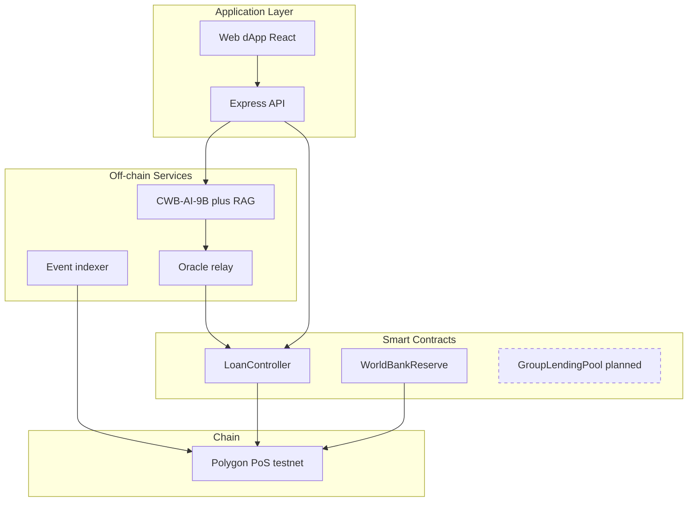
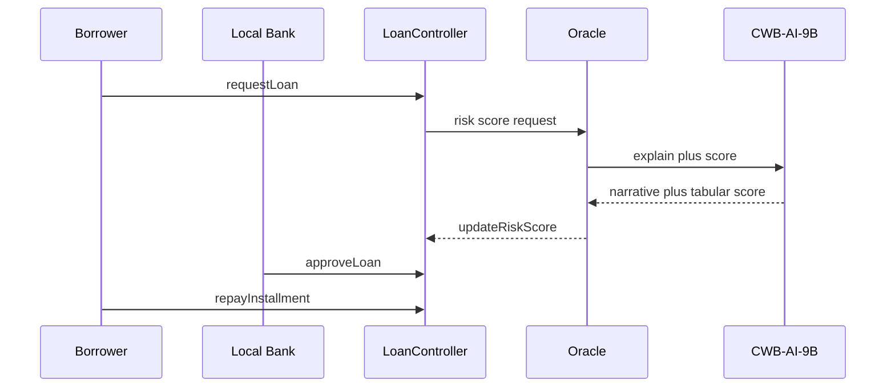
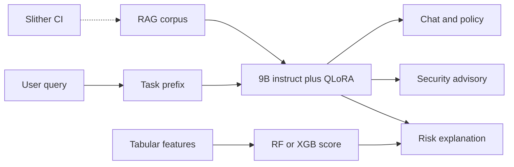

# Pre-thesis v12 Execution Manifest

Run these steps in **agent mode** (plan mode cannot edit `.tex`). Order matches graded Pre-thesis 1 priorities.

## Phase 1 — Content (v11 in place)

### 1.1 Design-phase tone script

Create and run `Documentation/tools/pt1_content_pass.py` (see plan) then manual grep:

```bash
rg "implements|fully implements|We show" Documentation/Pre-thesis_v11.tex
```

### 1.2 Abstract (replace paragraph 4–5)

```latex
Here we present \textit{Crypto World Bank}, a proposed architecture that models a multi-tier institutional lending system on programmable blockchain infrastructure. We specify how hierarchical capital flows, role-based governance, and data-informed risk analytics can be coordinated within a unified smart contract environment, enabling transparent state visibility alongside adaptive decision support. The architecture is designed to cover six functional domains---deposit mobilization, credit allocation, payment settlement, risk intermediation, liquidity management, and ancillary financial services---within a four-tier hierarchical governance structure. This work is at the \textbf{design and specification} stage: core lending workflow contracts are partially scaffolded on public testnets; extended banking modules and production deployment are planned for subsequent thesis phases.
```

### 1.3 Document status block (after Abstract)

```latex
\chapter*{Document Status (Pre-thesis 1)}
\phantomsection
\addcontentsline{toc}{chapter}{Document Status (Pre-thesis 1)}
\noindent\textbf{Stage:} Design, specification, and partial testnet prototype.\\
\noindent\textbf{Pre-thesis 1 emphasis:} Chapter~1 (CO1) and Chapter~2 (CO9).\\
\noindent\textbf{Not claimed:} Mainnet deployment, production KYC/AML, or geo-specific operational rollout.
```

### 1.4 Replace Sylhet section (~line 4077)

Replace `\section{Accessibility Assessment: A Borrower in Rural Sylhet}` through closing paragraph with:

```latex
\section{Accessibility Design Considerations}

This section evaluates inclusion \emph{as a design requirement}, not as evidence of deployed access. Six dimensions apply to underserved retail borrowers in developing economies:

\begin{description}[leftmargin=0pt]
\item[\textbf{1. Device access.}] Mobile-first web and WalletConnect reduce hardware barriers relative to branch-only banking.
\item[\textbf{2. Connectivity.}] L2/L3 networks with low per-transaction data footprint support intermittent mobile connectivity.
\item[\textbf{3. Transaction cost.}] On-chain settlement can reduce repeated intermediary fees when gas and routing are optimized; exact costs depend on chain and congestion (evaluated at prototype stage).
\item[\textbf{4. Language and literacy.}] Production deployments require localized UI and plain-language loan disclosures; the current specification is English-only.
\item[\textbf{5. Identity and onboarding.}] The planned ZKP KYC pathway (Section~\ref{sec:identity}) is designed to verify credentials without publishing PII on-chain.
\item[\textbf{6. Group lending fit.}] Solidarity group lending (GroupLendingPool, planned) encodes mutual liability in contract logic, aligned with documented microfinance models in the literature.
\end{description}

\noindent\textbf{Design implication:} Accessibility is architecturally supported (mobile, low-cost chain choice, group lending design) but requires localization, stablecoin denomination, and regulatory sandbox validation before any operational claims.
```

### 1.5 Banking capability matrix (insert after `\subsection{Banking Functions of the Platform}`)

```latex
\begin{table}[t]
\caption{Banking capability matrix: functions, tiers, modules, and prototype status}
\label{tab:banking-matrix}
\noindent\textit{\small Maps six banking functions to on-chain modules, off-chain/AI services, and implementation status. Figures in Ch.~1--5 reference rows of this table.}
\centering
\small
\begin{tabularx}{\linewidth}{@{}L{}L{}L{}L{}C{1.6cm}@{}}
\toprule
\textbf{Function} & \textbf{Primary tiers} & \textbf{On-chain module} & \textbf{Off-chain / AI} & \textbf{Status} \\
\midrule
Deposit mobilization & Local+ & SavingsVault, FixedDeposit & --- & Planned \\
Credit allocation & All & LoanController, reserves & CWB-AI-9B, oracle & Partial \\
Payment \& settlement & All & Transfer / escrow patterns & Indexer & Designed \\
Risk intermediation & NB, LB & Governance, ratios & Tabular score + 9B explain & Designed \\
Liquidity management & WB, NB & Reserve rules, interbank pool & ALM analytics & Planned \\
Ancillary (FX, group, ID) & Local+ & GroupLendingPool, FX oracle & RAG corpus & Planned \\
\bottomrule
\end{tabularx}
\end{table}
```

### 1.6 Unified 9B AI section (new `\subsection` in Ch.3 or Ch.4)

Title: `\subsection{Unified Fine-Tuned 9B Assistant (Design)}`

Key points to write:

- One **instruction-tuned 9B-class** model (QLoRA) for chat, RAG, security advisory text, risk **explanation**.
- **Guardrails:** Slither/static analysis authoritative for code; tabular model (RF/XGBoost) produces numeric fraud/risk score for oracle; 9B explains, does not replace.
- **Hardware:** i5-10400, 32 GB RAM, RX 9060 XT 16 GB — QLoRA feasible; note AMD/ROCm setup vs CUDA tutorials.
- **Prototype scope:** `CWB-AI-9B` = Planned unless weights exist.
- Figure: `ai-unified-9b-architecture.png` (add to `new-diagrams-build.md`).

### 1.7 Conclusion fixes

- Change “With a working prototype” → “With a specified architecture and partial testnet scaffold”
- List unimplemented modules as **designed**, not “implements”

## Phase 2 — Diagrams

Append to `Documentation/Diagrams/new-diagrams-build.md`:

### blockchain-stack-layers.png



### blockchain-tx-lifecycle.png



### ai-unified-9b-architecture.png



Then: `python3 tools/build_mermaid_pdfs.py` and insert `\FigureImageMaxFit{...}` in Ch.2–3.

## Phase 3 — ACM styling (hybrid)

`acmart.cls` **not installed** on author machine (`kpsewhich acmart.cls` → empty).

**Option A (recommended now):** Keep BRAC `report` cover; apply ACM table rules already in v11; defer full `acmart` until `tlmgr install acmart`.

**Option B:** `tlmgr install acmart` then fork `Pre-thesis_v12_acm.tex` with `\documentclass[acmsmall,screen,review]{acmart}` and map `\chapter` → `\section`.

## Phase 4 — Verify

```bash
cd Documentation
python3 tools/build_mermaid_pdfs.py
pdflatex -interaction=nonstopmode Pre-thesis_v11.tex
pdflatex -interaction=nonstopmode Pre-thesis_v11.tex
```

Checklist:

- [ ] No duplicate LOT entries
- [ ] Ch.1 CO1 sections present and design-honest
- [ ] Ch.2 CO9 preliminaries + synthesis
- [ ] Sylhet section removed
- [ ] `tab:banking-matrix` referenced in new figure captions
- [ ] 9B AI section present; RF framed as guardrail/score, not sole AI story

## Files touched (execution)

| File | Action |
|------|--------|
| `Pre-thesis_v11.tex` | Tone, geo, matrix, AI section, figures |
| `new-diagrams-build.md` | +3 mermaid blocks |
| `tools/pt1_content_pass.py` | Bulk replacements |
| `tools/diagram-style-guide.md` | Created |
| `Pre-thesis_v12_acm.tex` | Optional after acmart install |
